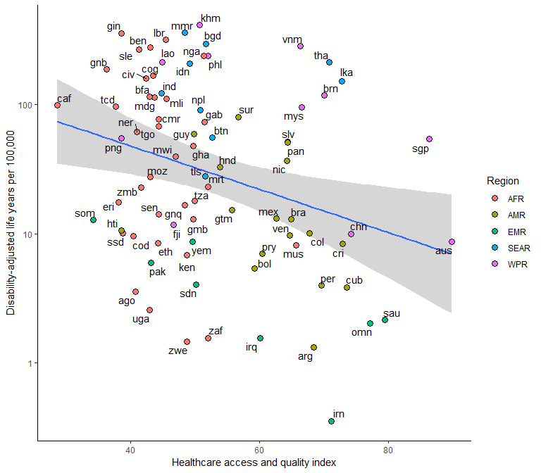

melioidosis-daly.R
================
Bdevleesschauwer
Sun Aug 26 19:40:03 2018

# Settings

``` r
## required packages
library(bd)
library(FERG2015)
library(ggplot2)
library(ggrepel)
library(mc2d)
library(prevalence)

## simulations
set.seed(264)
n <- 1e5
```

# Load simulations

``` r
## incidence, mortality, by country
source("read-inc-mrt-median.R")
```

    ## 'data.frame':    92 obs. of  7 variables:
    ##  $ Country.name: chr  "East_Asia_and_Pacific" "Indonesia" "Vietnam" "Phillipines" ...
    ##  $ X__1        : chr  "Predicted_Incidence" "20038" "10430" "9116" ...
    ##  $ X__2        : chr  "Lower_Limit_PI" "7859" "4097" "4819" ...
    ##  $ X__3        : chr  "Upper_Limit_PI" "52812" "27480" "18999" ...
    ##  $ X__4        : chr  "Predicted Mortality" "10224" "4703" "4510" ...
    ##  $ X__5        : chr  "Lower_Limit_PM" "3944" "1827" "2369" ...
    ##  $ X__6        : chr  "Upper_Limit_PM" "27524" "12631" "9739" ...
    ## 'data.frame':    83 obs. of  7 variables:
    ##  $ COUNTRY: chr  "Indonesia" "Vietnam" "Phillipines" "Thailand" ...
    ##  $ INC    : chr  "20038" "10430" "9116" "7572" ...
    ##  $ INC.LW : chr  "7859" "4097" "4819" "3396" ...
    ##  $ INC.UP : chr  "52812" "27480" "18999" "17685" ...
    ##  $ MRT    : chr  "10224" "4703" "4510" "2838" ...
    ##  $ MRT.LW : chr  "3944" "1827" "2369" "1259" ...
    ##  $ MRT.UP : chr  "27524" "12631" "9739" "6678" ...

``` r
INC_sim <- INC_sim[, !is.na(colnames(INC_sim))]
MRT_sim <- MRT_sim[, !is.na(colnames(MRT_sim))]

knitr::kable(t(apply(INC_sim, 2, mean_ci)), digits = 0)
```

|                                    |  mean |  2.5% |  97.5% |
| ---------------------------------- | ----: | ----: | -----: |
| Indonesia                          | 23520 |  6124 |  52505 |
| Viet Nam                           | 12243 |  3191 |  27320 |
| Philippines                        | 10226 |  4234 |  18829 |
| Thailand                           |  8636 |  2858 |  17565 |
| China                              |  7924 |  2795 |  15672 |
| Myanmar                            |  7161 |  2085 |  15316 |
| Cambodia                           |  2451 |   656 |   5416 |
| Malaysia                           |  2062 |   554 |   4551 |
| Lao People’s Democratic Republic   |   489 |   136 |   1065 |
| Singapore                          |   338 |    45 |    922 |
| Australia                          |   178 |    41 |    415 |
| Papua New Guinea                   |   148 |    37 |    338 |
| Brunei Darussalam                  |    33 |    10 |     71 |
| Timor-Leste                        |    13 |     2 |     35 |
| Fiji                               |     5 |     1 |     14 |
| India                              | 59769 | 18862 | 123900 |
| Bangladesh                         | 19039 |  6781 |  37500 |
| Sri Lanka                          |  2106 |   625 |   4472 |
| Nepal                              |  1046 |   269 |   2347 |
| Pakistan                           |   571 |    49 |   1720 |
| Bhutan                             |    16 |     3 |     42 |
| Nigeria                            | 16140 |  3542 |  38229 |
| Guinea                             |  1619 |   365 |   3807 |
| Côte d’Ivoire                      |  1390 |   286 |   3355 |
| Benin                              |  1102 |   253 |   2569 |
| Madagascar                         |  1051 |   241 |   2455 |
| Burkina Faso                       |   785 |   115 |   2092 |
| Sierra Leone                       |   718 |   155 |   1708 |
| Mali                               |   726 |   113 |   1903 |
| Cameroon                           |   661 |   112 |   1695 |
| Liberia                            |   532 |   109 |   1285 |
| Chad                               |   510 |    60 |   1425 |
| Ghana                              |   502 |    53 |   1441 |
| Niger                              |   467 |    46 |   1372 |
| United Republic of Tanzania        |   371 |    54 |    989 |
| Congo                              |   311 |    75 |    715 |
| Ethiopia                           |   321 |    41 |    882 |
| Mozambique                         |   292 |    44 |    773 |
| Democratic Republic of the Congo   |   276 |    33 |    769 |
| Malawi                             |   262 |    53 |    635 |
| Togo                               |   191 |    30 |    499 |
| Central African Republic           |   170 |    33 |    422 |
| Zambia                             |   138 |    19 |    372 |
| Guinea-Bissau                      |   125 |    16 |    343 |
| Kenya                              |   123 |    18 |    326 |
| Somalia                            |    88 |     9 |    254 |
| Sudan                              |    80 |     6 |    248 |
| Senegal                            |    79 |     6 |    248 |
| Gabon                              |    54 |    12 |    127 |
| South Sudan                        |    47 |     6 |    131 |
| Uganda                             |    40 |     2 |    131 |
| Angola                             |    38 |     3 |    116 |
| South Africa                       |    35 |     4 |    103 |
| Mauritania                         |    36 |     3 |    110 |
| Eritrea                            |    34 |     3 |    101 |
| Gambia                             |    10 |     1 |     33 |
| Zimbabwe                           |     9 |     1 |     28 |
| Equatorial Guinea                  |     7 |     2 |     17 |
| Mauritius                          |     6 |     1 |     18 |
| Brazil                             |  1090 |   162 |   2892 |
| Mexico                             |   666 |   112 |   1710 |
| Colombia                           |   190 |    30 |    495 |
| El Salvador                        |   130 |    32 |    296 |
| Venezuela (Bolivarian Republic of) |   124 |    23 |    311 |
| Honduras                           |   103 |    17 |    264 |
| Panama                             |    78 |    19 |    179 |
| Guatemala                          |    79 |    15 |    197 |
| Nicaragua                          |    77 |    14 |    196 |
| Peru                               |    48 |     7 |    128 |
| Haiti                              |    30 |     3 |     86 |
| Cuba                               |    27 |     2 |     89 |
| Argentina                          |    24 |     2 |     75 |
| Costa Rica                         |    19 |     3 |     49 |
| Suriname                           |    16 |     3 |     39 |
| Paraguay                           |    18 |     1 |     59 |
| Bolivia (Plurinational State of)   |    17 |     2 |     49 |
| Guyana                             |    14 |     2 |     36 |
| Yemen                              |   119 |    21 |    302 |
| Saudi Arabia                       |    67 |     7 |    197 |
| Iraq                               |    33 |     1 |    128 |
| Iran (Islamic Republic of)         |    21 |     1 |     73 |
| Oman                               |     7 |     1 |     19 |

``` r
knitr::kable(t(mean_ci(rowSums(INC_sim))), digits = 0)
```

|   mean |   2.5% |  97.5% |
| -----: | -----: | -----: |
| 190322 | 131346 | 267195 |

``` r
knitr::kable(t(apply(MRT_sim, 2, mean_ci)), digits = 0)
```

|                                    |  mean |  2.5% | 97.5% |
| ---------------------------------- | ----: | ----: | ----: |
| Indonesia                          | 12095 |  3024 | 27480 |
| Viet Nam                           |  5562 |  1400 | 12610 |
| Philippines                        |  5126 |  2025 |  9644 |
| Thailand                           |  3241 |  1056 |  6633 |
| China                              |  2913 |  1015 |  5793 |
| Myanmar                            |  4252 |  1184 |  9254 |
| Cambodia                           |  1356 |   355 |  3023 |
| Malaysia                           |   609 |   163 |  1344 |
| Lao People’s Democratic Republic   |   299 |    85 |   646 |
| Singapore                          |    60 |     6 |   174 |
| Australia                          |    42 |    10 |    98 |
| Papua New Guinea                   |    92 |    21 |   214 |
| Brunei Darussalam                  |    10 |     3 |    21 |
| Timor-Leste                        |     8 |     1 |    22 |
| Fiji                               |     2 |     0 |     6 |
| India                              | 35971 | 11155 | 75098 |
| Bangladesh                         | 10720 |  3684 | 21457 |
| Sri Lanka                          |   697 |   201 |  1497 |
| Nepal                              |   586 |   140 |  1353 |
| Pakistan                           |   343 |    26 |  1061 |
| Bhutan                             |    10 |     2 |    24 |
| Nigeria                            |  9999 |  2139 | 23820 |
| Guinea                             |  1007 |   211 |  2416 |
| Côte d’Ivoire                      |   854 |   175 |  2066 |
| Benin                              |   683 |   150 |  1617 |
| Madagascar                         |   642 |   140 |  1522 |
| Burkina Faso                       |   485 |    66 |  1315 |
| Sierra Leone                       |   449 |    90 |  1094 |
| Mali                               |   450 |    66 |  1199 |
| Cameroon                           |   407 |    62 |  1072 |
| Liberia                            |   331 |    65 |   813 |
| Chad                               |   316 |    35 |   900 |
| Ghana                              |   307 |    32 |   889 |
| Niger                              |   285 |    24 |   858 |
| United Republic of Tanzania        |   224 |    30 |   609 |
| Congo                              |   195 |    44 |   455 |
| Ethiopia                           |   197 |    21 |   568 |
| Mozambique                         |   178 |    23 |   490 |
| Democratic Republic of the Congo   |   169 |    18 |   484 |
| Malawi                             |   162 |    30 |   406 |
| Togo                               |   118 |    18 |   312 |
| Central African Republic           |   105 |    19 |   265 |
| Zambia                             |    85 |    10 |   239 |
| Guinea-Bissau                      |    78 |     9 |   220 |
| Kenya                              |    75 |    10 |   204 |
| Somalia                            |    54 |     5 |   161 |
| Sudan                              |    48 |     3 |   154 |
| Senegal                            |    49 |     3 |   160 |
| Gabon                              |    33 |     8 |    77 |
| South Sudan                        |    28 |     3 |    81 |
| Uganda                             |    24 |     1 |    84 |
| Angola                             |    23 |     1 |    74 |
| South Africa                       |    20 |     2 |    62 |
| Mauritania                         |    22 |     2 |    69 |
| Eritrea                            |    20 |     1 |    62 |
| Gambia                             |     6 |     0 |    22 |
| Zimbabwe                           |     5 |     0 |    17 |
| Equatorial Guinea                  |     5 |     1 |    11 |
| Mauritius                          |     2 |     0 |     7 |
| Brazil                             |   423 |    63 |  1122 |
| Mexico                             |   261 |    44 |   671 |
| Colombia                           |    78 |    12 |   205 |
| El Salvador                        |    52 |    13 |   119 |
| Venezuela (Bolivarian Republic of) |    48 |     9 |   121 |
| Honduras                           |    47 |     6 |   126 |
| Panama                             |    32 |     8 |    75 |
| Guatemala                          |    40 |     7 |   100 |
| Nicaragua                          |    36 |     6 |    91 |
| Peru                               |    20 |     3 |    55 |
| Haiti                              |    18 |     1 |    56 |
| Cuba                               |     7 |     0 |    23 |
| Argentina                          |     9 |     1 |    29 |
| Costa Rica                         |     6 |     1 |    16 |
| Suriname                           |     7 |     2 |    17 |
| Paraguay                           |     7 |     0 |    27 |
| Bolivia (Plurinational State of)   |     9 |     1 |    28 |
| Guyana                             |     7 |     1 |    18 |
| Yemen                              |    71 |    12 |   182 |
| Saudi Arabia                       |    21 |     2 |    61 |
| Iraq                               |    17 |     0 |    67 |
| Iran (Islamic Republic of)         |     9 |     0 |    30 |
| Oman                               |     3 |     1 |     6 |

``` r
knitr::kable(t(mean_ci(rowSums(MRT_sim))), digits = 0)
```

|   mean |  2.5% |  97.5% |
| -----: | ----: | -----: |
| 103363 | 70105 | 147774 |

``` r
## age-sex distributions, by region
source("sim-age.R")
```

<!-- --><!-- --><!-- --><!-- --><!-- -->

``` r
str(reg_inc)
```

    ## List of 5
    ##  $ AFR :'data.frame':    14 obs. of  2 variables:
    ##   ..$ age: num [1:14] 60 70 57 58 29 29 52 45 40 1.33 ...
    ##   ..$ sex: logi [1:14] TRUE TRUE TRUE TRUE TRUE TRUE ...
    ##  $ AMR :'data.frame':    72 obs. of  2 variables:
    ##   ..$ age: num [1:72] 50 35 17 36 32 7 88 27 42 46 ...
    ##   ..$ sex: logi [1:72] TRUE TRUE TRUE TRUE TRUE FALSE ...
    ##  $ EMR :'data.frame':    1 obs. of  2 variables:
    ##   ..$ age: num 60
    ##   ..$ sex: logi TRUE
    ##  $ SEAR:'data.frame':    7338 obs. of  2 variables:
    ##   ..$ age: num [1:7338] 45 47 42 58 62 48 55 65 45 52 ...
    ##   ..$ sex: logi [1:7338] TRUE TRUE TRUE TRUE FALSE TRUE ...
    ##  $ WPR :'data.frame':    3646 obs. of  2 variables:
    ##   ..$ age: num [1:3646] 53 53 48.8 51.8 56.7 ...
    ##   ..$ sex: logi [1:3646] TRUE TRUE TRUE TRUE TRUE TRUE ...

``` r
str(reg_mrt)
```

    ## List of 5
    ##  $ AFR :'data.frame':    4 obs. of  2 variables:
    ##   ..$ age: num [1:4] 52 45 40 62
    ##   ..$ sex: logi [1:4] TRUE TRUE FALSE FALSE
    ##  $ AMR :'data.frame':    26 obs. of  2 variables:
    ##   ..$ age: num [1:26] 50 35 58 44 53 17 44 38 55 11 ...
    ##   ..$ sex: logi [1:26] TRUE TRUE TRUE TRUE TRUE TRUE ...
    ##  $ EMR :'data.frame':    1 obs. of  2 variables:
    ##   ..$ age: num 60
    ##   ..$ sex: logi TRUE
    ##  $ SEAR:'data.frame':    2301 obs. of  2 variables:
    ##   ..$ age: num [1:2301] 47 42 62 65 55 42 63 50 61.1 61.1 ...
    ##   ..$ sex: logi [1:2301] TRUE TRUE FALSE TRUE TRUE TRUE ...
    ##  $ WPR :'data.frame':    962 obs. of  2 variables:
    ##   ..$ age: num [1:962] 62.9518 51.3842 58.8574 56.373 0.0356 ...
    ##   ..$ sex: logi [1:962] TRUE FALSE TRUE TRUE FALSE TRUE ...

``` r
## residual life expectancy, by region
load("rle-sim.RData")
str(RLE_WHO)
```

    ##  num [1:100000, 1:5] 43.9 46.8 39.7 40.9 40.9 ...

``` r
str(RLE_GBD)
```

    ##  num [1:100000, 1:5] 38.5 37.4 32.9 37.9 39.1 ...

``` r
## local life expectancy, by country
load("lle-sim.RData")
str(lle_sim)
```

    ##  num [1:100000, 1:82] 26.5 26.7 26.2 26.4 26.4 ...
    ##  - attr(*, "dimnames")=List of 2
    ##   ..$ : NULL
    ##   ..$ : chr [1:82] "Indonesia" "Viet Nam" "Philippines" "Thailand" ...

<!-- -->

# Years of Life Lost

``` r
## YLL / MRT

reg_id <-
  match(
    FERG2015:::crpop_2015$WHORegion[
      match(colnames(MRT_sim), FERG2015:::crpop_2015$Country)],
    names(reg_mrt))

YLL_WHO <- MRT_sim * RLE_WHO[, reg_id]
mean_ci(rowSums(YLL_WHO))
```

    ##    mean    2.5%   97.5% 
    ## 4585094 3114498 6550593

``` r
YLL_GBD <- MRT_sim * RLE_GBD[, reg_id]
mean_ci(rowSums(YLL_GBD))
```

    ##    mean    2.5%   97.5% 
    ## 4042568 2740388 5775291

# Years Lived with Disability

``` r
dismod <- readxl("../02_data/20180815/MEL_dismod_15-8-18.xlsx", "main")
dismod_tx <- readxl("../02_data/20180815/MEL_dismod_15-8-18.xlsx", "tx")
dismod_pi <- readxl("../02_data/20180815/MEL_dismod_15-8-18.xlsx", "pi")

p_seq <- p_seq_pi <-
YLDcase <- YLDcase_pi_nd <-
  matrix(nrow = n, ncol = nrow(dismod))
colnames(p_seq) <- colnames(p_seq_pi) <-
colnames(YLDcase) <- colnames(YLDcase_pi_nd) <-
  abbreviate(gsub("\\(.*", "", dismod$HS), 10)

for (i in seq(nrow(dismod))) {
  p <- rbeta(n, dismod[i, "X"], dismod[i, "N"] - dismod[i, "X"])
  dw <- FERG2015:::sim_mean(
          n, unlist(dismod[i, c("DW.lwr", "DW", "DW.upr")]), "PROB")
  durs <- rgamma2(n, dismod[i, "DURS"], dismod[i, "DURS.sd"]) / 365
  durh <- rgamma2(n, dismod[i, "DURH"], dismod[i, "DURH.sd"]) / 365

  p_pi <- rbeta(n, dismod_pi[i, "X"], dismod_pi[i, "N"] - dismod_pi[i, "X"])
  dw_pi <- FERG2015:::sim_mean(
             n, unlist(dismod_pi[i, c("DW.lwr", "DW", "DW.upr")]), "PROB")

  p_seq[, i] <- p
  p_seq_pi[, i] <- p_pi

  YLDcase[, i] <- p * dw * (durs + durh)
  YLDcase_pi_nd[, i] <- p * p_pi * dw_pi
}

knitr::kable(t(apply(p_seq, 2, mean_ci)))
```

|            |      mean |      2.5% |     97.5% |
| ---------- | --------: | --------: | --------: |
| Septicshck | 0.1209941 | 0.1141098 | 0.1281121 |
| SpsswthtSS | 0.1801952 | 0.1720663 | 0.1884446 |
| Pneumonia  | 0.3570653 | 0.3478246 | 0.3663774 |
| CNSinfectn | 0.0160771 | 0.0136875 | 0.0186459 |
| Abscsintr- | 0.1832462 | 0.1752278 | 0.1914151 |
| Msclskltli | 0.0818638 | 0.0765389 | 0.0874223 |
| Urntrctinf | 0.0665139 | 0.0617155 | 0.0715068 |
| Parotitis  | 0.0228888 | 0.0200225 | 0.0259453 |
| SSTI       | 0.1261096 | 0.1195758 | 0.1327852 |
| Other      | 0.0260358 | 0.0229791 | 0.0292934 |

``` r
knitr::kable(t(apply(p_seq_pi, 2, mean_ci)))
```

|            |      mean |      2.5% |     97.5% |
| ---------- | --------: | --------: | --------: |
| Septicshck | 0.1665265 | 0.0050687 | 0.5223500 |
| SpsswthtSS | 0.1660721 | 0.0051489 | 0.5214613 |
| Pneumonia  | 0.0000000 | 0.0000000 | 0.0000000 |
| CNSinfectn | 0.3620057 | 0.2447683 | 0.4887149 |
| Abscsintr- | 0.0000000 | 0.0000000 | 0.0000000 |
| Msclskltli | 0.4066093 | 0.3406742 | 0.4744329 |
| Urntrctinf | 0.0000000 | 0.0000000 | 0.0000000 |
| Parotitis  | 0.0000000 | 0.0000000 | 0.0000000 |
| SSTI       | 0.0000000 | 0.0000000 | 0.0000000 |
| Other      | 0.0000000 | 0.0000000 | 0.0000000 |

``` r
knitr::kable(t(apply(YLDcase, 2, mean_ci)))
```

|            |      mean |      2.5% |     97.5% |
| ---------- | --------: | --------: | --------: |
| Septicshck | 0.0049250 | 0.0004610 | 0.0150386 |
| SpsswthtSS | 0.0018450 | 0.0002842 | 0.0050365 |
| Pneumonia  | 0.0041972 | 0.0006763 | 0.0112510 |
| CNSinfectn | 0.0013875 | 0.0000153 | 0.0063400 |
| Abscsintr- | 0.0058119 | 0.0000008 | 0.0400289 |
| Msclskltli | 0.0035850 | 0.0000029 | 0.0221441 |
| Urntrctinf | 0.0012489 | 0.0001331 | 0.0041743 |
| Parotitis  | 0.0001999 | 0.0000135 | 0.0007953 |
| SSTI       | 0.0006414 | 0.0000291 | 0.0038994 |
| Other      | 0.0004914 | 0.0000730 | 0.0015767 |

``` r
knitr::kable(t(mean_ci(rowSums(YLDcase))))
```

|      mean |      2.5% |    97.5% |
| --------: | --------: | -------: |
| 0.0243333 | 0.0090374 | 0.064161 |

``` r
## Pr(survival)

p_surv <- 1 - apply(MRT_sim, 2, sort) / apply(INC_sim, 2, sort)
knitr::kable(t(apply(p_surv, 2, mean_ci)))
```

|                                    |      mean |      2.5% |     97.5% |
| ---------------------------------- | --------: | --------: | --------: |
| Indonesia                          | 0.4894527 | 0.4765875 | 0.5056936 |
| Viet Nam                           | 0.5485945 | 0.5385208 | 0.5607057 |
| Philippines                        | 0.5017127 | 0.4878309 | 0.5212527 |
| Thailand                           | 0.6255544 | 0.6223359 | 0.6303470 |
| China                              | 0.6330471 | 0.6304186 | 0.6369662 |
| Myanmar                            | 0.4104181 | 0.3957707 | 0.4321695 |
| Cambodia                           | 0.4486829 | 0.4421982 | 0.4593066 |
| Malaysia                           | 0.7050463 | 0.7047594 | 0.7055174 |
| Lao People’s Democratic Republic   | 0.3860171 | 0.3747633 | 0.3933773 |
| Singapore                          | 0.8313601 | 0.8114294 | 0.8658079 |
| Australia                          | 0.7656668 | 0.7645143 | 0.7679059 |
| Papua New Guinea                   | 0.3859327 | 0.3665938 | 0.4191200 |
| Brunei Darussalam                  | 0.6872754 | 0.6591765 | 0.7042829 |
| Timor-Leste                        | 0.3943985 | 0.3712087 | 0.4394384 |
| Fiji                               | 0.5558803 | 0.5302584 | 0.5675486 |
| India                              | 0.3997785 | 0.3939529 | 0.4089964 |
| Bangladesh                         | 0.4398578 | 0.4280388 | 0.4570574 |
| Sri Lanka                          | 0.6705141 | 0.6654365 | 0.6779354 |
| Nepal                              | 0.4465960 | 0.4238278 | 0.4799694 |
| Pakistan                           | 0.4142297 | 0.3821555 | 0.4714471 |
| Bhutan                             | 0.3864424 | 0.3088850 | 0.4281985 |
| Nigeria                            | 0.3828158 | 0.3763170 | 0.3944246 |
| Guinea                             | 0.3849895 | 0.3651634 | 0.4201034 |
| Côte d’Ivoire                      | 0.3858734 | 0.3842628 | 0.3882083 |
| Benin                              | 0.3841732 | 0.3709204 | 0.4062459 |
| Madagascar                         | 0.3944581 | 0.3800454 | 0.4183675 |
| Burkina Faso                       | 0.3903787 | 0.3714023 | 0.4251767 |
| Sierra Leone                       | 0.3828337 | 0.3600857 | 0.4187299 |
| Mali                               | 0.3862256 | 0.3700941 | 0.4150965 |
| Cameroon                           | 0.3958628 | 0.3682148 | 0.4466464 |
| Liberia                            | 0.3814027 | 0.3677215 | 0.4025013 |
| Chad                               | 0.3893931 | 0.3691162 | 0.4261966 |
| Ghana                              | 0.3922529 | 0.3829259 | 0.4075486 |
| Niger                              | 0.4053102 | 0.3748833 | 0.4617264 |
| United Republic of Tanzania        | 0.4050156 | 0.3837173 | 0.4440694 |
| Congo                              | 0.3791751 | 0.3628191 | 0.4070286 |
| Ethiopia                           | 0.4074520 | 0.3575447 | 0.4988819 |
| Mozambique                         | 0.4027893 | 0.3660626 | 0.4689365 |
| Democratic Republic of the Congo   | 0.3988322 | 0.3715637 | 0.4490893 |
| Malawi                             | 0.3928674 | 0.3612515 | 0.4426545 |
| Togo                               | 0.3872110 | 0.3748560 | 0.4101451 |
| Central African Republic           | 0.3908622 | 0.3719280 | 0.4227368 |
| Zambia                             | 0.4018076 | 0.3574613 | 0.4831098 |
| Guinea-Bissau                      | 0.3940329 | 0.3612650 | 0.4547002 |
| Kenya                              | 0.4026769 | 0.3736837 | 0.4562962 |
| Somalia                            | 0.3960134 | 0.3647149 | 0.4495600 |
| Sudan                              | 0.4225381 | 0.3800556 | 0.5042354 |
| Senegal                            | 0.4079861 | 0.3520903 | 0.5169610 |
| Gabon                              | 0.3789114 | 0.3528779 | 0.3933410 |
| South Sudan                        | 0.4338254 | 0.3806923 | 0.5281141 |
| Uganda                             | 0.4476938 | 0.3621804 | 0.6188409 |
| Angola                             | 0.4171533 | 0.3605518 | 0.5216125 |
| South Africa                       | 0.4617357 | 0.3970400 | 0.5729292 |
| Mauritania                         | 0.3906264 | 0.3710693 | 0.4237766 |
| Eritrea                            | 0.4572614 | 0.3839889 | 0.5816170 |
| Gambia                             | 0.5078859 | 0.3375080 | 0.7834584 |
| Zimbabwe                           | 0.4443143 | 0.3899860 | 0.5413652 |
| Equatorial Guinea                  | 0.3643350 | 0.3494100 | 0.3880658 |
| Mauritius                          | 0.6322080 | 0.6086148 | 0.6728076 |
| Brazil                             | 0.6118083 | 0.6114524 | 0.6120903 |
| Mexico                             | 0.6070833 | 0.6050904 | 0.6079846 |
| Colombia                           | 0.5944226 | 0.5856212 | 0.6117390 |
| El Salvador                        | 0.6018187 | 0.5969933 | 0.6101497 |
| Venezuela (Bolivarian Republic of) | 0.6118035 | 0.6108968 | 0.6133580 |
| Honduras                           | 0.5570263 | 0.5210795 | 0.6198823 |
| Panama                             | 0.5871742 | 0.5808587 | 0.5971209 |
| Guatemala                          | 0.4995069 | 0.4922153 | 0.5124086 |
| Nicaragua                          | 0.5407842 | 0.5357356 | 0.5496791 |
| Peru                               | 0.5926143 | 0.5710190 | 0.6326978 |
| Haiti                              | 0.4222276 | 0.3475001 | 0.5464876 |
| Cuba                               | 0.7528988 | 0.7415803 | 0.7780505 |
| Argentina                          | 0.6141898 | 0.6132373 | 0.6162891 |
| Costa Rica                         | 0.6726177 | 0.6694735 | 0.6745619 |
| Suriname                           | 0.5595941 | 0.5502866 | 0.5650433 |
| Paraguay                           | 0.6257716 | 0.5435632 | 0.7804447 |
| Bolivia (Plurinational State of)   | 0.4548656 | 0.4293962 | 0.5026759 |
| Guyana                             | 0.4769033 | 0.4303783 | 0.5015135 |
| Yemen                              | 0.4056535 | 0.3980051 | 0.4193891 |
| Saudi Arabia                       | 0.6927879 | 0.6903219 | 0.6968465 |
| Iraq                               | 0.4777854 | 0.4725588 | 0.4914150 |
| Iran (Islamic Republic of)         | 0.6066521 | 0.5878750 | 0.6467091 |
| Oman                               | 0.6330641 | 0.5249506 | 0.6858870 |

``` r
median(colMeans(p_surv))
```

    ## [1] 0.4368416

``` r
median(colMeans(lle_sim))
```

    ## [1] 27.70076

``` r
## YLD ABtx = YLDcase_tx * Pr(survival)

p_tx <- 1
dw_tx <-
  FERG2015:::sim_mean(
    n, unlist(dismod_tx[1, c("DW.lwr", "DW", "DW.upr")]), "PROB")
dur_tx <-
  rgamma2(n,
          dismod_tx[1, "DUR_Oral_Abx"],
          dismod_tx[1, "DUR_Oral_Abx.sd"]) / 365

YLDcase_tx <- p_surv * (p_tx * dw_tx * dur_tx)


## YLD post-infectious = YLDcase_pi_nd * local LE * Pr(survival)

YLDcase_pi <- array(dim = c(n, ncol(INC_sim), ncol(YLDcase_pi_nd)))

for (i in seq(ncol(YLDcase_pi_nd))) {
  YLDcase_pi[, , i] <- p_surv * lle_sim * YLDcase_pi_nd[, i]
}

YLDcase_pi_sum <- apply(YLDcase_pi, 1:2, sum)
YLDcase_pi_mean <- apply(YLDcase_pi, 2:3, mean)
rowSums(YLDcase_pi_mean)
```

    ##  [1] 0.22841084 0.33077069 0.25770653 0.34724734 0.37173172 0.19137063
    ##  [7] 0.23455583 0.40533315 0.19737306 0.55706162 0.52006602 0.19470643
    ## [13] 0.41145267 0.18883416 0.28709096 0.19483478 0.22912720 0.36008541
    ## [19] 0.21535840 0.06769610 0.20172083 0.15915477 0.17467649 0.15878745
    ## [25] 0.18701653 0.19286999 0.17884600 0.15310196 0.17666122 0.18115666
    ## [31] 0.17726589 0.17162831 0.18287879 0.18979072 0.19917334 0.18654486
    ## [37] 0.20485087 0.18278406 0.18972038 0.18710749 0.17556099 0.16254392
    ## [43] 0.19097858 0.17667859 0.20464456 0.05777120 0.06758855 0.20000207
    ## [49] 0.19168558 0.19849345 0.20998052 0.20173990 0.19823724 0.19002228
    ## [55] 0.21316366 0.23225244 0.20093795 0.16989299 0.34691475 0.43852819
    ## [61] 0.45770405 0.42743289 0.41980393 0.43010413 0.40587705 0.45189780
    ## [67] 0.35592101 0.39427546 0.42850289 0.26575720 0.57886921 0.44155934
    ## [73] 0.52173795 0.37012066 0.44915036 0.31830451 0.29639367 0.05872579
    ## [79] 0.11265486 0.07252894 0.10750805 0.11354715

``` r
## multiply INC * YLDcase

YLD <- INC_sim * rowSums(YLDcase)
YLD_tx <- INC_sim * YLDcase_tx
YLD_pi <- INC_sim * YLDcase_pi_sum
YLD_all <- YLD + YLD_tx + YLD_pi

knitr::kable(
  rbind(
    YLD.sym = mean_ci(rowSums(YLD)),
    YLD.tx = mean_ci(rowSums(YLD_tx)),
    YLD.pi = mean_ci(rowSums(YLD_pi)),
    YLD.all = mean_ci(rowSums(YLD_all))))
```

|         |      mean |       2.5% |     97.5% |
| ------- | --------: | ---------: | --------: |
| YLD.sym |  4630.935 |  1577.4187 | 12641.558 |
| YLD.tx  |  1523.038 |   515.1788 |  3295.489 |
| YLD.pi  | 44387.765 | 18062.8214 | 90164.805 |
| YLD.all | 50541.738 | 22778.1730 | 97825.391 |

``` r
## .. contributions of the 3 groups
knitr::kable(
  rbind(
    sympt = mean_ci(rowSums(YLD) / rowSums(YLD_all)),
    tx = mean_ci(rowSums(YLD_tx) / rowSums(YLD_all)),
    pi = mean_ci(rowSums(YLD_pi) / rowSums(YLD_all))))
```

|       |      mean |      2.5% |     97.5% |
| ----- | --------: | --------: | --------: |
| sympt | 0.0987122 | 0.0296962 | 0.2549914 |
| tx    | 0.0335238 | 0.0095656 | 0.0804326 |
| pi    | 0.8677640 | 0.7024830 | 0.9521041 |

# Disability-Adjusted Life Years

``` r
DALY_WHO <- YLL_WHO + YLD_all
DALY_GBD <- YLL_GBD + YLD_all

## regional estimates
pop <- pop[!is.na(pop$region), ]
region <- pop$region  # define regional grouping
reg <- levels(region)
nreg <- length(reg)

DALY_WHO_reg <-
  DALY_GBD_reg <-
  YLL_WHO_reg <-
  YLL_GBD_reg <-
  YLD_reg <-
  matrix(0, nrow = n, ncol = nreg)

colnames(DALY_WHO_reg) <-
  colnames(DALY_GBD_reg) <-
  colnames(YLL_WHO_reg) <-
  colnames(YLL_GBD_reg) <-
  colnames(YLD_reg) <-
  reg

for (i in seq(nreg)) {
  DALY_WHO_reg[, i] <-
    rowSums(DALY_WHO[, region == reg[i]], na.rm = TRUE)
  DALY_GBD_reg[, i] <-
    rowSums(DALY_GBD[, region == reg[i]], na.rm = TRUE)
  YLL_WHO_reg[, i] <-
    rowSums(YLL_WHO[, region == reg[i]], na.rm = TRUE)
  YLL_GBD_reg[, i] <-
    rowSums(YLL_GBD[, region == reg[i]], na.rm = TRUE)
  YLD_reg[, i] <-
    rowSums(YLD_all[, region == reg[i]], na.rm = TRUE)
}


## global estimates
DALY_WHO_glo <- rowSums(DALY_WHO, na.rm = TRUE)
DALY_GBD_glo <- rowSums(DALY_GBD, na.rm = TRUE)
YLL_WHO_glo <- rowSums(YLL_WHO, na.rm = TRUE)
YLL_GBD_glo <- rowSums(YLL_GBD, na.rm = TRUE)
YLD_glo <- rowSums(YLD_all, na.rm = TRUE)


## contribution of top 5 countries
top5 <-
  colnames(DALY_WHO) %in%
  c("India", "Bangladesh", "Viet Nam", "Nigeria", "Indonesia")

mean_ci(rowSums(DALY_WHO[, top5]))
```

    ##    mean    2.5%   97.5% 
    ## 3307178 1892971 5251783

``` r
mean_ci(rowSums(DALY_WHO[, top5]) / DALY_WHO_glo)
```

    ##      mean      2.5%     97.5% 
    ## 0.7048678 0.5768098 0.8091369

``` r
mean_ci(rowSums(DALY_GBD[, top5]))
```

    ##    mean    2.5%   97.5% 
    ## 2916305 1669981 4622451

``` r
mean_ci(rowSums(DALY_GBD[, top5]) / DALY_GBD_glo)
```

    ##      mean      2.5%     97.5% 
    ## 0.7039738 0.5758850 0.8084755

``` r
## convert to rates
DALY_WHO_rt <- t(t(n * DALY_WHO) / pop$pop)
DALY_GBD_rt <- t(t(n * DALY_GBD) / pop$pop)
YLL_WHO_rt <- t(t(n * YLL_WHO) / pop$pop)
YLL_GBD_rt <- t(t(n * YLL_GBD) / pop$pop)
YLD_rt <- t(t(n * YLD_all) / pop$pop)

pop_reg <- as.numeric(tapply(pop$pop, region, sum, na.rm = TRUE))

DALY_WHO_reg_rt <- t(t(n * DALY_WHO_reg) / pop_reg)
DALY_GBD_reg_rt <- t(t(n * DALY_GBD_reg) / pop_reg)
YLL_WHO_reg_rt <- t(t(n * YLL_WHO_reg) / pop_reg)
YLL_GBD_reg_rt <- t(t(n * YLL_GBD_reg) / pop_reg)
YLD_reg_rt <- t(t(n * YLD_reg) / pop_reg)

DALY_WHO_glo_rt <- n * DALY_WHO_glo / sum(pop$pop, na.rm = TRUE)
DALY_GBD_glo_rt <- n * DALY_GBD_glo / sum(pop$pop, na.rm = TRUE)
YLL_WHO_glo_rt <- n * YLL_WHO_glo / sum(pop$pop, na.rm = TRUE)
YLL_GBD_glo_rt <- n * YLL_GBD_glo / sum(pop$pop, na.rm = TRUE)
YLD_glo_rt <- n * YLD_glo / sum(pop$pop, na.rm = TRUE)

## save results
save(YLD_all, YLL_WHO, YLL_GBD, DALY_WHO, DALY_GBD,
     YLD_reg, YLL_WHO_reg, YLL_GBD_reg, DALY_WHO_reg, DALY_GBD_reg,
     YLD_glo, YLL_WHO_glo, YLL_GBD_glo, DALY_WHO_glo, DALY_GBD_glo,
     YLD_rt, YLL_WHO_rt, YLL_GBD_rt, DALY_WHO_rt, DALY_GBD_rt,
     YLD_reg_rt, YLL_WHO_reg_rt, YLL_GBD_reg_rt,
     DALY_WHO_reg_rt, DALY_GBD_reg_rt,
     YLD_glo_rt, YLL_WHO_glo_rt, YLL_GBD_glo_rt,
     DALY_WHO_glo_rt, DALY_GBD_glo_rt,
     file = "mel.RData")
```

# Comorbidities

``` r
como <- readxl("../02_data/20180815/Co-morbidity_Data_15-8-2018.xlsx")
como_sim <-
  with(como,
       mapply(rbeta,
              No_patients,
              Total_patients - No_patients,
              MoreArgs = list(n = n)))
colnames(como_sim) <- como$Co_morbidity
knitr::kable(t(apply(como_sim, 2, mean_ci)))
```

|                        |      mean |      2.5% |     97.5% |
| ---------------------- | --------: | --------: | --------: |
| Diabetes               | 0.4610914 | 0.4518206 | 0.4703851 |
| Liver\_Cirrhosis       | 0.0743042 | 0.0694454 | 0.0792552 |
| CKD                    | 0.0929135 | 0.0877121 | 0.0982505 |
| Chronic\_Lung\_Disease | 0.0335823 | 0.0302938 | 0.0370178 |

``` r
## proportion YLD
como_yld <-
  rbind(
    mean_ci(como_sim[,1] * YLD_glo),
    mean_ci(como_sim[,2] * YLD_glo),
    mean_ci(como_sim[,3] * YLD_glo),
    mean_ci(como_sim[,4] * YLD_glo))
rownames(como_yld) <- como$Co_morbidity
knitr::kable(como_yld)
```

|                        |      mean |       2.5% |     97.5% |
| ---------------------- | --------: | ---------: | --------: |
| Diabetes               | 23304.342 | 10490.3323 | 45111.421 |
| Liver\_Cirrhosis       |  3755.431 |  1687.5064 |  7283.975 |
| CKD                    |  4696.013 |  2107.2078 |  9112.317 |
| Chronic\_Lung\_Disease |  1697.307 |   759.6318 |  3303.350 |

``` r
## proportion YLD per 100k
como_yld_rt <-
  rbind(
    mean_ci(como_sim[,1] * YLD_glo_rt),
    mean_ci(como_sim[,2] * YLD_glo_rt),
    mean_ci(como_sim[,3] * YLD_glo_rt),
    mean_ci(como_sim[,4] * YLD_glo_rt))
rownames(como_yld_rt) <- como$Co_morbidity
knitr::kable(como_yld_rt)
```

|                        |      mean |      2.5% |     97.5% |
| ---------------------- | --------: | --------: | --------: |
| Diabetes               | 0.4237340 | 0.1907417 | 0.8202439 |
| Liver\_Cirrhosis       | 0.0682836 | 0.0306833 | 0.1324418 |
| CKD                    | 0.0853858 | 0.0383146 | 0.1656858 |
| Chronic\_Lung\_Disease | 0.0308615 | 0.0138121 | 0.0600636 |

``` r
## proportion DALY
como_daly <-
  rbind(
    mean_ci(como_sim[,1] * DALY_WHO_glo),
    mean_ci(como_sim[,2] * DALY_WHO_glo),
    mean_ci(como_sim[,3] * DALY_WHO_glo),
    mean_ci(como_sim[,4] * DALY_WHO_glo))
rownames(como_daly) <- como$Co_morbidity
knitr::kable(como_daly)
```

|                        |      mean |      2.5% |     97.5% |
| ---------------------- | --------: | --------: | --------: |
| Diabetes               | 2137433.3 | 1459182.0 | 3046177.1 |
| Liver\_Cirrhosis       |  344449.9 |  233462.2 |  493073.6 |
| CKD                    |  430711.8 |  292249.4 |  615674.0 |
| Chronic\_Lung\_Disease |  155677.1 |  104688.0 |  224390.4 |

``` r
## proportion DALY per 100k
como_daly_rt <-
  rbind(
    mean_ci(como_sim[,1] * DALY_WHO_glo_rt),
    mean_ci(como_sim[,2] * DALY_WHO_glo_rt),
    mean_ci(como_sim[,3] * DALY_WHO_glo_rt),
    mean_ci(como_sim[,4] * DALY_WHO_glo_rt))
rownames(como_daly_rt) <- como$Co_morbidity
knitr::kable(como_daly_rt)
```

|                        |      mean |      2.5% |     97.5% |
| ---------------------- | --------: | --------: | --------: |
| Diabetes               | 38.864141 | 26.531755 | 55.387487 |
| Liver\_Cirrhosis       |  6.263002 |  4.244955 |  8.965370 |
| CKD                    |  7.831469 |  5.313860 | 11.194568 |
| Chronic\_Lung\_Disease |  2.830618 |  1.903503 |  4.080007 |

# MAIN TEXT RESULTS

``` r
## main results
mean_ci(rowSums(DALY_WHO))
```

    ##    mean    2.5%   97.5% 
    ## 4635636 3164157 6602075

``` r
mean_ci(rowSums(DALY_GBD))
```

    ##    mean    2.5%   97.5% 
    ## 4093110 2790743 5826117

``` r
mean_ci(DALY_WHO_glo_rt)
```

    ##      mean      2.5%     97.5% 
    ##  84.28801  57.53267 120.04304

``` r
mean_ci(DALY_GBD_glo_rt)
```

    ##      mean      2.5%     97.5% 
    ##  74.42347  50.74303 105.93408

``` r
## proportion YLL/YLD
mean_ci(rowSums(YLL_WHO) / rowSums(DALY_WHO))
```

    ##      mean      2.5%     97.5% 
    ## 0.9887313 0.9767571 0.9954051

``` r
mean_ci(rowSums(YLD) / rowSums(DALY_WHO))
```

    ##         mean         2.5%        97.5% 
    ## 0.0010327142 0.0003236961 0.0028833877

``` r
mean_ci(rowSums(YLL_GBD) / rowSums(DALY_GBD))
```

    ##      mean      2.5%     97.5% 
    ## 0.9872421 0.9737257 0.9947797

``` r
mean_ci(rowSums(YLD) / rowSums(DALY_GBD))
```

    ##         mean         2.5%        97.5% 
    ## 0.0011693655 0.0003669989 0.0032627942

# TABLE 2 / DALY BY COUNTRY / REGION / GLOBAL

## WHO life expectancy table

``` r
knitr::kable(t(apply(DALY_WHO, 2, mean_ci)), digits = 0)
```

|                                    |    mean |   2.5% |   97.5% |
| ---------------------------------- | ------: | -----: | ------: |
| Indonesia                          |  538480 | 138880 | 1216825 |
| Viet Nam                           |  265521 |  70102 |  596432 |
| Philippines                        |  243582 |  98035 |  456063 |
| Thailand                           |  145946 |  49726 |  295285 |
| China                              |  139958 |  50709 |  275425 |
| Myanmar                            |  188733 |  53729 |  409251 |
| Cambodia                           |   64328 |  17359 |  142676 |
| Malaysia                           |   29476 |   8435 |   64088 |
| Lao People’s Democratic Republic   |   14170 |   4110 |   30455 |
| Singapore                          |    3010 |    456 |    8379 |
| Australia                          |    2062 |    536 |    4697 |
| Papua New Guinea                   |    4344 |   1031 |   10064 |
| Brunei Darussalam                  |     496 |    173 |     995 |
| Timor-Leste                        |     346 |     43 |     967 |
| Fiji                               |     105 |     15 |     285 |
| India                              | 1596733 | 503727 | 3320277 |
| Bangladesh                         |  476803 | 166451 |  949640 |
| Sri Lanka                          |   31511 |   9655 |   66771 |
| Nepal                              |   26057 |   6394 |   59808 |
| Pakistan                           |   11250 |    900 |   34705 |
| Bhutan                             |     437 |     91 |    1055 |
| Nigeria                            |  429641 |  92865 | 1034804 |
| Guinea                             |   43294 |   9190 |  104890 |
| Côte d’Ivoire                      |   36686 |   7599 |   89665 |
| Benin                              |   29395 |   6510 |   69975 |
| Madagascar                         |   27594 |   6107 |   65878 |
| Burkina Faso                       |   20850 |   2948 |   56834 |
| Sierra Leone                       |   19272 |   3884 |   47455 |
| Mali                               |   19348 |   2913 |   51768 |
| Cameroon                           |   17503 |   2738 |   46378 |
| Liberia                            |   14242 |   2868 |   35269 |
| Chad                               |   13561 |   1567 |   38928 |
| Ghana                              |   13203 |   1443 |   38382 |
| Niger                              |   12249 |   1130 |   37026 |
| United Republic of Tanzania        |    9647 |   1354 |   26437 |
| Congo                              |    8363 |   1921 |   19769 |
| Ethiopia                           |    8475 |    950 |   24473 |
| Mozambique                         |    7675 |   1026 |   21253 |
| Democratic Republic of the Congo   |    7275 |    830 |   20871 |
| Malawi                             |    6951 |   1303 |   17587 |
| Togo                               |    5070 |    783 |   13474 |
| Central African Republic           |    4512 |    825 |   11489 |
| Zambia                             |    3666 |    454 |   10350 |
| Guinea-Bissau                      |    3341 |    402 |    9472 |
| Kenya                              |    3216 |    442 |    8879 |
| Somalia                            |    1783 |    174 |    5280 |
| Sudan                              |    1563 |    102 |    5023 |
| Senegal                            |    2115 |    135 |    6929 |
| Gabon                              |    1422 |    335 |    3335 |
| South Sudan                        |    1200 |    131 |    3504 |
| Uganda                             |    1036 |     47 |    3629 |
| Angola                             |     993 |     68 |    3206 |
| South Africa                       |     864 |     72 |    2686 |
| Mauritania                         |     966 |     82 |    2987 |
| Eritrea                            |     854 |     68 |    2683 |
| Gambia                             |     257 |      9 |     942 |
| Zimbabwe                           |     232 |     18 |     735 |
| Equatorial Guinea                  |     196 |     41 |     478 |
| Mauritius                          |     103 |     11 |     304 |
| Brazil                             |   26632 |   4304 |   70044 |
| Mexico                             |   16456 |   3012 |   41937 |
| Colombia                           |    4896 |    806 |   12817 |
| El Salvador                        |    3265 |    827 |    7470 |
| Venezuela (Bolivarian Republic of) |    3028 |    590 |    7569 |
| Honduras                           |    2939 |    443 |    7879 |
| Panama                             |    2033 |    500 |    4694 |
| Guatemala                          |    2485 |    474 |    6234 |
| Nicaragua                          |    2238 |    411 |    5690 |
| Peru                               |    1249 |    175 |    3411 |
| Haiti                              |    1138 |     98 |    3481 |
| Cuba                               |     442 |     34 |    1444 |
| Argentina                          |     577 |     47 |    1815 |
| Costa Rica                         |     402 |     81 |    1000 |
| Suriname                           |     446 |    100 |    1059 |
| Paraguay                           |     464 |     19 |    1679 |
| Bolivia (Plurinational State of)   |     579 |     55 |    1741 |
| Guyana                             |     453 |     90 |    1122 |
| Yemen                              |    2334 |    408 |    5945 |
| Saudi Arabia                       |     685 |     73 |    2002 |
| Iraq                               |     566 |     12 |    2204 |
| Iran (Islamic Republic of)         |     282 |     12 |     983 |
| Oman                               |      85 |     21 |     195 |

``` r
knitr::kable(t(apply(DALY_WHO_reg, 2, mean_ci)), digits = 0)
```

|      |    mean |    2.5% |   97.5% |
| ---- | ------: | ------: | ------: |
| AFR  |  775266 |  400236 | 1405485 |
| AMR  |   69722 |   37135 |  120070 |
| EMR  |   18549 |    6460 |   42347 |
| SEAR | 3005047 | 1678472 | 4866872 |
| WPR  |  767053 |  466874 | 1170486 |

``` r
knitr::kable(t(mean_ci(DALY_WHO_glo)), digits = 0)
```

|    mean |    2.5% |   97.5% |
| ------: | ------: | ------: |
| 4635636 | 3164157 | 6602075 |

``` r
knitr::kable(t(apply(DALY_WHO_rt, 2, mean_ci, na.rm = T)), digits = 3)
```

|                                    |    mean |    2.5% |   97.5% |
| ---------------------------------- | ------: | ------: | ------: |
| Indonesia                          | 208.582 |  53.796 | 471.341 |
| Viet Nam                           | 283.763 |  74.918 | 637.408 |
| Philippines                        | 239.471 |  96.381 | 448.367 |
| Thailand                           | 212.571 |  72.425 | 430.083 |
| China                              |  10.018 |   3.630 |  19.715 |
| Myanmar                            | 360.153 | 102.528 | 780.958 |
| Cambodia                           | 414.551 | 111.864 | 919.442 |
| Malaysia                           |  95.942 |  27.454 | 208.597 |
| Lao People’s Democratic Republic   | 212.634 |  61.670 | 457.002 |
| Singapore                          |  54.377 |   8.241 | 151.377 |
| Australia                          |   8.666 |   2.252 |  19.737 |
| Papua New Guinea                   |  54.851 |  13.012 | 127.080 |
| Brunei Darussalam                  | 118.752 |  41.493 | 238.381 |
| Timor-Leste                        |  27.895 |   3.460 |  77.921 |
| Fiji                               |  11.723 |   1.659 |  31.923 |
| India                              | 121.976 |  38.480 | 253.639 |
| Bangladesh                         | 295.782 | 103.257 | 589.104 |
| Sri Lanka                          | 152.125 |  46.612 | 322.346 |
| Nepal                              |  90.931 |  22.312 | 208.707 |
| Pakistan                           |   5.941 |   0.475 |  18.326 |
| Bhutan                             |  55.437 |  11.573 | 134.037 |
| Nigeria                            | 237.133 |  51.255 | 571.141 |
| Guinea                             | 358.049 |  76.003 | 867.469 |
| Côte d’Ivoire                      | 158.757 |  32.883 | 388.018 |
| Benin                              | 277.939 |  61.557 | 661.640 |
| Madagascar                         | 113.865 |  25.200 | 271.841 |
| Burkina Faso                       | 115.124 |  16.278 | 313.815 |
| Sierra Leone                       | 266.297 |  53.672 | 655.719 |
| Mali                               | 110.763 |  16.678 | 296.360 |
| Cameroon                           |  76.649 |  11.992 | 203.105 |
| Liberia                            | 316.518 |  63.741 | 783.823 |
| Chad                               |  96.798 |  11.183 | 277.869 |
| Ghana                              |  47.868 |   5.232 | 139.154 |
| Niger                              |  61.564 |   5.679 | 186.090 |
| United Republic of Tanzania        |  17.904 |   2.513 |  49.067 |
| Congo                              | 167.405 |  38.462 | 395.727 |
| Ethiopia                           |   8.486 |   0.951 |  24.504 |
| Mozambique                         |  27.401 |   3.662 |  75.875 |
| Democratic Republic of the Congo   |   9.547 |   1.089 |  27.391 |
| Malawi                             |  39.554 |   7.415 | 100.077 |
| Togo                               |  68.354 |  10.557 | 181.672 |
| Central African Republic           |  99.249 |  18.148 | 252.713 |
| Zambia                             |  22.767 |   2.817 |  64.286 |
| Guinea-Bissau                      | 188.686 |  22.725 | 534.996 |
| Kenya                              |   6.809 |   0.935 |  18.796 |
| Somalia                            |  12.823 |   1.252 |  37.961 |
| Sudan                              |   4.045 |   0.265 |  12.996 |
| Senegal                            |  14.124 |   0.904 |  46.261 |
| Gabon                              |  73.676 |  17.353 | 172.792 |
| South Sudan                        |  10.102 |   1.105 |  29.486 |
| Uganda                             |   2.581 |   0.116 |   9.039 |
| Angola                             |   3.565 |   0.246 |  11.508 |
| South Africa                       |   1.562 |   0.130 |   4.857 |
| Mauritania                         |  23.090 |   1.954 |  71.420 |
| Eritrea                            |  17.611 |   1.393 |  55.348 |
| Gambia                             |  13.020 |   0.454 |  47.622 |
| Zimbabwe                           |   1.470 |   0.111 |   4.656 |
| Equatorial Guinea                  |  16.648 |   3.446 |  40.694 |
| Mauritius                          |   8.182 |   0.887 |  24.174 |
| Brazil                             |  12.931 |   2.090 |  34.008 |
| Mexico                             |  13.071 |   2.393 |  33.312 |
| Colombia                           |  10.152 |   1.671 |  26.575 |
| El Salvador                        |  51.721 |  13.094 | 118.339 |
| Venezuela (Bolivarian Republic of) |   9.718 |   1.893 |  24.295 |
| Honduras                           |  32.800 |   4.946 |  87.924 |
| Panama                             |  51.218 |  12.603 | 118.267 |
| Guatemala                          |  15.291 |   2.915 |  38.359 |
| Nicaragua                          |  36.797 |   6.759 |  93.552 |
| Peru                               |   3.979 |   0.558 |  10.872 |
| Haiti                              |  10.625 |   0.918 |  32.498 |
| Cuba                               |   3.860 |   0.296 |  12.597 |
| Argentina                          |   1.328 |   0.108 |   4.180 |
| Costa Rica                         |   8.366 |   1.680 |  20.790 |
| Suriname                           |  80.559 |  18.087 | 191.376 |
| Paraguay                           |   6.986 |   0.291 |  25.286 |
| Bolivia (Plurinational State of)   |   5.398 |   0.509 |  16.231 |
| Guyana                             |  58.994 |  11.749 | 146.013 |
| Yemen                              |   8.673 |   1.518 |  22.086 |
| Saudi Arabia                       |   2.171 |   0.233 |   6.345 |
| Iraq                               |   1.566 |   0.034 |   6.102 |
| Iran (Islamic Republic of)         |   0.355 |   0.016 |   1.239 |
| Oman                               |   2.020 |   0.493 |   4.651 |

``` r
knitr::kable(t(apply(DALY_WHO_reg_rt, 2, mean_ci, na.rm = T)), digits = 3)
```

|      |    mean |   2.5% |   97.5% |
| ---- | ------: | -----: | ------: |
| AFR  |  84.109 | 43.422 | 152.483 |
| AMR  |  12.162 |  6.478 |  20.945 |
| EMR  |   4.415 |  1.538 |  10.081 |
| SEAR | 158.087 | 88.300 | 256.033 |
| WPR  |  45.555 | 27.728 |  69.515 |

``` r
knitr::kable(t(mean_ci(DALY_WHO_glo_rt, na.rm = T)), digits = 3)
```

|   mean |   2.5% |   97.5% |
| -----: | -----: | ------: |
| 84.288 | 57.533 | 120.043 |

## GBD life expectancy table

``` r
knitr::kable(t(apply(DALY_GBD, 2, mean_ci)), digits = 0)
```

|                                    |    mean |   2.5% |   97.5% |
| ---------------------------------- | ------: | -----: | ------: |
| Indonesia                          |  474751 | 122945 | 1070956 |
| Viet Nam                           |  236689 |  62704 |  531692 |
| Philippines                        |  217012 |  87539 |  405440 |
| Thailand                           |  128870 |  44116 |  260432 |
| China                              |  124861 |  45453 |  245661 |
| Myanmar                            |  166329 |  47382 |  360422 |
| Cambodia                           |   57291 |  15475 |  126878 |
| Malaysia                           |   26321 |   7584 |   57130 |
| Lao People’s Democratic Republic   |   12617 |   3669 |   27117 |
| Singapore                          |    2700 |    420 |    7477 |
| Australia                          |    1846 |    486 |    4195 |
| Papua New Guinea                   |    3868 |    920 |    8961 |
| Brunei Darussalam                  |     443 |    156 |     888 |
| Timor-Leste                        |     305 |     38 |     852 |
| Fiji                               |      93 |     13 |     254 |
| India                              | 1407197 | 445480 | 2925456 |
| Bangladesh                         |  420317 | 147071 |  836268 |
| Sri Lanka                          |   27839 |   8589 |   58923 |
| Nepal                              |   22968 |   5668 |   52666 |
| Pakistan                           |    9591 |    775 |   29572 |
| Bhutan                             |     385 |     80 |     930 |
| Nigeria                            |  377352 |  81303 |  912324 |
| Guinea                             |   38039 |   8067 |   92570 |
| Côte d’Ivoire                      |   32243 |   6704 |   79141 |
| Benin                              |   25820 |   5744 |   61885 |
| Madagascar                         |   24248 |   5339 |   58180 |
| Burkina Faso                       |   18314 |   2583 |   49834 |
| Sierra Leone                       |   16922 |   3439 |   41746 |
| Mali                               |   16999 |   2568 |   45666 |
| Cameroon                           |   15370 |   2412 |   40718 |
| Liberia                            |   12507 |   2506 |   31105 |
| Chad                               |   11914 |   1380 |   34097 |
| Ghana                              |   11598 |   1271 |   33742 |
| Niger                              |   10759 |   1005 |   32576 |
| United Republic of Tanzania        |    8475 |   1195 |   23150 |
| Congo                              |    7345 |   1685 |   17397 |
| Ethiopia                           |    7451 |    837 |   21615 |
| Mozambique                         |    6742 |    910 |   18622 |
| Democratic Republic of the Congo   |    6392 |    733 |   18388 |
| Malawi                             |    6107 |   1142 |   15533 |
| Togo                               |    4453 |    693 |   11868 |
| Central African Republic           |    3961 |    730 |   10077 |
| Zambia                             |    3220 |    399 |    9115 |
| Guinea-Bissau                      |    2935 |    354 |    8363 |
| Kenya                              |    2824 |    390 |    7755 |
| Somalia                            |    1520 |    149 |    4499 |
| Sudan                              |    1333 |     88 |    4279 |
| Senegal                            |    1858 |    121 |    6101 |
| Gabon                              |    1249 |    293 |    2941 |
| South Sudan                        |    1055 |    116 |    3064 |
| Uganda                             |     911 |     42 |    3177 |
| Angola                             |     873 |     61 |    2826 |
| South Africa                       |     759 |     64 |    2352 |
| Mauritania                         |     849 |     73 |    2631 |
| Eritrea                            |     750 |     60 |    2365 |
| Gambia                             |     226 |      8 |     831 |
| Zimbabwe                           |     204 |     15 |     647 |
| Equatorial Guinea                  |     172 |     36 |     420 |
| Mauritius                          |      91 |     10 |     270 |
| Brazil                             |   24303 |   3965 |   63987 |
| Mexico                             |   15015 |   2762 |   38244 |
| Colombia                           |    4467 |    745 |   11710 |
| El Salvador                        |    2977 |    760 |    6795 |
| Venezuela (Bolivarian Republic of) |    2762 |    542 |    6902 |
| Honduras                           |    2680 |    406 |    7197 |
| Panama                             |    1854 |    456 |    4277 |
| Guatemala                          |    2265 |    436 |    5674 |
| Nicaragua                          |    2041 |    378 |    5175 |
| Peru                               |    1139 |    161 |    3112 |
| Haiti                              |    1037 |     90 |    3179 |
| Cuba                               |     404 |     32 |    1315 |
| Argentina                          |     526 |     44 |    1657 |
| Costa Rica                         |     367 |     74 |     913 |
| Suriname                           |     406 |     91 |     965 |
| Paraguay                           |     423 |     18 |    1529 |
| Bolivia (Plurinational State of)   |     528 |     50 |    1579 |
| Guyana                             |     413 |     83 |    1022 |
| Yemen                              |    1990 |    350 |    5065 |
| Saudi Arabia                       |     585 |     64 |    1708 |
| Iraq                               |     482 |     11 |    1878 |
| Iran (Islamic Republic of)         |     240 |     11 |     838 |
| Oman                               |      72 |     18 |     167 |

``` r
knitr::kable(t(apply(DALY_GBD_reg, 2, mean_ci)), digits = 0)
```

|      |    mean |    2.5% |   97.5% |
| ---- | ------: | ------: | ------: |
| AFR  |  680986 |  348716 | 1242627 |
| AMR  |   63608 |   33820 |  110132 |
| EMR  |   15814 |    5518 |   36082 |
| SEAR | 2648960 | 1480429 | 4286603 |
| WPR  |  683741 |  416769 | 1042312 |

``` r
knitr::kable(t(mean_ci(DALY_GBD_glo)), digits = 0)
```

|    mean |    2.5% |   97.5% |
| ------: | ------: | ------: |
| 4093110 | 2790743 | 5826117 |

``` r
knitr::kable(t(apply(DALY_GBD_rt, 2, mean_ci, na.rm = T)), digits = 3)
```

|                                    |    mean |   2.5% |   97.5% |
| ---------------------------------- | ------: | -----: | ------: |
| Indonesia                          | 183.896 | 47.623 | 414.839 |
| Viet Nam                           | 252.950 | 67.012 | 568.219 |
| Philippines                        | 213.351 | 86.062 | 398.599 |
| Thailand                           | 187.699 | 64.256 | 379.320 |
| China                              |   8.938 |  3.254 |  17.585 |
| Myanmar                            | 317.400 | 90.417 | 687.779 |
| Cambodia                           | 369.202 | 99.727 | 817.640 |
| Malaysia                           |  85.673 | 24.685 | 185.950 |
| Lao People’s Democratic Republic   | 189.335 | 55.059 | 406.912 |
| Singapore                          |  48.775 |  7.595 | 135.077 |
| Australia                          |   7.755 |  2.041 |  17.626 |
| Papua New Guinea                   |  48.837 | 11.615 | 113.148 |
| Brunei Darussalam                  | 106.025 | 37.307 | 212.689 |
| Timor-Leste                        |  24.583 |  3.072 |  68.635 |
| Fiji                               |  10.447 |  1.494 |  28.420 |
| India                              | 107.497 | 34.031 | 223.479 |
| Bangladesh                         | 260.741 | 91.235 | 518.774 |
| Sri Lanka                          | 134.395 | 41.466 | 284.460 |
| Nepal                              |  80.151 | 19.780 | 183.785 |
| Pakistan                           |   5.064 |  0.409 |  15.615 |
| Bhutan                             |  48.858 | 10.220 | 118.103 |
| Nigeria                            | 208.272 | 44.874 | 503.541 |
| Guinea                             | 314.591 | 66.714 | 765.573 |
| Côte d’Ivoire                      | 139.528 | 29.011 | 342.477 |
| Benin                              | 244.142 | 54.309 | 585.151 |
| Madagascar                         | 100.058 | 22.031 | 240.075 |
| Burkina Faso                       | 101.125 | 14.265 | 275.167 |
| Sierra Leone                       | 233.827 | 47.526 | 576.843 |
| Mali                               |  97.318 | 14.703 | 261.427 |
| Cameroon                           |  67.309 | 10.564 | 178.320 |
| Liberia                            | 277.964 | 55.704 | 691.270 |
| Chad                               |  85.044 |  9.847 | 243.383 |
| Ghana                              |  42.046 |  4.610 | 122.331 |
| Niger                              |  54.075 |  5.049 | 163.726 |
| United Republic of Tanzania        |  15.729 |  2.217 |  42.965 |
| Congo                              | 147.032 | 33.739 | 348.238 |
| Ethiopia                           |   7.460 |  0.838 |  21.643 |
| Mozambique                         |  24.069 |  3.250 |  66.483 |
| Democratic Republic of the Congo   |   8.389 |  0.962 |  24.133 |
| Malawi                             |  34.749 |  6.500 |  88.386 |
| Togo                               |  60.039 |  9.342 | 160.012 |
| Central African Republic           |  87.134 | 16.060 | 221.664 |
| Zambia                             |  20.001 |  2.476 |  56.610 |
| Guinea-Bissau                      | 165.744 | 20.018 | 472.363 |
| Kenya                              |   5.979 |  0.825 |  16.417 |
| Somalia                            |  10.931 |  1.073 |  32.345 |
| Sudan                              |   3.448 |  0.228 |  11.073 |
| Senegal                            |  12.406 |  0.807 |  40.733 |
| Gabon                              |  64.728 | 15.158 | 152.353 |
| South Sudan                        |   8.876 |  0.974 |  25.788 |
| Uganda                             |   2.268 |  0.104 |   7.913 |
| Angola                             |   3.133 |  0.219 |  10.144 |
| South Africa                       |   1.372 |  0.115 |   4.253 |
| Mauritania                         |  20.289 |  1.738 |  62.911 |
| Eritrea                            |  15.477 |  1.237 |  48.784 |
| Gambia                             |  11.447 |  0.412 |  42.009 |
| Zimbabwe                           |   1.292 |  0.098 |   4.103 |
| Equatorial Guinea                  |  14.618 |  3.040 |  35.703 |
| Mauritius                          |   7.203 |  0.798 |  21.436 |
| Brazil                             |  11.800 |  1.925 |  31.067 |
| Mexico                             |  11.927 |  2.194 |  30.379 |
| Colombia                           |   9.262 |  1.545 |  24.281 |
| El Salvador                        |  47.155 | 12.043 | 107.636 |
| Venezuela (Bolivarian Republic of) |   8.865 |  1.740 |  22.153 |
| Honduras                           |  29.910 |  4.530 |  80.311 |
| Panama                             |  46.715 | 11.500 | 107.747 |
| Guatemala                          |  13.939 |  2.681 |  34.910 |
| Nicaragua                          |  33.562 |  6.218 |  85.082 |
| Peru                               |   3.630 |  0.514 |   9.918 |
| Haiti                              |   9.683 |  0.841 |  29.679 |
| Cuba                               |   3.527 |  0.278 |  11.476 |
| Argentina                          |   1.212 |  0.100 |   3.817 |
| Costa Rica                         |   7.636 |  1.537 |  18.984 |
| Suriname                           |  73.441 | 16.517 | 174.441 |
| Paraguay                           |   6.374 |  0.273 |  23.026 |
| Bolivia (Plurinational State of)   |   4.919 |  0.466 |  14.727 |
| Guyana                             |  53.766 | 10.750 | 132.942 |
| Yemen                              |   7.393 |  1.300 |  18.819 |
| Saudi Arabia                       |   1.854 |  0.202 |   5.411 |
| Iraq                               |   1.335 |  0.031 |   5.199 |
| Iran (Islamic Republic of)         |   0.303 |  0.014 |   1.056 |
| Oman                               |   1.724 |  0.424 |   3.966 |

``` r
knitr::kable(t(apply(DALY_GBD_reg_rt, 2, mean_ci, na.rm = T)), digits = 3)
```

|      |    mean |   2.5% |   97.5% |
| ---- | ------: | -----: | ------: |
| AFR  |  73.881 | 37.833 | 134.814 |
| AMR  |  11.096 |  5.900 |  19.211 |
| EMR  |   3.764 |  1.313 |   8.589 |
| SEAR | 139.355 | 77.881 | 225.507 |
| WPR  |  40.607 | 24.752 |  61.903 |

``` r
knitr::kable(t(mean_ci(DALY_GBD_glo_rt, na.rm = T)), digits = 3)
```

|   mean |   2.5% |   97.5% |
| -----: | -----: | ------: |
| 74.423 | 50.743 | 105.934 |

# FIG 3 / WORLDMAP DALY BY COUNTRY

``` r
source("global-daly-map.R")

daly_who <- na.omit(colMeans(DALY_WHO_rt))

col1 <- brewer.pal(5, "Reds")

daly_map(daly_who, col1, "Fig1.tiff", save = F)
```

<!-- -->

``` r
pdf("Fig4.pdf", 12, 5.5)
daly_map(daly_who, col1, "Fig1.tiff", save = F)
graphics.off()
```

# FIG 5a / SCATTERPLOT DALY-HAQ

``` r
haqf <-
  "IHME_GBD_2015_HAQ_INDEX_1990_2015_HAQ_INDEX_AND_VALUES_Y2017M05D18.xls"
haq <- readxl(paste0("../02_data/20180815/", haqf))
haq <- subset(haq, year_id == 2015)
haq <- subset(haq, indicator_name == "Healthcare Access and Quality")

id_haq <- match(names(daly_who), haq$location_name)
names(daly_who)[is.na(id_haq)]
```

    ## [1] "Viet Nam"                          
    ## [2] "Lao People's Democratic Republic"  
    ## [3] "Brunei Darussalam"                 
    ## [4] "Côte d'Ivoire"                     
    ## [5] "United Republic of Tanzania"       
    ## [6] "Gambia"                            
    ## [7] "Venezuela (Bolivarian Republic of)"
    ## [8] "Bolivia (Plurinational State of)"  
    ## [9] "Iran (Islamic Republic of)"

``` r
haq$location_name[haq$location_name == "Vietnam"] <-
  "Viet Nam"
haq$location_name[haq$location_name == "Laos"] <-
  "Lao People's Democratic Republic"
haq$location_name[haq$location_name == "Brunei"] <-
  "Brunei Darussalam"
haq$location_name[haq$location_name == "Cote d'Ivoire"] <-
  "Côte d'Ivoire"
haq$location_name[haq$location_name == "Tanzania"] <-
  "United Republic of Tanzania"
haq$location_name[haq$location_name == "The Gambia"] <-
  "Gambia"
haq$location_name[haq$location_name == "Venezuela"] <-
  "Venezuela (Bolivarian Republic of)"
haq$location_name[haq$location_name == "Bolivia"] <-
  "Bolivia (Plurinational State of)"
haq$location_name[haq$location_name == "Iran"] <-
  "Iran (Islamic Republic of)"

id_haq <- match(names(daly_who), haq$location_name)
names(daly_who)[is.na(id_haq)]
```

    ## character(0)

``` r
df_haq <- data.frame(DALY = daly_who, HAQ = haq$val[id_haq])
df_haq$HAQ <- as.numeric(as.character(df_haq$HAQ))
df_haq$Region <-
  FERG2015:::crpop_2015$WHORegion[
    match(rownames(df_haq), FERG2015:::crpop_2015$Country)]
df_haq$ISO <-
  FERG2015:::crpop_2015$ISO3[
    match(rownames(df_haq), FERG2015:::crpop_2015$Country)]

summary(lm(log(DALY) ~ HAQ, data = df_haq))
```

    ## 
    ## Call:
    ## lm(formula = log(DALY) ~ HAQ, data = df_haq)
    ## 
    ## Residuals:
    ##     Min      1Q  Median      3Q     Max 
    ## -3.7030 -1.2058  0.0827  1.1554  2.7956 
    ## 
    ## Coefficients:
    ##             Estimate Std. Error t value Pr(>|t|)    
    ## (Intercept)  5.40851    0.75165   7.196 2.98e-10 ***
    ## HAQ         -0.03855    0.01374  -2.806   0.0063 ** 
    ## ---
    ## Signif. codes:  0 '***' 0.001 '**' 0.01 '*' 0.05 '.' 0.1 ' ' 1
    ## 
    ## Residual standard error: 1.586 on 80 degrees of freedom
    ## Multiple R-squared:  0.0896, Adjusted R-squared:  0.07822 
    ## F-statistic: 7.873 on 1 and 80 DF,  p-value: 0.006297

``` r
with(df_haq, cor.test(log(DALY), HAQ, method = "spearman"))
```

    ## Warning in cor.test.default(log(DALY), HAQ, method = "spearman"): Cannot
    ## compute exact p-value with ties

    ## 
    ##  Spearman's rank correlation rho
    ## 
    ## data:  log(DALY) and HAQ
    ## S = 116400, p-value = 0.01538
    ## alternative hypothesis: true rho is not equal to 0
    ## sample estimates:
    ##        rho 
    ## -0.2668408

``` r
p1 <-
ggplot(df_haq, aes(x = HAQ, y = DALY)) +
  geom_smooth(method = "lm") + 
  geom_point(aes(fill = Region), size = 3, shape = 21) +
  geom_text_repel(aes(label = ISO), show.legend = FALSE) +
  theme_classic() +
  scale_y_log10("Disability-adjusted life years per 100,000") +
  scale_x_continuous("Healthcare access and quality index")

print(p1)
```

<!-- -->

# FIG 5b / SCATTERPLOT DALY-SDI

``` r
sdi <- readxl("../02_data/20180815/DALY SDI and HAQ Index.xls", skip = 1)
str(sdi)
```

    ## 'data.frame':    591 obs. of  2 variables:
    ##  $ Location: chr  "Global" "Southeast Asia, East Asia, and Oceania" "East Asia" "China" ...
    ##  $ X2015   : num  0.638 0.667 0.679 0.678 0.611 ...

``` r
id_sdi <- match(names(daly_who), sdi$Location)
names(daly_who)[is.na(id_sdi)]
```

    ## [1] "Viet Nam"                          
    ## [2] "Lao People's Democratic Republic"  
    ## [3] "Brunei Darussalam"                 
    ## [4] "Côte d'Ivoire"                     
    ## [5] "United Republic of Tanzania"       
    ## [6] "Gambia"                            
    ## [7] "Venezuela (Bolivarian Republic of)"
    ## [8] "Bolivia (Plurinational State of)"  
    ## [9] "Iran (Islamic Republic of)"

``` r
sdi$Location[sdi$Location == "Vietnam"] <-
  "Viet Nam"
sdi$Location[sdi$Location == "Laos"] <-
  "Lao People's Democratic Republic"
sdi$Location[sdi$Location == "Brunei"] <-
  "Brunei Darussalam"
sdi$Location[sdi$Location == "Cote d'Ivoire"] <-
  "Côte d'Ivoire"
sdi$Location[sdi$Location == "Tanzania"] <-
  "United Republic of Tanzania"
sdi$Location[sdi$Location == "The Gambia"] <-
  "Gambia"
sdi$Location[sdi$Location == "Venezuela"] <-
  "Venezuela (Bolivarian Republic of)"
sdi$Location[sdi$Location == "Bolivia"] <-
  "Bolivia (Plurinational State of)"
sdi$Location[sdi$Location == "Iran"] <-
  "Iran (Islamic Republic of)"

id_sdi <- match(names(daly_who), sdi$Location)
names(daly_who)[is.na(id_sdi)]
```

    ## character(0)

``` r
df_sdi <- data.frame(DALY = daly_who, SDI = sdi$X2015[id_sdi])
df_sdi$Region <-
  FERG2015:::crpop_2015$WHORegion[
    match(rownames(df_sdi), FERG2015:::crpop_2015$Country)]
df_sdi$ISO <-
  FERG2015:::crpop_2015$ISO3[
    match(rownames(df_sdi), FERG2015:::crpop_2015$Country)]

summary(lm(log(DALY) ~ SDI, data = df_sdi))
```

    ## 
    ## Call:
    ## lm(formula = log(DALY) ~ SDI, data = df_sdi)
    ## 
    ## Residuals:
    ##    Min     1Q Median     3Q    Max 
    ## -3.963 -1.227 -0.163  1.400  2.596 
    ## 
    ## Coefficients:
    ##             Estimate Std. Error t value Pr(>|t|)    
    ## (Intercept)   4.4989     0.5317   8.461 1.01e-12 ***
    ## SDI          -2.1962     0.9641  -2.278   0.0254 *  
    ## ---
    ## Signif. codes:  0 '***' 0.001 '**' 0.01 '*' 0.05 '.' 0.1 ' ' 1
    ## 
    ## Residual standard error: 1.611 on 80 degrees of freedom
    ## Multiple R-squared:  0.06091,    Adjusted R-squared:  0.04917 
    ## F-statistic: 5.189 on 1 and 80 DF,  p-value: 0.0254

``` r
with(df_sdi, cor.test(log(DALY), SDI, method = "spearman"))
```

    ## 
    ##  Spearman's rank correlation rho
    ## 
    ## data:  log(DALY) and SDI
    ## S = 116480, p-value = 0.01525
    ## alternative hypothesis: true rho is not equal to 0
    ## sample estimates:
    ##        rho 
    ## -0.2677485

``` r
p2 <-
ggplot(df_sdi, aes(x = SDI, y = DALY)) +
  geom_smooth(method = "lm") + 
  geom_point(aes(fill = Region), size = 3, shape = 21) +
  geom_text_repel(aes(label = ISO), show.legend = FALSE) +
  theme_classic() +
  scale_y_log10("Disability-adjusted life years per 100,000") +
  scale_x_continuous("Socio-demographic index")

print(p2)
```

<!-- -->

``` r
## combine plots
pdf("Fig5.pdf", 16, 7)
cowplot::plot_grid(
  p1 + theme(legend.position = "none"),
  p2 + theme(legend.position = "none"),
  cowplot::get_legend(p1),
  labels = c("A", "B"),
  nrow = 1,
  rel_widths = c(1, 1, .2))
graphics.off()
```

# R session info

``` r
sessionInfo()
```

    ## R version 3.5.1 (2018-07-02)
    ## Platform: x86_64-w64-mingw32/x64 (64-bit)
    ## Running under: Windows 7 x64 (build 7601) Service Pack 1
    ## 
    ## Matrix products: default
    ## 
    ## locale:
    ## [1] LC_COLLATE=Dutch_Belgium.1252  LC_CTYPE=Dutch_Belgium.1252   
    ## [3] LC_MONETARY=Dutch_Belgium.1252 LC_NUMERIC=C                  
    ## [5] LC_TIME=Dutch_Belgium.1252    
    ## 
    ## attached base packages:
    ## [1] stats     graphics  grDevices utils     datasets  methods   base     
    ## 
    ## other attached packages:
    ##  [1] RColorBrewer_1.1-2 maps_3.3.0         maptools_0.9-3    
    ##  [4] sp_1.3-1           prevalence_0.4.0   rjags_4-6         
    ##  [7] coda_0.19-1        ggrepel_0.8.0      FERG2015_0.3.0    
    ## [10] future.apply_1.0.0 future_1.9.0       mc2d_0.1-18       
    ## [13] mvtnorm_1.0-8      ggplot2_3.0.0      bd_0.0.12         
    ## 
    ## loaded via a namespace (and not attached):
    ##  [1] spam_2.2-0           tidyselect_0.2.4     listenv_0.7.0       
    ##  [4] purrr_0.2.5          rJava_0.9-10         lattice_0.20-35     
    ##  [7] XLConnect_0.2-15     colorspace_1.3-2     htmltools_0.3.6     
    ## [10] yaml_2.2.0           rlang_0.2.1          pillar_1.3.0        
    ## [13] foreign_0.8-70       glue_1.3.0           withr_2.1.2         
    ## [16] readxl_1.1.0         bindrcpp_0.2.2       plyr_1.8.4          
    ## [19] bindr_0.1.1          stringr_1.3.1        fields_9.6          
    ## [22] dotCall64_1.0-0      munsell_0.5.0        gtable_0.2.0        
    ## [25] cellranger_1.1.0     codetools_0.2-15     evaluate_0.11       
    ## [28] labeling_0.3         knitr_1.20           parallel_3.5.1      
    ## [31] rworldmap_1.3-6      highr_0.7            Rcpp_0.12.18        
    ## [34] xtable_1.8-2         XLConnectJars_0.2-15 scales_0.5.0        
    ## [37] backports_1.1.2      digest_0.6.15        stringi_1.1.7       
    ## [40] dplyr_0.7.6          cowplot_0.9.3        grid_3.5.1          
    ## [43] rprojroot_1.3-2      tools_3.5.1          magrittr_1.5        
    ## [46] lazyeval_0.2.1       tibble_1.4.2         crayon_1.3.4        
    ## [49] pkgconfig_2.0.1      assertthat_0.2.0     rmarkdown_1.10      
    ## [52] globals_0.12.1       R6_2.2.2             compiler_3.5.1

``` r
## render script
if (FALSE) {
rmarkdown::render(
  "melioidosis-daly.R",
  output_file = paste0("melioidosis-daly-", bd::today(), ".md"))
}
```
