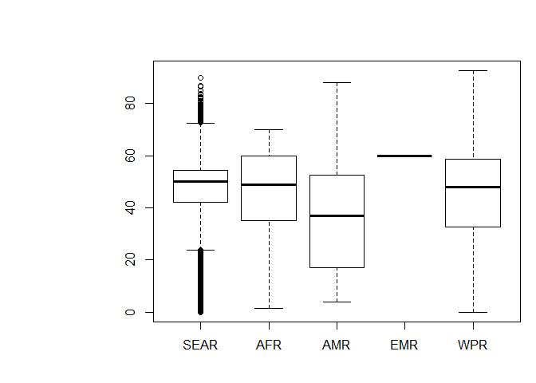
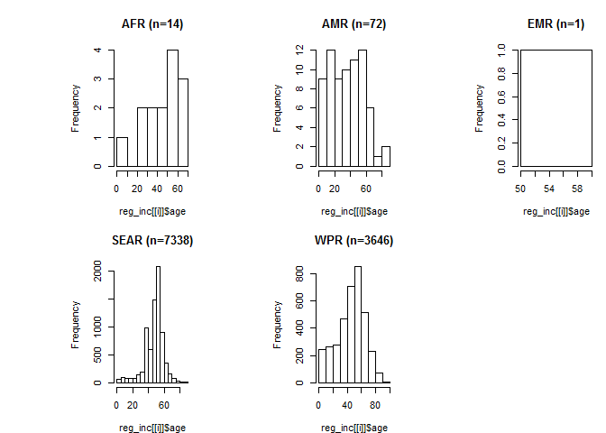

melioidosis-daly.R
================
Bdevleesschauwer
Sun Aug 26 19:22:25 2018

# Settings

``` r
## required packages
library(bd)
library(FERG2015)
library(ggplot2)
library(ggrepel)
library(mc2d)
library(prevalence)

## simulations
set.seed(264)
n <- 1e5
```

# Load simulations

``` r
## incidence, mortality, by country
source("read-inc-mrt-median.R")
```

    ## 'data.frame':    92 obs. of  7 variables:
    ##  $ Country.name: chr  "East_Asia_and_Pacific" "Indonesia" "Vietnam" "Phillipines" ...
    ##  $ X__1        : chr  "Predicted_Incidence" "20038" "10430" "9116" ...
    ##  $ X__2        : chr  "Lower_Limit_PI" "7859" "4097" "4819" ...
    ##  $ X__3        : chr  "Upper_Limit_PI" "52812" "27480" "18999" ...
    ##  $ X__4        : chr  "Predicted Mortality" "10224" "4703" "4510" ...
    ##  $ X__5        : chr  "Lower_Limit_PM" "3944" "1827" "2369" ...
    ##  $ X__6        : chr  "Upper_Limit_PM" "27524" "12631" "9739" ...
    ## 'data.frame':    83 obs. of  7 variables:
    ##  $ COUNTRY: chr  "Indonesia" "Vietnam" "Phillipines" "Thailand" ...
    ##  $ INC    : chr  "20038" "10430" "9116" "7572" ...
    ##  $ INC.LW : chr  "7859" "4097" "4819" "3396" ...
    ##  $ INC.UP : chr  "52812" "27480" "18999" "17685" ...
    ##  $ MRT    : chr  "10224" "4703" "4510" "2838" ...
    ##  $ MRT.LW : chr  "3944" "1827" "2369" "1259" ...
    ##  $ MRT.UP : chr  "27524" "12631" "9739" "6678" ...

``` r
INC_sim <- INC_sim[, !is.na(colnames(INC_sim))]
MRT_sim <- MRT_sim[, !is.na(colnames(MRT_sim))]

knitr::kable(t(apply(INC_sim, 2, mean_ci)), digits = 0)
```

|                                    |  mean |  2.5% |  97.5% |
| ---------------------------------- | ----: | ----: | -----: |
| Indonesia                          | 23520 |  6124 |  52505 |
| Viet Nam                           | 12243 |  3191 |  27320 |
| Philippines                        | 10226 |  4234 |  18829 |
| Thailand                           |  8636 |  2858 |  17565 |
| China                              |  7924 |  2795 |  15672 |
| Myanmar                            |  7161 |  2085 |  15316 |
| Cambodia                           |  2451 |   656 |   5416 |
| Malaysia                           |  2062 |   554 |   4551 |
| Lao People’s Democratic Republic   |   489 |   136 |   1065 |
| Singapore                          |   338 |    45 |    922 |
| Australia                          |   178 |    41 |    415 |
| Papua New Guinea                   |   148 |    37 |    338 |
| Brunei Darussalam                  |    33 |    10 |     71 |
| Timor-Leste                        |    13 |     2 |     35 |
| Fiji                               |     5 |     1 |     14 |
| India                              | 59769 | 18862 | 123900 |
| Bangladesh                         | 19039 |  6781 |  37500 |
| Sri Lanka                          |  2106 |   625 |   4472 |
| Nepal                              |  1046 |   269 |   2347 |
| Pakistan                           |   571 |    49 |   1720 |
| Bhutan                             |    16 |     3 |     42 |
| Nigeria                            | 16140 |  3542 |  38229 |
| Guinea                             |  1619 |   365 |   3807 |
| Côte d’Ivoire                      |  1390 |   286 |   3355 |
| Benin                              |  1102 |   253 |   2569 |
| Madagascar                         |  1051 |   241 |   2455 |
| Burkina Faso                       |   785 |   115 |   2092 |
| Sierra Leone                       |   718 |   155 |   1708 |
| Mali                               |   726 |   113 |   1903 |
| Cameroon                           |   661 |   112 |   1695 |
| Liberia                            |   532 |   109 |   1285 |
| Chad                               |   510 |    60 |   1425 |
| Ghana                              |   502 |    53 |   1441 |
| Niger                              |   467 |    46 |   1372 |
| United Republic of Tanzania        |   371 |    54 |    989 |
| Congo                              |   311 |    75 |    715 |
| Ethiopia                           |   321 |    41 |    882 |
| Mozambique                         |   292 |    44 |    773 |
| Democratic Republic of the Congo   |   276 |    33 |    769 |
| Malawi                             |   262 |    53 |    635 |
| Togo                               |   191 |    30 |    499 |
| Central African Republic           |   170 |    33 |    422 |
| Zambia                             |   138 |    19 |    372 |
| Guinea-Bissau                      |   125 |    16 |    343 |
| Kenya                              |   123 |    18 |    326 |
| Somalia                            |    88 |     9 |    254 |
| Sudan                              |    80 |     6 |    248 |
| Senegal                            |    79 |     6 |    248 |
| Gabon                              |    54 |    12 |    127 |
| South Sudan                        |    47 |     6 |    131 |
| Uganda                             |    40 |     2 |    131 |
| Angola                             |    38 |     3 |    116 |
| South Africa                       |    35 |     4 |    103 |
| Mauritania                         |    36 |     3 |    110 |
| Eritrea                            |    34 |     3 |    101 |
| Gambia                             |    10 |     1 |     33 |
| Zimbabwe                           |     9 |     1 |     28 |
| Equatorial Guinea                  |     7 |     2 |     17 |
| Mauritius                          |     6 |     1 |     18 |
| Brazil                             |  1090 |   162 |   2892 |
| Mexico                             |   666 |   112 |   1710 |
| Colombia                           |   190 |    30 |    495 |
| El Salvador                        |   130 |    32 |    296 |
| Venezuela (Bolivarian Republic of) |   124 |    23 |    311 |
| Honduras                           |   103 |    17 |    264 |
| Panama                             |    78 |    19 |    179 |
| Guatemala                          |    79 |    15 |    197 |
| Nicaragua                          |    77 |    14 |    196 |
| Peru                               |    48 |     7 |    128 |
| Haiti                              |    30 |     3 |     86 |
| Cuba                               |    27 |     2 |     89 |
| Argentina                          |    24 |     2 |     75 |
| Costa Rica                         |    19 |     3 |     49 |
| Suriname                           |    16 |     3 |     39 |
| Paraguay                           |    18 |     1 |     59 |
| Bolivia (Plurinational State of)   |    17 |     2 |     49 |
| Guyana                             |    14 |     2 |     36 |
| Yemen                              |   119 |    21 |    302 |
| Saudi Arabia                       |    67 |     7 |    197 |
| Iraq                               |    33 |     1 |    128 |
| Iran (Islamic Republic of)         |    21 |     1 |     73 |
| Oman                               |     7 |     1 |     19 |

``` r
knitr::kable(t(mean_ci(rowSums(INC_sim))), digits = 0)
```

|   mean |   2.5% |  97.5% |
| -----: | -----: | -----: |
| 190322 | 131346 | 267195 |

``` r
knitr::kable(t(apply(MRT_sim, 2, mean_ci)), digits = 0)
```

|                                    |  mean |  2.5% | 97.5% |
| ---------------------------------- | ----: | ----: | ----: |
| Indonesia                          | 12095 |  3024 | 27480 |
| Viet Nam                           |  5562 |  1400 | 12610 |
| Philippines                        |  5126 |  2025 |  9644 |
| Thailand                           |  3241 |  1056 |  6633 |
| China                              |  2913 |  1015 |  5793 |
| Myanmar                            |  4252 |  1184 |  9254 |
| Cambodia                           |  1356 |   355 |  3023 |
| Malaysia                           |   609 |   163 |  1344 |
| Lao People’s Democratic Republic   |   299 |    85 |   646 |
| Singapore                          |    60 |     6 |   174 |
| Australia                          |    42 |    10 |    98 |
| Papua New Guinea                   |    92 |    21 |   214 |
| Brunei Darussalam                  |    10 |     3 |    21 |
| Timor-Leste                        |     8 |     1 |    22 |
| Fiji                               |     2 |     0 |     6 |
| India                              | 35971 | 11155 | 75098 |
| Bangladesh                         | 10720 |  3684 | 21457 |
| Sri Lanka                          |   697 |   201 |  1497 |
| Nepal                              |   586 |   140 |  1353 |
| Pakistan                           |   343 |    26 |  1061 |
| Bhutan                             |    10 |     2 |    24 |
| Nigeria                            |  9999 |  2139 | 23820 |
| Guinea                             |  1007 |   211 |  2416 |
| Côte d’Ivoire                      |   854 |   175 |  2066 |
| Benin                              |   683 |   150 |  1617 |
| Madagascar                         |   642 |   140 |  1522 |
| Burkina Faso                       |   485 |    66 |  1315 |
| Sierra Leone                       |   449 |    90 |  1094 |
| Mali                               |   450 |    66 |  1199 |
| Cameroon                           |   407 |    62 |  1072 |
| Liberia                            |   331 |    65 |   813 |
| Chad                               |   316 |    35 |   900 |
| Ghana                              |   307 |    32 |   889 |
| Niger                              |   285 |    24 |   858 |
| United Republic of Tanzania        |   224 |    30 |   609 |
| Congo                              |   195 |    44 |   455 |
| Ethiopia                           |   197 |    21 |   568 |
| Mozambique                         |   178 |    23 |   490 |
| Democratic Republic of the Congo   |   169 |    18 |   484 |
| Malawi                             |   162 |    30 |   406 |
| Togo                               |   118 |    18 |   312 |
| Central African Republic           |   105 |    19 |   265 |
| Zambia                             |    85 |    10 |   239 |
| Guinea-Bissau                      |    78 |     9 |   220 |
| Kenya                              |    75 |    10 |   204 |
| Somalia                            |    54 |     5 |   161 |
| Sudan                              |    48 |     3 |   154 |
| Senegal                            |    49 |     3 |   160 |
| Gabon                              |    33 |     8 |    77 |
| South Sudan                        |    28 |     3 |    81 |
| Uganda                             |    24 |     1 |    84 |
| Angola                             |    23 |     1 |    74 |
| South Africa                       |    20 |     2 |    62 |
| Mauritania                         |    22 |     2 |    69 |
| Eritrea                            |    20 |     1 |    62 |
| Gambia                             |     6 |     0 |    22 |
| Zimbabwe                           |     5 |     0 |    17 |
| Equatorial Guinea                  |     5 |     1 |    11 |
| Mauritius                          |     2 |     0 |     7 |
| Brazil                             |   423 |    63 |  1122 |
| Mexico                             |   261 |    44 |   671 |
| Colombia                           |    78 |    12 |   205 |
| El Salvador                        |    52 |    13 |   119 |
| Venezuela (Bolivarian Republic of) |    48 |     9 |   121 |
| Honduras                           |    47 |     6 |   126 |
| Panama                             |    32 |     8 |    75 |
| Guatemala                          |    40 |     7 |   100 |
| Nicaragua                          |    36 |     6 |    91 |
| Peru                               |    20 |     3 |    55 |
| Haiti                              |    18 |     1 |    56 |
| Cuba                               |     7 |     0 |    23 |
| Argentina                          |     9 |     1 |    29 |
| Costa Rica                         |     6 |     1 |    16 |
| Suriname                           |     7 |     2 |    17 |
| Paraguay                           |     7 |     0 |    27 |
| Bolivia (Plurinational State of)   |     9 |     1 |    28 |
| Guyana                             |     7 |     1 |    18 |
| Yemen                              |    71 |    12 |   182 |
| Saudi Arabia                       |    21 |     2 |    61 |
| Iraq                               |    17 |     0 |    67 |
| Iran (Islamic Republic of)         |     9 |     0 |    30 |
| Oman                               |     3 |     1 |     6 |

``` r
knitr::kable(t(mean_ci(rowSums(MRT_sim))), digits = 0)
```

|   mean |  2.5% |  97.5% |
| -----: | ----: | -----: |
| 103363 | 70105 | 147774 |

``` r
## age-sex distributions, by region
source("sim-age.R")
```

<!-- --><!-- --><!-- --><!-- --><!-- -->

``` r
str(reg_inc)
```

    ## List of 5
    ##  $ AFR :'data.frame':    14 obs. of  2 variables:
    ##   ..$ age: num [1:14] 60 70 57 58 29 29 52 45 40 1.33 ...
    ##   ..$ sex: logi [1:14] TRUE TRUE TRUE TRUE TRUE TRUE ...
    ##  $ AMR :'data.frame':    72 obs. of  2 variables:
    ##   ..$ age: num [1:72] 50 35 17 36 32 7 88 27 42 46 ...
    ##   ..$ sex: logi [1:72] TRUE TRUE TRUE TRUE TRUE FALSE ...
    ##  $ EMR :'data.frame':    1 obs. of  2 variables:
    ##   ..$ age: num 60
    ##   ..$ sex: logi TRUE
    ##  $ SEAR:'data.frame':    7338 obs. of  2 variables:
    ##   ..$ age: num [1:7338] 45 47 42 58 62 48 55 65 45 52 ...
    ##   ..$ sex: logi [1:7338] TRUE TRUE TRUE TRUE FALSE TRUE ...
    ##  $ WPR :'data.frame':    3646 obs. of  2 variables:
    ##   ..$ age: num [1:3646] 53 53 48.8 51.8 56.7 ...
    ##   ..$ sex: logi [1:3646] TRUE TRUE TRUE TRUE TRUE TRUE ...

``` r
str(reg_mrt)
```

    ## List of 5
    ##  $ AFR :'data.frame':    4 obs. of  2 variables:
    ##   ..$ age: num [1:4] 52 45 40 62
    ##   ..$ sex: logi [1:4] TRUE TRUE FALSE FALSE
    ##  $ AMR :'data.frame':    26 obs. of  2 variables:
    ##   ..$ age: num [1:26] 50 35 58 44 53 17 44 38 55 11 ...
    ##   ..$ sex: logi [1:26] TRUE TRUE TRUE TRUE TRUE TRUE ...
    ##  $ EMR :'data.frame':    1 obs. of  2 variables:
    ##   ..$ age: num 60
    ##   ..$ sex: logi TRUE
    ##  $ SEAR:'data.frame':    2301 obs. of  2 variables:
    ##   ..$ age: num [1:2301] 47 42 62 65 55 42 63 50 61.1 61.1 ...
    ##   ..$ sex: logi [1:2301] TRUE TRUE FALSE TRUE TRUE TRUE ...
    ##  $ WPR :'data.frame':    962 obs. of  2 variables:
    ##   ..$ age: num [1:962] 62.9518 51.3842 58.8574 56.373 0.0356 ...
    ##   ..$ sex: logi [1:962] TRUE FALSE TRUE TRUE FALSE TRUE ...

``` r
## residual life expectancy, by region
load("rle-sim.RData")
str(RLE_WHO)
```

    ##  num [1:100000, 1:5] 43.8 37.3 39.7 41.5 51 ...

``` r
str(RLE_GBD)
```

    ##  num [1:100000, 1:5] 32.2 35.1 32.9 32.9 37.4 ...

``` r
## local life expectancy, by country
load("lle-sim.RData")
str(lle_sim)
```

    ##  num [1:100000, 1:82] 26.9 26.3 26.3 26.6 26.6 ...
    ##  - attr(*, "dimnames")=List of 2
    ##   ..$ : NULL
    ##   ..$ : chr [1:82] "Indonesia" "Viet Nam" "Philippines" "Thailand" ...

<!-- -->

# Years of Life Lost

``` r
## YLL / MRT

reg_id <-
  match(
    FERG2015:::crpop_2015$WHORegion[
      match(colnames(MRT_sim), FERG2015:::crpop_2015$Country)],
    names(reg_mrt))

YLL_WHO <- MRT_sim * RLE_WHO[, reg_id]
mean_ci(rowSums(YLL_WHO))
```

    ##    mean    2.5%   97.5% 
    ## 4584801 3112378 6544812

``` r
YLL_GBD <- MRT_sim * RLE_GBD[, reg_id]
mean_ci(rowSums(YLL_GBD))
```

    ##    mean    2.5%   97.5% 
    ## 4042114 2744746 5777695

# Years Lived with Disability

``` r
dismod <- readxl("../02_data/20180815/MEL_dismod_15-8-18.xlsx", "main")
dismod_tx <- readxl("../02_data/20180815/MEL_dismod_15-8-18.xlsx", "tx")
dismod_pi <- readxl("../02_data/20180815/MEL_dismod_15-8-18.xlsx", "pi")

p_seq <- p_seq_pi <-
YLDcase <- YLDcase_pi_nd <-
  matrix(nrow = n, ncol = nrow(dismod))
colnames(p_seq) <- colnames(p_seq_pi) <-
colnames(YLDcase) <- colnames(YLDcase_pi_nd) <-
  abbreviate(gsub("\\(.*", "", dismod$HS), 10)

for (i in seq(nrow(dismod))) {
  p <- rbeta(n, dismod[i, "X"], dismod[i, "N"] - dismod[i, "X"])
  dw <- FERG2015:::sim_mean(
          n, unlist(dismod[i, c("DW.lwr", "DW", "DW.upr")]), "PROB")
  durs <- rgamma2(n, dismod[i, "DURS"], dismod[i, "DURS.sd"]) / 365
  durh <- rgamma2(n, dismod[i, "DURH"], dismod[i, "DURH.sd"]) / 365

  p_pi <- rbeta(n, dismod_pi[i, "X"], dismod_pi[i, "N"] - dismod_pi[i, "X"])
  dw_pi <- FERG2015:::sim_mean(
             n, unlist(dismod_pi[i, c("DW.lwr", "DW", "DW.upr")]), "PROB")

  p_seq[, i] <- p
  p_seq_pi[, i] <- p_pi

  YLDcase[, i] <- p * dw * (durs + durh)
  YLDcase_pi_nd[, i] <- p * p_pi * dw_pi
}

knitr::kable(t(apply(p_seq, 2, mean_ci)))
```

|            |      mean |      2.5% |     97.5% |
| ---------- | --------: | --------: | --------: |
| Septicshck | 0.1209941 | 0.1141098 | 0.1281121 |
| SpsswthtSS | 0.1801952 | 0.1720663 | 0.1884446 |
| Pneumonia  | 0.3570653 | 0.3478246 | 0.3663774 |
| CNSinfectn | 0.0160771 | 0.0136875 | 0.0186459 |
| Abscsintr- | 0.1832462 | 0.1752278 | 0.1914151 |
| Msclskltli | 0.0818638 | 0.0765389 | 0.0874223 |
| Urntrctinf | 0.0665139 | 0.0617155 | 0.0715068 |
| Parotitis  | 0.0228888 | 0.0200225 | 0.0259453 |
| SSTI       | 0.1261096 | 0.1195758 | 0.1327852 |
| Other      | 0.0260358 | 0.0229791 | 0.0292934 |

``` r
knitr::kable(t(apply(p_seq_pi, 2, mean_ci)))
```

|            |      mean |      2.5% |     97.5% |
| ---------- | --------: | --------: | --------: |
| Septicshck | 0.1665265 | 0.0050687 | 0.5223500 |
| SpsswthtSS | 0.1660721 | 0.0051489 | 0.5214613 |
| Pneumonia  | 0.0000000 | 0.0000000 | 0.0000000 |
| CNSinfectn | 0.3620057 | 0.2447683 | 0.4887149 |
| Abscsintr- | 0.0000000 | 0.0000000 | 0.0000000 |
| Msclskltli | 0.4066093 | 0.3406742 | 0.4744329 |
| Urntrctinf | 0.0000000 | 0.0000000 | 0.0000000 |
| Parotitis  | 0.0000000 | 0.0000000 | 0.0000000 |
| SSTI       | 0.0000000 | 0.0000000 | 0.0000000 |
| Other      | 0.0000000 | 0.0000000 | 0.0000000 |

``` r
knitr::kable(t(apply(YLDcase, 2, mean_ci)))
```

|            |      mean |      2.5% |     97.5% |
| ---------- | --------: | --------: | --------: |
| Septicshck | 0.0049250 | 0.0004610 | 0.0150386 |
| SpsswthtSS | 0.0018450 | 0.0002842 | 0.0050365 |
| Pneumonia  | 0.0041972 | 0.0006763 | 0.0112510 |
| CNSinfectn | 0.0013875 | 0.0000153 | 0.0063400 |
| Abscsintr- | 0.0058119 | 0.0000008 | 0.0400289 |
| Msclskltli | 0.0035850 | 0.0000029 | 0.0221441 |
| Urntrctinf | 0.0012489 | 0.0001331 | 0.0041743 |
| Parotitis  | 0.0001999 | 0.0000135 | 0.0007953 |
| SSTI       | 0.0006414 | 0.0000291 | 0.0038994 |
| Other      | 0.0004914 | 0.0000730 | 0.0015767 |

``` r
knitr::kable(t(mean_ci(rowSums(YLDcase))))
```

|      mean |      2.5% |    97.5% |
| --------: | --------: | -------: |
| 0.0243333 | 0.0090374 | 0.064161 |

``` r
## Pr(survival)

p_surv <- 1 - apply(MRT_sim, 2, sort) / apply(INC_sim, 2, sort)
knitr::kable(t(apply(p_surv, 2, mean_ci)))
```

|                                    |      mean |      2.5% |     97.5% |
| ---------------------------------- | --------: | --------: | --------: |
| Indonesia                          | 0.4894527 | 0.4765875 | 0.5056936 |
| Viet Nam                           | 0.5485945 | 0.5385208 | 0.5607057 |
| Philippines                        | 0.5017127 | 0.4878309 | 0.5212527 |
| Thailand                           | 0.6255544 | 0.6223359 | 0.6303470 |
| China                              | 0.6330471 | 0.6304186 | 0.6369662 |
| Myanmar                            | 0.4104181 | 0.3957707 | 0.4321695 |
| Cambodia                           | 0.4486829 | 0.4421982 | 0.4593066 |
| Malaysia                           | 0.7050463 | 0.7047594 | 0.7055174 |
| Lao People’s Democratic Republic   | 0.3860171 | 0.3747633 | 0.3933773 |
| Singapore                          | 0.8313601 | 0.8114294 | 0.8658079 |
| Australia                          | 0.7656668 | 0.7645143 | 0.7679059 |
| Papua New Guinea                   | 0.3859327 | 0.3665938 | 0.4191200 |
| Brunei Darussalam                  | 0.6872754 | 0.6591765 | 0.7042829 |
| Timor-Leste                        | 0.3943985 | 0.3712087 | 0.4394384 |
| Fiji                               | 0.5558803 | 0.5302584 | 0.5675486 |
| India                              | 0.3997785 | 0.3939529 | 0.4089964 |
| Bangladesh                         | 0.4398578 | 0.4280388 | 0.4570574 |
| Sri Lanka                          | 0.6705141 | 0.6654365 | 0.6779354 |
| Nepal                              | 0.4465960 | 0.4238278 | 0.4799694 |
| Pakistan                           | 0.4142297 | 0.3821555 | 0.4714471 |
| Bhutan                             | 0.3864424 | 0.3088850 | 0.4281985 |
| Nigeria                            | 0.3828158 | 0.3763170 | 0.3944246 |
| Guinea                             | 0.3849895 | 0.3651634 | 0.4201034 |
| Côte d’Ivoire                      | 0.3858734 | 0.3842628 | 0.3882083 |
| Benin                              | 0.3841732 | 0.3709204 | 0.4062459 |
| Madagascar                         | 0.3944581 | 0.3800454 | 0.4183675 |
| Burkina Faso                       | 0.3903787 | 0.3714023 | 0.4251767 |
| Sierra Leone                       | 0.3828337 | 0.3600857 | 0.4187299 |
| Mali                               | 0.3862256 | 0.3700941 | 0.4150965 |
| Cameroon                           | 0.3958628 | 0.3682148 | 0.4466464 |
| Liberia                            | 0.3814027 | 0.3677215 | 0.4025013 |
| Chad                               | 0.3893931 | 0.3691162 | 0.4261966 |
| Ghana                              | 0.3922529 | 0.3829259 | 0.4075486 |
| Niger                              | 0.4053102 | 0.3748833 | 0.4617264 |
| United Republic of Tanzania        | 0.4050156 | 0.3837173 | 0.4440694 |
| Congo                              | 0.3791751 | 0.3628191 | 0.4070286 |
| Ethiopia                           | 0.4074520 | 0.3575447 | 0.4988819 |
| Mozambique                         | 0.4027893 | 0.3660626 | 0.4689365 |
| Democratic Republic of the Congo   | 0.3988322 | 0.3715637 | 0.4490893 |
| Malawi                             | 0.3928674 | 0.3612515 | 0.4426545 |
| Togo                               | 0.3872110 | 0.3748560 | 0.4101451 |
| Central African Republic           | 0.3908622 | 0.3719280 | 0.4227368 |
| Zambia                             | 0.4018076 | 0.3574613 | 0.4831098 |
| Guinea-Bissau                      | 0.3940329 | 0.3612650 | 0.4547002 |
| Kenya                              | 0.4026769 | 0.3736837 | 0.4562962 |
| Somalia                            | 0.3960134 | 0.3647149 | 0.4495600 |
| Sudan                              | 0.4225381 | 0.3800556 | 0.5042354 |
| Senegal                            | 0.4079861 | 0.3520903 | 0.5169610 |
| Gabon                              | 0.3789114 | 0.3528779 | 0.3933410 |
| South Sudan                        | 0.4338254 | 0.3806923 | 0.5281141 |
| Uganda                             | 0.4476938 | 0.3621804 | 0.6188409 |
| Angola                             | 0.4171533 | 0.3605518 | 0.5216125 |
| South Africa                       | 0.4617357 | 0.3970400 | 0.5729292 |
| Mauritania                         | 0.3906264 | 0.3710693 | 0.4237766 |
| Eritrea                            | 0.4572614 | 0.3839889 | 0.5816170 |
| Gambia                             | 0.5078859 | 0.3375080 | 0.7834584 |
| Zimbabwe                           | 0.4443143 | 0.3899860 | 0.5413652 |
| Equatorial Guinea                  | 0.3643350 | 0.3494100 | 0.3880658 |
| Mauritius                          | 0.6322080 | 0.6086148 | 0.6728076 |
| Brazil                             | 0.6118083 | 0.6114524 | 0.6120903 |
| Mexico                             | 0.6070833 | 0.6050904 | 0.6079846 |
| Colombia                           | 0.5944226 | 0.5856212 | 0.6117390 |
| El Salvador                        | 0.6018187 | 0.5969933 | 0.6101497 |
| Venezuela (Bolivarian Republic of) | 0.6118035 | 0.6108968 | 0.6133580 |
| Honduras                           | 0.5570263 | 0.5210795 | 0.6198823 |
| Panama                             | 0.5871742 | 0.5808587 | 0.5971209 |
| Guatemala                          | 0.4995069 | 0.4922153 | 0.5124086 |
| Nicaragua                          | 0.5407842 | 0.5357356 | 0.5496791 |
| Peru                               | 0.5926143 | 0.5710190 | 0.6326978 |
| Haiti                              | 0.4222276 | 0.3475001 | 0.5464876 |
| Cuba                               | 0.7528988 | 0.7415803 | 0.7780505 |
| Argentina                          | 0.6141898 | 0.6132373 | 0.6162891 |
| Costa Rica                         | 0.6726177 | 0.6694735 | 0.6745619 |
| Suriname                           | 0.5595941 | 0.5502866 | 0.5650433 |
| Paraguay                           | 0.6257716 | 0.5435632 | 0.7804447 |
| Bolivia (Plurinational State of)   | 0.4548656 | 0.4293962 | 0.5026759 |
| Guyana                             | 0.4769033 | 0.4303783 | 0.5015135 |
| Yemen                              | 0.4056535 | 0.3980051 | 0.4193891 |
| Saudi Arabia                       | 0.6927879 | 0.6903219 | 0.6968465 |
| Iraq                               | 0.4777854 | 0.4725588 | 0.4914150 |
| Iran (Islamic Republic of)         | 0.6066521 | 0.5878750 | 0.6467091 |
| Oman                               | 0.6330641 | 0.5249506 | 0.6858870 |

``` r
median(colMeans(p_surv))
```

    ## [1] 0.4368416

``` r
median(colMeans(lle_sim))
```

    ## [1] 27.7049

``` r
## YLD ABtx = YLDcase_tx * Pr(survival)

p_tx <- 1
dw_tx <-
  FERG2015:::sim_mean(
    n, unlist(dismod_tx[1, c("DW.lwr", "DW", "DW.upr")]), "PROB")
dur_tx <-
  rgamma2(n,
          dismod_tx[1, "DUR_Oral_Abx"],
          dismod_tx[1, "DUR_Oral_Abx.sd"]) / 365

YLDcase_tx <- p_surv * (p_tx * dw_tx * dur_tx)


## YLD post-infectious = YLDcase_pi_nd * local LE * Pr(survival)

YLDcase_pi <- array(dim = c(n, ncol(INC_sim), ncol(YLDcase_pi_nd)))

for (i in seq(ncol(YLDcase_pi_nd))) {
  YLDcase_pi[, , i] <- p_surv * lle_sim * YLDcase_pi_nd[, i]
}

YLDcase_pi_sum <- apply(YLDcase_pi, 1:2, sum)
YLDcase_pi_mean <- apply(YLDcase_pi, 2:3, mean)
rowSums(YLDcase_pi_mean)
```

    ##  [1] 0.22840382 0.33076782 0.25769353 0.34724937 0.37174602 0.19136707
    ##  [7] 0.23456590 0.40534721 0.19737360 0.55707344 0.52006451 0.19470750
    ## [13] 0.41146236 0.18883390 0.28709835 0.19483522 0.22912460 0.36009068
    ## [19] 0.21535775 0.06767064 0.20172426 0.15901657 0.17472554 0.15884774
    ## [25] 0.18700962 0.19291129 0.17876049 0.15301928 0.17647037 0.18122364
    ## [31] 0.17722164 0.17157352 0.18296105 0.18966460 0.19930328 0.18684707
    ## [37] 0.20489622 0.18281003 0.18974351 0.18712990 0.17557580 0.16271107
    ## [43] 0.19100677 0.17697515 0.20472165 0.05777342 0.06762514 0.19969434
    ## [49] 0.19193821 0.19863163 0.21000038 0.20165054 0.19815263 0.18998909
    ## [55] 0.21319155 0.23231791 0.20091937 0.16993174 0.34682062 0.43839044
    ## [61] 0.45769838 0.42756377 0.41991731 0.43032980 0.40586740 0.45192487
    ## [67] 0.35604129 0.39427113 0.42847040 0.26574924 0.57866626 0.44146645
    ## [73] 0.52170711 0.37014436 0.44903255 0.31841005 0.29630960 0.05876566
    ## [79] 0.11262839 0.07249669 0.10747552 0.11343901

``` r
## multiply INC * YLDcase

YLD <- INC_sim * rowSums(YLDcase)
YLD_tx <- INC_sim * YLDcase_tx
YLD_pi <- INC_sim * YLDcase_pi_sum
YLD_all <- YLD + YLD_tx + YLD_pi

knitr::kable(
  rbind(
    YLD.sym = mean_ci(rowSums(YLD)),
    YLD.tx = mean_ci(rowSums(YLD_tx)),
    YLD.pi = mean_ci(rowSums(YLD_pi)),
    YLD.all = mean_ci(rowSums(YLD_all))))
```

|         |      mean |       2.5% |     97.5% |
| ------- | --------: | ---------: | --------: |
| YLD.sym |  4630.935 |  1577.4187 | 12641.558 |
| YLD.tx  |  1523.038 |   515.1788 |  3295.489 |
| YLD.pi  | 44384.762 | 18074.3190 | 90167.078 |
| YLD.all | 50538.735 | 22765.3598 | 97853.432 |

``` r
## .. contributions of the 3 groups
knitr::kable(
  rbind(
    sympt = mean_ci(rowSums(YLD) / rowSums(YLD_all)),
    tx = mean_ci(rowSums(YLD_tx) / rowSums(YLD_all)),
    pi = mean_ci(rowSums(YLD_pi) / rowSums(YLD_all))))
```

|       |      mean |      2.5% |     97.5% |
| ----- | --------: | --------: | --------: |
| sympt | 0.0987166 | 0.0297198 | 0.2549705 |
| tx    | 0.0335251 | 0.0095646 | 0.0805190 |
| pi    | 0.8677583 | 0.7023042 | 0.9520415 |

# Disability-Adjusted Life Years

``` r
DALY_WHO <- YLL_WHO + YLD_all
DALY_GBD <- YLL_GBD + YLD_all

## regional estimates
pop <- pop[!is.na(pop$region), ]
region <- pop$region  # define regional grouping
reg <- levels(region)
nreg <- length(reg)

DALY_WHO_reg <-
  DALY_GBD_reg <-
  YLL_WHO_reg <-
  YLL_GBD_reg <-
  YLD_reg <-
  matrix(0, nrow = n, ncol = nreg)

colnames(DALY_WHO_reg) <-
  colnames(DALY_GBD_reg) <-
  colnames(YLL_WHO_reg) <-
  colnames(YLL_GBD_reg) <-
  colnames(YLD_reg) <-
  reg

for (i in seq(nreg)) {
  DALY_WHO_reg[, i] <-
    rowSums(DALY_WHO[, region == reg[i]], na.rm = TRUE)
  DALY_GBD_reg[, i] <-
    rowSums(DALY_GBD[, region == reg[i]], na.rm = TRUE)
  YLL_WHO_reg[, i] <-
    rowSums(YLL_WHO[, region == reg[i]], na.rm = TRUE)
  YLL_GBD_reg[, i] <-
    rowSums(YLL_GBD[, region == reg[i]], na.rm = TRUE)
  YLD_reg[, i] <-
    rowSums(YLD_all[, region == reg[i]], na.rm = TRUE)
}


## global estimates
DALY_WHO_glo <- rowSums(DALY_WHO, na.rm = TRUE)
DALY_GBD_glo <- rowSums(DALY_GBD, na.rm = TRUE)
YLL_WHO_glo <- rowSums(YLL_WHO, na.rm = TRUE)
YLL_GBD_glo <- rowSums(YLL_GBD, na.rm = TRUE)
YLD_glo <- rowSums(YLD_all, na.rm = TRUE)


## contribution of top 5 countries
top5 <-
  colnames(DALY_WHO) %in%
  c("India", "Bangladesh", "Viet Nam", "Nigeria", "Indonesia")

mean_ci(rowSums(DALY_WHO[, top5]))
```

    ##    mean    2.5%   97.5% 
    ## 3306932 1890677 5244545

``` r
mean_ci(rowSums(DALY_WHO[, top5]) / DALY_WHO_glo)
```

    ##      mean      2.5%     97.5% 
    ## 0.7048612 0.5766915 0.8091183

``` r
mean_ci(rowSums(DALY_GBD[, top5]))
```

    ##    mean    2.5%   97.5% 
    ## 2915988 1669906 4619590

``` r
mean_ci(rowSums(DALY_GBD[, top5]) / DALY_GBD_glo)
```

    ##      mean      2.5%     97.5% 
    ## 0.7039797 0.5761913 0.8083329

``` r
## convert to rates
DALY_WHO_rt <- t(t(n * DALY_WHO) / pop$pop)
DALY_GBD_rt <- t(t(n * DALY_GBD) / pop$pop)
YLL_WHO_rt <- t(t(n * YLL_WHO) / pop$pop)
YLL_GBD_rt <- t(t(n * YLL_GBD) / pop$pop)
YLD_rt <- t(t(n * YLD_all) / pop$pop)

pop_reg <- as.numeric(tapply(pop$pop, region, sum, na.rm = TRUE))

DALY_WHO_reg_rt <- t(t(n * DALY_WHO_reg) / pop_reg)
DALY_GBD_reg_rt <- t(t(n * DALY_GBD_reg) / pop_reg)
YLL_WHO_reg_rt <- t(t(n * YLL_WHO_reg) / pop_reg)
YLL_GBD_reg_rt <- t(t(n * YLL_GBD_reg) / pop_reg)
YLD_reg_rt <- t(t(n * YLD_reg) / pop_reg)

DALY_WHO_glo_rt <- n * DALY_WHO_glo / sum(pop$pop, na.rm = TRUE)
DALY_GBD_glo_rt <- n * DALY_GBD_glo / sum(pop$pop, na.rm = TRUE)
YLL_WHO_glo_rt <- n * YLL_WHO_glo / sum(pop$pop, na.rm = TRUE)
YLL_GBD_glo_rt <- n * YLL_GBD_glo / sum(pop$pop, na.rm = TRUE)
YLD_glo_rt <- n * YLD_glo / sum(pop$pop, na.rm = TRUE)

## save results
save(YLD_all, YLL_WHO, YLL_GBD, DALY_WHO, DALY_GBD,
     YLD_reg, YLL_WHO_reg, YLL_GBD_reg, DALY_WHO_reg, DALY_GBD_reg,
     YLD_glo, YLL_WHO_glo, YLL_GBD_glo, DALY_WHO_glo, DALY_GBD_glo,
     YLD_rt, YLL_WHO_rt, YLL_GBD_rt, DALY_WHO_rt, DALY_GBD_rt,
     YLD_reg_rt, YLL_WHO_reg_rt, YLL_GBD_reg_rt,
     DALY_WHO_reg_rt, DALY_GBD_reg_rt,
     YLD_glo_rt, YLL_WHO_glo_rt, YLL_GBD_glo_rt,
     DALY_WHO_glo_rt, DALY_GBD_glo_rt,
     file = "mel.RData")
```

# Comorbidities

``` r
como <- readxl("../02_data/20180815/Co-morbidity_Data_15-8-2018.xlsx")
como_sim <-
  with(como,
       mapply(rbeta,
              No_patients,
              Total_patients - No_patients,
              MoreArgs = list(n = n)))
colnames(como_sim) <- como$Co_morbidity
knitr::kable(t(apply(como_sim, 2, mean_ci)))
```

|                        |      mean |      2.5% |     97.5% |
| ---------------------- | --------: | --------: | --------: |
| Diabetes               | 0.4610914 | 0.4518206 | 0.4703851 |
| Liver\_Cirrhosis       | 0.0743042 | 0.0694454 | 0.0792552 |
| CKD                    | 0.0929135 | 0.0877121 | 0.0982505 |
| Chronic\_Lung\_Disease | 0.0335823 | 0.0302938 | 0.0370178 |

``` r
## proportion YLD
como_yld <-
  rbind(
    mean_ci(como_sim[,1] * YLD_glo),
    mean_ci(como_sim[,2] * YLD_glo),
    mean_ci(como_sim[,3] * YLD_glo),
    mean_ci(como_sim[,4] * YLD_glo))
rownames(como_yld) <- como$Co_morbidity
knitr::kable(como_yld)
```

|                        |      mean |       2.5% |     97.5% |
| ---------------------- | --------: | ---------: | --------: |
| Diabetes               | 23302.968 | 10479.4702 | 45116.093 |
| Liver\_Cirrhosis       |  3755.204 |  1685.2111 |  7290.209 |
| CKD                    |  4695.729 |  2107.8643 |  9105.896 |
| Chronic\_Lung\_Disease |  1697.207 |   760.5486 |  3301.946 |

``` r
## proportion YLD per 100k
como_yld_rt <-
  rbind(
    mean_ci(como_sim[,1] * YLD_glo_rt),
    mean_ci(como_sim[,2] * YLD_glo_rt),
    mean_ci(como_sim[,3] * YLD_glo_rt),
    mean_ci(como_sim[,4] * YLD_glo_rt))
rownames(como_yld_rt) <- como$Co_morbidity
knitr::kable(como_yld_rt)
```

|                        |      mean |      2.5% |     97.5% |
| ---------------------- | --------: | --------: | --------: |
| Diabetes               | 0.4237091 | 0.1905442 | 0.8203289 |
| Liver\_Cirrhosis       | 0.0682795 | 0.0306416 | 0.1325551 |
| CKD                    | 0.0853807 | 0.0383265 | 0.1655691 |
| Chronic\_Lung\_Disease | 0.0308597 | 0.0138288 | 0.0600380 |

``` r
## proportion DALY
como_daly <-
  rbind(
    mean_ci(como_sim[,1] * DALY_WHO_glo),
    mean_ci(como_sim[,2] * DALY_WHO_glo),
    mean_ci(como_sim[,3] * DALY_WHO_glo),
    mean_ci(como_sim[,4] * DALY_WHO_glo))
rownames(como_daly) <- como$Co_morbidity
knitr::kable(como_daly)
```

|                        |      mean |      2.5% |     97.5% |
| ---------------------- | --------: | --------: | --------: |
| Diabetes               | 2137296.3 | 1458556.3 | 3044474.7 |
| Liver\_Cirrhosis       |  344426.8 |  233245.7 |  493144.2 |
| CKD                    |  430684.8 |  292468.8 |  616094.7 |
| Chronic\_Lung\_Disease |  155668.1 |  104734.9 |  224348.1 |

``` r
## proportion DALY per 100k
como_daly_rt <-
  rbind(
    mean_ci(como_sim[,1] * DALY_WHO_glo_rt),
    mean_ci(como_sim[,2] * DALY_WHO_glo_rt),
    mean_ci(como_sim[,3] * DALY_WHO_glo_rt),
    mean_ci(como_sim[,4] * DALY_WHO_glo_rt))
rownames(como_daly_rt) <- como$Co_morbidity
knitr::kable(como_daly_rt)
```

|                        |      mean |      2.5% |     97.5% |
| ---------------------- | --------: | --------: | --------: |
| Diabetes               | 38.861650 | 26.520377 | 55.356532 |
| Liver\_Cirrhosis       |  6.262583 |  4.241019 |  8.966655 |
| CKD                    |  7.830980 |  5.317849 | 11.202217 |
| Chronic\_Lung\_Disease |  2.830454 |  1.904356 |  4.079237 |

# MAIN TEXT RESULTS

``` r
## main results
mean_ci(rowSums(DALY_WHO))
```

    ##    mean    2.5%   97.5% 
    ## 4635340 3162134 6596546

``` r
mean_ci(rowSums(DALY_GBD))
```

    ##    mean    2.5%   97.5% 
    ## 4092653 2793647 5828532

``` r
mean_ci(DALY_WHO_glo_rt)
```

    ##      mean      2.5%     97.5% 
    ##  84.28263  57.49589 119.94249

``` r
mean_ci(DALY_GBD_glo_rt)
```

    ##      mean      2.5%     97.5% 
    ##  74.41515  50.79583 105.97799

``` r
## proportion YLL/YLD
mean_ci(rowSums(YLL_WHO) / rowSums(DALY_WHO))
```

    ##      mean      2.5%     97.5% 
    ## 0.9887314 0.9767959 0.9954010

``` r
mean_ci(rowSums(YLD) / rowSums(DALY_WHO))
```

    ##         mean         2.5%        97.5% 
    ## 0.0010327276 0.0003238272 0.0028879937

``` r
mean_ci(rowSums(YLL_GBD) / rowSums(DALY_GBD))
```

    ##      mean      2.5%     97.5% 
    ## 0.9872421 0.9737253 0.9947924

``` r
mean_ci(rowSums(YLD) / rowSums(DALY_GBD))
```

    ##         mean         2.5%        97.5% 
    ## 0.0011693507 0.0003671881 0.0032646530

# TABLE 2 / DALY BY COUNTRY / REGION / GLOBAL

## WHO life expectancy table

``` r
knitr::kable(t(apply(DALY_WHO, 2, mean_ci)), digits = 0)
```

|                                    |    mean |   2.5% |   97.5% |
| ---------------------------------- | ------: | -----: | ------: |
| Indonesia                          |  538474 | 138931 | 1215617 |
| Viet Nam                           |  265532 |  70023 |  596397 |
| Philippines                        |  243601 |  98066 |  455746 |
| Thailand                           |  145944 |  49725 |  295565 |
| China                              |  139970 |  50732 |  275348 |
| Myanmar                            |  188730 |  53653 |  409299 |
| Cambodia                           |   64329 |  17338 |  142501 |
| Malaysia                           |   29479 |   8439 |   64074 |
| Lao People’s Democratic Republic   |   14170 |   4108 |   30500 |
| Singapore                          |    3010 |    456 |    8372 |
| Australia                          |    2063 |    536 |    4697 |
| Papua New Guinea                   |    4344 |   1029 |   10078 |
| Brunei Darussalam                  |     496 |    173 |     995 |
| Timor-Leste                        |     346 |     43 |     966 |
| Fiji                               |     105 |     15 |     285 |
| India                              | 1596701 | 504383 | 3320840 |
| Bangladesh                         |  476801 | 166517 |  948664 |
| Sri Lanka                          |   31511 |   9642 |   66744 |
| Nepal                              |   26056 |   6400 |   59770 |
| Pakistan                           |   11250 |    902 |   34709 |
| Bhutan                             |     436 |     91 |    1057 |
| Nigeria                            |  429426 |  92544 | 1032230 |
| Guinea                             |   43272 |   9225 |  104716 |
| Côte d’Ivoire                      |   36678 |   7611 |   89474 |
| Benin                              |   29381 |   6515 |   70150 |
| Madagascar                         |   27593 |   6099 |   66113 |
| Burkina Faso                       |   20846 |   2929 |   56988 |
| Sierra Leone                       |   19263 |   3910 |   47511 |
| Mali                               |   19348 |   2921 |   51985 |
| Cameroon                           |   17497 |   2738 |   46532 |
| Liberia                            |   14239 |   2833 |   35160 |
| Chad                               |   13563 |   1568 |   38781 |
| Ghana                              |   13194 |   1438 |   38354 |
| Niger                              |   12250 |   1135 |   37009 |
| United Republic of Tanzania        |    9646 |   1346 |   26366 |
| Congo                              |    8361 |   1922 |   19705 |
| Ethiopia                           |    8476 |    950 |   24488 |
| Mozambique                         |    7673 |   1035 |   21190 |
| Democratic Republic of the Congo   |    7271 |    831 |   20868 |
| Malawi                             |    6951 |   1303 |   17601 |
| Togo                               |    5066 |    785 |   13488 |
| Central African Republic           |    4512 |    820 |   11438 |
| Zambia                             |    3664 |    453 |   10320 |
| Guinea-Bissau                      |    3339 |    402 |    9486 |
| Kenya                              |    3214 |    442 |    8826 |
| Somalia                            |    1783 |    174 |    5280 |
| Sudan                              |    1563 |    102 |    5022 |
| Senegal                            |    2116 |    135 |    6930 |
| Gabon                              |    1421 |    333 |    3326 |
| South Sudan                        |    1200 |    131 |    3500 |
| Uganda                             |    1036 |     46 |    3608 |
| Angola                             |     993 |     69 |    3202 |
| South Africa                       |     864 |     72 |    2675 |
| Mauritania                         |     965 |     82 |    2979 |
| Eritrea                            |     853 |     67 |    2682 |
| Gambia                             |     257 |      9 |     944 |
| Zimbabwe                           |     232 |     18 |     736 |
| Equatorial Guinea                  |     196 |     41 |     478 |
| Mauritius                          |     103 |     11 |     306 |
| Brazil                             |   26643 |   4316 |   70304 |
| Mexico                             |   16455 |   3011 |   41952 |
| Colombia                           |    4897 |    807 |   12806 |
| El Salvador                        |    3265 |    828 |    7447 |
| Venezuela (Bolivarian Republic of) |    3028 |    593 |    7584 |
| Honduras                           |    2939 |    442 |    7877 |
| Panama                             |    2033 |    498 |    4689 |
| Guatemala                          |    2486 |    472 |    6232 |
| Nicaragua                          |    2239 |    411 |    5675 |
| Peru                               |    1249 |    175 |    3413 |
| Haiti                              |    1138 |     98 |    3486 |
| Cuba                               |     442 |     34 |    1440 |
| Argentina                          |     577 |     47 |    1812 |
| Costa Rica                         |     402 |     81 |    1001 |
| Suriname                           |     446 |    100 |    1059 |
| Paraguay                           |     464 |     19 |    1680 |
| Bolivia (Plurinational State of)   |     579 |     55 |    1738 |
| Guyana                             |     454 |     90 |    1123 |
| Yemen                              |    2335 |    408 |    5945 |
| Saudi Arabia                       |     685 |     74 |    2002 |
| Iraq                               |     566 |     12 |    2203 |
| Iran (Islamic Republic of)         |     282 |     12 |     983 |
| Oman                               |      85 |     21 |     195 |

``` r
knitr::kable(t(apply(DALY_WHO_reg, 2, mean_ci)), digits = 0)
```

|      |    mean |    2.5% |   97.5% |
| ---- | ------: | ------: | ------: |
| AFR  |  774961 |  399812 | 1402714 |
| AMR  |   69734 |   37147 |  120290 |
| EMR  |   18549 |    6461 |   42350 |
| SEAR | 3004998 | 1678115 | 4865271 |
| WPR  |  767098 |  467400 | 1171176 |

``` r
knitr::kable(t(mean_ci(DALY_WHO_glo)), digits = 0)
```

|    mean |    2.5% |   97.5% |
| ------: | ------: | ------: |
| 4635340 | 3162134 | 6596546 |

``` r
knitr::kable(t(apply(DALY_WHO_rt, 2, mean_ci, na.rm = T)), digits = 3)
```

|                                    |    mean |    2.5% |   97.5% |
| ---------------------------------- | ------: | ------: | ------: |
| Indonesia                          | 208.580 |  53.815 | 470.874 |
| Viet Nam                           | 283.774 |  74.834 | 637.370 |
| Philippines                        | 239.490 |  96.411 | 448.056 |
| Thailand                           | 212.568 |  72.425 | 430.492 |
| China                              |  10.019 |   3.631 |  19.710 |
| Myanmar                            | 360.146 | 102.384 | 781.050 |
| Cambodia                           | 414.554 | 111.731 | 918.314 |
| Malaysia                           |  95.949 |  27.466 | 208.554 |
| Lao People’s Democratic Republic   | 212.635 |  61.645 | 457.687 |
| Singapore                          |  54.383 |   8.236 | 151.249 |
| Australia                          |   8.666 |   2.252 |  19.738 |
| Papua New Guinea                   |  54.855 |  12.996 | 127.246 |
| Brunei Darussalam                  | 118.756 |  41.529 | 238.404 |
| Timor-Leste                        |  27.895 |   3.457 |  77.873 |
| Fiji                               |  11.723 |   1.657 |  31.914 |
| India                              | 121.974 |  38.530 | 253.682 |
| Bangladesh                         | 295.780 | 103.298 | 588.498 |
| Sri Lanka                          | 152.123 |  46.549 | 322.217 |
| Nepal                              |  90.926 |  22.335 | 208.575 |
| Pakistan                           |   5.940 |   0.477 |  18.327 |
| Bhutan                             |  55.436 |  11.559 | 134.192 |
| Nigeria                            | 237.014 |  51.078 | 569.721 |
| Guinea                             | 357.873 |  76.291 | 866.029 |
| Côte d’Ivoire                      | 158.723 |  32.935 | 387.193 |
| Benin                              | 277.811 |  61.605 | 663.294 |
| Madagascar                         | 113.861 |  25.169 | 272.808 |
| Burkina Faso                       | 115.102 |  16.172 | 314.666 |
| Sierra Leone                       | 266.176 |  54.031 | 656.503 |
| Mali                               | 110.764 |  16.724 | 297.603 |
| Cameroon                           |  76.627 |  11.989 | 203.780 |
| Liberia                            | 316.446 |  62.956 | 781.405 |
| Chad                               |  96.816 |  11.191 | 276.824 |
| Ghana                              |  47.834 |   5.212 | 139.049 |
| Niger                              |  61.565 |   5.706 | 186.004 |
| United Republic of Tanzania        |  17.903 |   2.498 |  48.934 |
| Congo                              | 167.364 |  38.472 | 394.437 |
| Ethiopia                           |   8.487 |   0.951 |  24.519 |
| Mozambique                         |  27.394 |   3.694 |  75.651 |
| Democratic Republic of the Congo   |   9.543 |   1.090 |  27.387 |
| Malawi                             |  39.554 |   7.414 | 100.156 |
| Togo                               |  68.300 |  10.587 | 181.858 |
| Central African Republic           |  99.242 |  18.028 | 251.605 |
| Zambia                             |  22.758 |   2.813 |  64.098 |
| Guinea-Bissau                      | 188.605 |  22.722 | 535.783 |
| Kenya                              |   6.805 |   0.935 |  18.685 |
| Somalia                            |  12.823 |   1.251 |  37.964 |
| Sudan                              |   4.045 |   0.265 |  12.994 |
| Senegal                            |  14.127 |   0.901 |  46.272 |
| Gabon                              |  73.632 |  17.271 | 172.293 |
| South Sudan                        |  10.100 |   1.100 |  29.452 |
| Uganda                             |   2.579 |   0.116 |   8.987 |
| Angola                             |   3.564 |   0.247 |  11.495 |
| South Africa                       |   1.562 |   0.130 |   4.838 |
| Mauritania                         |  23.081 |   1.962 |  71.219 |
| Eritrea                            |  17.608 |   1.389 |  55.340 |
| Gambia                             |  13.019 |   0.452 |  47.760 |
| Zimbabwe                           |   1.470 |   0.111 |   4.663 |
| Equatorial Guinea                  |  16.641 |   3.454 |  40.645 |
| Mauritius                          |   8.183 |   0.889 |  24.267 |
| Brazil                             |  12.936 |   2.096 |  34.135 |
| Mexico                             |  13.071 |   2.392 |  33.324 |
| Colombia                           |  10.154 |   1.674 |  26.553 |
| El Salvador                        |  51.719 |  13.114 | 117.976 |
| Venezuela (Bolivarian Republic of) |   9.719 |   1.902 |  24.343 |
| Honduras                           |  32.802 |   4.935 |  87.901 |
| Panama                             |  51.214 |  12.559 | 118.138 |
| Guatemala                          |  15.293 |   2.906 |  38.343 |
| Nicaragua                          |  36.806 |   6.763 |  93.309 |
| Peru                               |   3.979 |   0.557 |  10.876 |
| Haiti                              |  10.629 |   0.913 |  32.548 |
| Cuba                               |   3.859 |   0.296 |  12.565 |
| Argentina                          |   1.329 |   0.108 |   4.173 |
| Costa Rica                         |   8.365 |   1.682 |  20.818 |
| Suriname                           |  80.567 |  18.023 | 191.446 |
| Paraguay                           |   6.987 |   0.293 |  25.297 |
| Bolivia (Plurinational State of)   |   5.397 |   0.509 |  16.204 |
| Guyana                             |  59.015 |  11.717 | 146.169 |
| Yemen                              |   8.673 |   1.517 |  22.087 |
| Saudi Arabia                       |   2.171 |   0.234 |   6.344 |
| Iraq                               |   1.566 |   0.035 |   6.101 |
| Iran (Islamic Republic of)         |   0.355 |   0.016 |   1.239 |
| Oman                               |   2.020 |   0.493 |   4.650 |

``` r
knitr::kable(t(apply(DALY_WHO_reg_rt, 2, mean_ci, na.rm = T)), digits = 3)
```

|      |    mean |   2.5% |   97.5% |
| ---- | ------: | -----: | ------: |
| AFR  |  84.076 | 43.376 | 152.182 |
| AMR  |  12.164 |  6.480 |  20.983 |
| EMR  |   4.415 |  1.538 |  10.081 |
| SEAR | 158.085 | 88.281 | 255.949 |
| WPR  |  45.558 | 27.759 |  69.556 |

``` r
knitr::kable(t(mean_ci(DALY_WHO_glo_rt, na.rm = T)), digits = 3)
```

|   mean |   2.5% |   97.5% |
| -----: | -----: | ------: |
| 84.283 | 57.496 | 119.942 |

## GBD life expectancy table

``` r
knitr::kable(t(apply(DALY_GBD, 2, mean_ci)), digits = 0)
```

|                                    |    mean |   2.5% |   97.5% |
| ---------------------------------- | ------: | -----: | ------: |
| Indonesia                          |  474746 | 123034 | 1069487 |
| Viet Nam                           |  236707 |  62673 |  532059 |
| Philippines                        |  217022 |  87497 |  405650 |
| Thailand                           |  128869 |  44103 |  260223 |
| China                              |  124865 |  45444 |  245541 |
| Myanmar                            |  166330 |  47379 |  360354 |
| Cambodia                           |   57295 |  15485 |  126902 |
| Malaysia                           |   26323 |   7590 |   57163 |
| Lao People’s Democratic Republic   |   12618 |   3656 |   27155 |
| Singapore                          |    2700 |    420 |    7465 |
| Australia                          |    1846 |    486 |    4195 |
| Papua New Guinea                   |    3868 |    919 |    8973 |
| Brunei Darussalam                  |     443 |    156 |     888 |
| Timor-Leste                        |     305 |     38 |     852 |
| Fiji                               |      93 |     13 |     253 |
| India                              | 1407171 | 445518 | 2926398 |
| Bangladesh                         |  420314 | 147112 |  836393 |
| Sri Lanka                          |   27839 |   8580 |   58901 |
| Nepal                              |   22968 |   5668 |   52667 |
| Pakistan                           |    9591 |    775 |   29569 |
| Bhutan                             |     385 |     81 |     930 |
| Nigeria                            |  377051 |  81280 |  907693 |
| Guinea                             |   38018 |   8074 |   92500 |
| Côte d’Ivoire                      |   32205 |   6686 |   78814 |
| Benin                              |   25804 |   5731 |   61689 |
| Madagascar                         |   24240 |   5344 |   58029 |
| Burkina Faso                       |   18303 |   2594 |   50022 |
| Sierra Leone                       |   16915 |   3429 |   41685 |
| Mali                               |   16991 |   2566 |   45728 |
| Cameroon                           |   15369 |   2427 |   40765 |
| Liberia                            |   12507 |   2491 |   31071 |
| Chad                               |   11909 |   1383 |   34125 |
| Ghana                              |   11600 |   1271 |   33771 |
| Niger                              |   10755 |   1003 |   32545 |
| United Republic of Tanzania        |    8474 |   1197 |   23281 |
| Congo                              |    7347 |   1683 |   17405 |
| Ethiopia                           |    7445 |    832 |   21571 |
| Mozambique                         |    6740 |    907 |   18586 |
| Democratic Republic of the Congo   |    6387 |    733 |   18363 |
| Malawi                             |    6105 |   1143 |   15400 |
| Togo                               |    4451 |    685 |   11861 |
| Central African Republic           |    3962 |    723 |   10069 |
| Zambia                             |    3220 |    399 |    9123 |
| Guinea-Bissau                      |    2934 |    355 |    8322 |
| Kenya                              |    2823 |    390 |    7778 |
| Somalia                            |    1520 |    149 |    4498 |
| Sudan                              |    1333 |     88 |    4279 |
| Senegal                            |    1858 |    121 |    6082 |
| Gabon                              |    1249 |    293 |    2942 |
| South Sudan                        |    1055 |    115 |    3078 |
| Uganda                             |     910 |     42 |    3179 |
| Angola                             |     873 |     61 |    2816 |
| South Africa                       |     759 |     64 |    2356 |
| Mauritania                         |     848 |     72 |    2615 |
| Eritrea                            |     750 |     60 |    2356 |
| Gambia                             |     226 |      8 |     831 |
| Zimbabwe                           |     204 |     16 |     646 |
| Equatorial Guinea                  |     172 |     36 |     421 |
| Mauritius                          |      91 |     10 |     269 |
| Brazil                             |   24295 |   3974 |   64029 |
| Mexico                             |   15009 |   2757 |   38204 |
| Colombia                           |    4466 |    740 |   11678 |
| El Salvador                        |    2976 |    759 |    6794 |
| Venezuela (Bolivarian Republic of) |    2761 |    542 |    6875 |
| Honduras                           |    2680 |    407 |    7174 |
| Panama                             |    1854 |    458 |    4283 |
| Guatemala                          |    2265 |    432 |    5675 |
| Nicaragua                          |    2040 |    378 |    5187 |
| Peru                               |    1138 |    161 |    3107 |
| Haiti                              |    1037 |     90 |    3166 |
| Cuba                               |     404 |     32 |    1312 |
| Argentina                          |     526 |     44 |    1657 |
| Costa Rica                         |     367 |     75 |     911 |
| Suriname                           |     406 |     92 |     965 |
| Paraguay                           |     423 |     18 |    1531 |
| Bolivia (Plurinational State of)   |     527 |     50 |    1582 |
| Guyana                             |     413 |     83 |    1020 |
| Yemen                              |    1990 |    350 |    5065 |
| Saudi Arabia                       |     585 |     64 |    1707 |
| Iraq                               |     482 |     11 |    1877 |
| Iran (Islamic Republic of)         |     240 |     11 |     838 |
| Oman                               |      72 |     18 |     166 |

``` r
knitr::kable(t(apply(DALY_GBD_reg, 2, mean_ci)), digits = 0)
```

|      |    mean |    2.5% |   97.5% |
| ---- | ------: | ------: | ------: |
| AFR  |  680547 |  348322 | 1236710 |
| AMR  |   63587 |   33773 |  109767 |
| EMR  |   15814 |    5517 |   36089 |
| SEAR | 2648926 | 1481161 | 4286626 |
| WPR  |  683779 |  416599 | 1042013 |

``` r
knitr::kable(t(mean_ci(DALY_GBD_glo)), digits = 0)
```

|    mean |    2.5% |   97.5% |
| ------: | ------: | ------: |
| 4092653 | 2793647 | 5828532 |

``` r
knitr::kable(t(apply(DALY_GBD_rt, 2, mean_ci, na.rm = T)), digits = 3)
```

|                                    |    mean |   2.5% |   97.5% |
| ---------------------------------- | ------: | -----: | ------: |
| Indonesia                          | 183.894 | 47.658 | 414.269 |
| Viet Nam                           | 252.969 | 66.978 | 568.612 |
| Philippines                        | 213.360 | 86.021 | 398.805 |
| Thailand                           | 187.697 | 64.236 | 379.015 |
| China                              |   8.938 |  3.253 |  17.576 |
| Myanmar                            | 317.401 | 90.411 | 687.650 |
| Cambodia                           | 369.223 | 99.791 | 817.794 |
| Malaysia                           |  85.678 | 24.706 | 186.058 |
| Lao People’s Democratic Republic   | 189.342 | 54.862 | 407.493 |
| Singapore                          |  48.780 |  7.594 | 134.866 |
| Australia                          |   7.755 |  2.043 |  17.627 |
| Papua New Guinea                   |  48.841 | 11.601 | 113.301 |
| Brunei Darussalam                  | 106.030 | 37.298 | 212.635 |
| Timor-Leste                        |  24.583 |  3.069 |  68.678 |
| Fiji                               |  10.448 |  1.494 |  28.370 |
| India                              | 107.495 | 34.034 | 223.551 |
| Bangladesh                         | 260.739 | 91.260 | 518.852 |
| Sri Lanka                          | 134.395 | 41.421 | 284.355 |
| Nepal                              |  80.150 | 19.779 | 183.788 |
| Pakistan                           |   5.064 |  0.409 |  15.614 |
| Bhutan                             |  48.859 | 10.235 | 118.128 |
| Nigeria                            | 208.106 | 44.861 | 500.985 |
| Guinea                             | 314.419 | 66.771 | 765.001 |
| Côte d’Ivoire                      | 139.365 | 28.932 | 341.061 |
| Benin                              | 243.986 | 54.192 | 583.293 |
| Madagascar                         | 100.026 | 22.051 | 239.453 |
| Burkina Faso                       | 101.062 | 14.325 | 276.204 |
| Sierra Leone                       | 233.731 | 47.380 | 575.992 |
| Mali                               |  97.268 | 14.691 | 261.782 |
| Cameroon                           |  67.306 | 10.627 | 178.522 |
| Liberia                            | 277.959 | 55.350 | 690.535 |
| Chad                               |  85.008 |  9.870 | 243.586 |
| Ghana                              |  42.055 |  4.609 | 122.435 |
| Niger                              |  54.055 |  5.041 | 163.566 |
| United Republic of Tanzania        |  15.728 |  2.221 |  43.208 |
| Congo                              | 147.061 | 33.684 | 348.400 |
| Ethiopia                           |   7.455 |  0.833 |  21.599 |
| Mozambique                         |  24.061 |  3.238 |  66.352 |
| Democratic Republic of the Congo   |   8.382 |  0.962 |  24.100 |
| Malawi                             |  34.740 |  6.503 |  87.631 |
| Togo                               |  60.015 |  9.240 | 159.924 |
| Central African Republic           |  87.143 | 15.898 | 221.484 |
| Zambia                             |  19.998 |  2.478 |  56.660 |
| Guinea-Bissau                      | 165.686 | 20.042 | 470.008 |
| Kenya                              |   5.976 |  0.827 |  16.466 |
| Somalia                            |  10.931 |  1.074 |  32.344 |
| Sudan                              |   3.448 |  0.228 |  11.071 |
| Senegal                            |  12.407 |  0.806 |  40.609 |
| Gabon                              |  64.699 | 15.203 | 152.413 |
| South Sudan                        |   8.875 |  0.969 |  25.903 |
| Uganda                             |   2.267 |  0.104 |   7.918 |
| Angola                             |   3.132 |  0.219 |  10.109 |
| South Africa                       |   1.373 |  0.115 |   4.260 |
| Mauritania                         |  20.265 |  1.724 |  62.523 |
| Eritrea                            |  15.468 |  1.234 |  48.613 |
| Gambia                             |  11.435 |  0.408 |  42.021 |
| Zimbabwe                           |   1.291 |  0.099 |   4.095 |
| Equatorial Guinea                  |  14.615 |  3.027 |  35.819 |
| Mauritius                          |   7.203 |  0.797 |  21.320 |
| Brazil                             |  11.796 |  1.929 |  31.088 |
| Mexico                             |  11.922 |  2.190 |  30.347 |
| Colombia                           |   9.260 |  1.534 |  24.214 |
| El Salvador                        |  47.149 | 12.016 | 107.621 |
| Venezuela (Bolivarian Republic of) |   8.862 |  1.739 |  22.067 |
| Honduras                           |  29.905 |  4.539 |  80.055 |
| Panama                             |  46.703 | 11.533 | 107.909 |
| Guatemala                          |  13.935 |  2.658 |  34.919 |
| Nicaragua                          |  33.543 |  6.209 |  85.279 |
| Peru                               |   3.628 |  0.514 |   9.903 |
| Haiti                              |   9.680 |  0.841 |  29.555 |
| Cuba                               |   3.525 |  0.278 |  11.449 |
| Argentina                          |   1.211 |  0.100 |   3.816 |
| Costa Rica                         |   7.634 |  1.551 |  18.942 |
| Suriname                           |  73.412 | 16.581 | 174.421 |
| Paraguay                           |   6.374 |  0.275 |  23.067 |
| Bolivia (Plurinational State of)   |   4.918 |  0.466 |  14.753 |
| Guyana                             |  53.746 | 10.759 | 132.729 |
| Yemen                              |   7.393 |  1.299 |  18.819 |
| Saudi Arabia                       |   1.854 |  0.203 |   5.409 |
| Iraq                               |   1.335 |  0.031 |   5.198 |
| Iran (Islamic Republic of)         |   0.303 |  0.014 |   1.056 |
| Oman                               |   1.724 |  0.424 |   3.964 |

``` r
knitr::kable(t(apply(DALY_GBD_reg_rt, 2, mean_ci, na.rm = T)), digits = 3)
```

|      |    mean |   2.5% |   97.5% |
| ---- | ------: | -----: | ------: |
| AFR  |  73.833 | 37.790 | 134.172 |
| AMR  |  11.092 |  5.891 |  19.147 |
| EMR  |   3.764 |  1.313 |   8.591 |
| SEAR | 139.353 | 77.920 | 225.508 |
| WPR  |  40.610 | 24.742 |  61.885 |

``` r
knitr::kable(t(mean_ci(DALY_GBD_glo_rt, na.rm = T)), digits = 3)
```

|   mean |   2.5% |   97.5% |
| -----: | -----: | ------: |
| 74.415 | 50.796 | 105.978 |

# FIG 3 / WORLDMAP DALY BY COUNTRY

``` r
source("global-daly-map.R")

daly_who <- na.omit(colMeans(DALY_WHO_rt))

col1 <- brewer.pal(5, "Reds")

daly_map(daly_who, col1, "Fig1.tiff", save = F)
```

<!-- -->

``` r
pdf("Fig4.pdf", 12, 5.5)
daly_map(daly_who, col1, "Fig1.tiff", save = F)
graphics.off()
```

# FIG 5a / SCATTERPLOT DALY-HAQ

``` r
haqf <-
  "IHME_GBD_2015_HAQ_INDEX_1990_2015_HAQ_INDEX_AND_VALUES_Y2017M05D18.xls"
haq <- readxl(paste0("../02_data/20180815/", haqf))
haq <- subset(haq, year_id == 2015)
haq <- subset(haq, indicator_name == "Healthcare Access and Quality")

id_haq <- match(names(daly_who), haq$location_name)
names(daly_who)[is.na(id_haq)]
```

    ## [1] "Viet Nam"                          
    ## [2] "Lao People's Democratic Republic"  
    ## [3] "Brunei Darussalam"                 
    ## [4] "Côte d'Ivoire"                     
    ## [5] "United Republic of Tanzania"       
    ## [6] "Gambia"                            
    ## [7] "Venezuela (Bolivarian Republic of)"
    ## [8] "Bolivia (Plurinational State of)"  
    ## [9] "Iran (Islamic Republic of)"

``` r
haq$location_name[haq$location_name == "Vietnam"] <-
  "Viet Nam"
haq$location_name[haq$location_name == "Laos"] <-
  "Lao People's Democratic Republic"
haq$location_name[haq$location_name == "Brunei"] <-
  "Brunei Darussalam"
haq$location_name[haq$location_name == "Cote d'Ivoire"] <-
  "Côte d'Ivoire"
haq$location_name[haq$location_name == "Tanzania"] <-
  "United Republic of Tanzania"
haq$location_name[haq$location_name == "The Gambia"] <-
  "Gambia"
haq$location_name[haq$location_name == "Venezuela"] <-
  "Venezuela (Bolivarian Republic of)"
haq$location_name[haq$location_name == "Bolivia"] <-
  "Bolivia (Plurinational State of)"
haq$location_name[haq$location_name == "Iran"] <-
  "Iran (Islamic Republic of)"

id_haq <- match(names(daly_who), haq$location_name)
names(daly_who)[is.na(id_haq)]
```

    ## character(0)

``` r
df_haq <- data.frame(DALY = daly_who, HAQ = haq$val[id_haq])
df_haq$HAQ <- as.numeric(as.character(df_haq$HAQ))
df_haq$Region <-
  FERG2015:::crpop_2015$WHORegion[
    match(rownames(df_haq), FERG2015:::crpop_2015$Country)]
df_haq$ISO <-
  FERG2015:::crpop_2015$ISO3[
    match(rownames(df_haq), FERG2015:::crpop_2015$Country)]

summary(lm(log(DALY) ~ HAQ, data = df_haq))
```

    ## 
    ## Call:
    ## lm(formula = log(DALY) ~ HAQ, data = df_haq)
    ## 
    ## Residuals:
    ##     Min      1Q  Median      3Q     Max 
    ## -3.7031 -1.2060  0.0828  1.1555  2.7956 
    ## 
    ## Coefficients:
    ##             Estimate Std. Error t value Pr(>|t|)    
    ## (Intercept)  5.40806    0.75164   7.195 2.99e-10 ***
    ## HAQ         -0.03854    0.01374  -2.805  0.00631 ** 
    ## ---
    ## Signif. codes:  0 '***' 0.001 '**' 0.01 '*' 0.05 '.' 0.1 ' ' 1
    ## 
    ## Residual standard error: 1.586 on 80 degrees of freedom
    ## Multiple R-squared:  0.08957,    Adjusted R-squared:  0.07819 
    ## F-statistic: 7.871 on 1 and 80 DF,  p-value: 0.006306

``` r
with(df_haq, cor.test(log(DALY), HAQ, method = "spearman"))
```

    ## Warning in cor.test.default(log(DALY), HAQ, method = "spearman"): Cannot
    ## compute exact p-value with ties

    ## 
    ##  Spearman's rank correlation rho
    ## 
    ## data:  log(DALY) and HAQ
    ## S = 116400, p-value = 0.01538
    ## alternative hypothesis: true rho is not equal to 0
    ## sample estimates:
    ##        rho 
    ## -0.2668408

``` r
p1 <-
ggplot(df_haq, aes(x = HAQ, y = DALY)) +
  geom_smooth(method = "lm") + 
  geom_point(aes(fill = Region), size = 3, shape = 21) +
  geom_text_repel(aes(label = ISO), show.legend = FALSE) +
  theme_classic() +
  scale_y_log10("Disability-adjusted life years per 100,000") +
  scale_x_continuous("Healthcare access and quality index")

print(p1)
```

<!-- -->

# FIG 5b / SCATTERPLOT DALY-SDI

``` r
sdi <- readxl("../02_data/20180815/DALY SDI and HAQ Index.xls", skip = 1)
str(sdi)
```

    ## 'data.frame':    591 obs. of  2 variables:
    ##  $ Location: chr  "Global" "Southeast Asia, East Asia, and Oceania" "East Asia" "China" ...
    ##  $ X2015   : num  0.638 0.667 0.679 0.678 0.611 ...

``` r
id_sdi <- match(names(daly_who), sdi$Location)
names(daly_who)[is.na(id_sdi)]
```

    ## [1] "Viet Nam"                          
    ## [2] "Lao People's Democratic Republic"  
    ## [3] "Brunei Darussalam"                 
    ## [4] "Côte d'Ivoire"                     
    ## [5] "United Republic of Tanzania"       
    ## [6] "Gambia"                            
    ## [7] "Venezuela (Bolivarian Republic of)"
    ## [8] "Bolivia (Plurinational State of)"  
    ## [9] "Iran (Islamic Republic of)"

``` r
sdi$Location[sdi$Location == "Vietnam"] <-
  "Viet Nam"
sdi$Location[sdi$Location == "Laos"] <-
  "Lao People's Democratic Republic"
sdi$Location[sdi$Location == "Brunei"] <-
  "Brunei Darussalam"
sdi$Location[sdi$Location == "Cote d'Ivoire"] <-
  "Côte d'Ivoire"
sdi$Location[sdi$Location == "Tanzania"] <-
  "United Republic of Tanzania"
sdi$Location[sdi$Location == "The Gambia"] <-
  "Gambia"
sdi$Location[sdi$Location == "Venezuela"] <-
  "Venezuela (Bolivarian Republic of)"
sdi$Location[sdi$Location == "Bolivia"] <-
  "Bolivia (Plurinational State of)"
sdi$Location[sdi$Location == "Iran"] <-
  "Iran (Islamic Republic of)"

id_sdi <- match(names(daly_who), sdi$Location)
names(daly_who)[is.na(id_sdi)]
```

    ## character(0)

``` r
df_sdi <- data.frame(DALY = daly_who, SDI = sdi$X2015[id_sdi])
df_sdi$Region <-
  FERG2015:::crpop_2015$WHORegion[
    match(rownames(df_sdi), FERG2015:::crpop_2015$Country)]
df_sdi$ISO <-
  FERG2015:::crpop_2015$ISO3[
    match(rownames(df_sdi), FERG2015:::crpop_2015$Country)]

summary(lm(log(DALY) ~ SDI, data = df_sdi))
```

    ## 
    ## Call:
    ## lm(formula = log(DALY) ~ SDI, data = df_sdi)
    ## 
    ## Residuals:
    ##     Min      1Q  Median      3Q     Max 
    ## -3.9634 -1.2269 -0.1628  1.4001  2.5959 
    ## 
    ## Coefficients:
    ##             Estimate Std. Error t value Pr(>|t|)    
    ## (Intercept)   4.4986     0.5317   8.461 1.01e-12 ***
    ## SDI          -2.1957     0.9641  -2.278   0.0254 *  
    ## ---
    ## Signif. codes:  0 '***' 0.001 '**' 0.01 '*' 0.05 '.' 0.1 ' ' 1
    ## 
    ## Residual standard error: 1.611 on 80 degrees of freedom
    ## Multiple R-squared:  0.06089,    Adjusted R-squared:  0.04915 
    ## F-statistic: 5.187 on 1 and 80 DF,  p-value: 0.02543

``` r
with(df_sdi, cor.test(log(DALY), SDI, method = "spearman"))
```

    ## 
    ##  Spearman's rank correlation rho
    ## 
    ## data:  log(DALY) and SDI
    ## S = 116480, p-value = 0.01525
    ## alternative hypothesis: true rho is not equal to 0
    ## sample estimates:
    ##        rho 
    ## -0.2677485

``` r
p2 <-
ggplot(df_sdi, aes(x = SDI, y = DALY)) +
  geom_smooth(method = "lm") + 
  geom_point(aes(fill = Region), size = 3, shape = 21) +
  geom_text_repel(aes(label = ISO), show.legend = FALSE) +
  theme_classic() +
  scale_y_log10("Disability-adjusted life years per 100,000") +
  scale_x_continuous("Socio-demographic index")

print(p2)
```

<!-- -->

``` r
## combine plots
pdf("Fig5.pdf", 16, 7)
cowplot::plot_grid(
  p1 + theme(legend.position = "none"),
  p2 + theme(legend.position = "none"),
  cowplot::get_legend(p1),
  labels = c("A", "B"),
  nrow = 1,
  rel_widths = c(1, 1, .2))
graphics.off()
```

# R session info

``` r
sessionInfo()
```

    ## R version 3.5.1 (2018-07-02)
    ## Platform: x86_64-w64-mingw32/x64 (64-bit)
    ## Running under: Windows 7 x64 (build 7601) Service Pack 1
    ## 
    ## Matrix products: default
    ## 
    ## locale:
    ## [1] LC_COLLATE=Dutch_Belgium.1252  LC_CTYPE=Dutch_Belgium.1252   
    ## [3] LC_MONETARY=Dutch_Belgium.1252 LC_NUMERIC=C                  
    ## [5] LC_TIME=Dutch_Belgium.1252    
    ## 
    ## attached base packages:
    ## [1] stats     graphics  grDevices utils     datasets  methods   base     
    ## 
    ## other attached packages:
    ##  [1] RColorBrewer_1.1-2 maps_3.3.0         maptools_0.9-3    
    ##  [4] sp_1.3-1           prevalence_0.4.0   rjags_4-6         
    ##  [7] coda_0.19-1        ggrepel_0.8.0      FERG2015_0.3.0    
    ## [10] future.apply_1.0.0 future_1.9.0       mc2d_0.1-18       
    ## [13] mvtnorm_1.0-8      ggplot2_3.0.0      bd_0.0.12         
    ## 
    ## loaded via a namespace (and not attached):
    ##  [1] spam_2.2-0           tidyselect_0.2.4     listenv_0.7.0       
    ##  [4] purrr_0.2.5          rJava_0.9-10         lattice_0.20-35     
    ##  [7] XLConnect_0.2-15     colorspace_1.3-2     htmltools_0.3.6     
    ## [10] yaml_2.2.0           rlang_0.2.1          pillar_1.3.0        
    ## [13] foreign_0.8-70       glue_1.3.0           withr_2.1.2         
    ## [16] readxl_1.1.0         bindrcpp_0.2.2       plyr_1.8.4          
    ## [19] bindr_0.1.1          stringr_1.3.1        fields_9.6          
    ## [22] dotCall64_1.0-0      munsell_0.5.0        gtable_0.2.0        
    ## [25] cellranger_1.1.0     codetools_0.2-15     evaluate_0.11       
    ## [28] labeling_0.3         knitr_1.20           parallel_3.5.1      
    ## [31] rworldmap_1.3-6      highr_0.7            Rcpp_0.12.18        
    ## [34] xtable_1.8-2         XLConnectJars_0.2-15 scales_0.5.0        
    ## [37] backports_1.1.2      digest_0.6.15        stringi_1.1.7       
    ## [40] dplyr_0.7.6          cowplot_0.9.3        grid_3.5.1          
    ## [43] rprojroot_1.3-2      tools_3.5.1          magrittr_1.5        
    ## [46] lazyeval_0.2.1       tibble_1.4.2         crayon_1.3.4        
    ## [49] pkgconfig_2.0.1      assertthat_0.2.0     rmarkdown_1.10      
    ## [52] globals_0.12.1       R6_2.2.2             compiler_3.5.1

``` r
## render script
if (FALSE) {
rmarkdown::render(
  "melioidosis-daly.R",
  output_file = paste0("melioidosis-daly-", bd::today(), ".md"))
}
```
