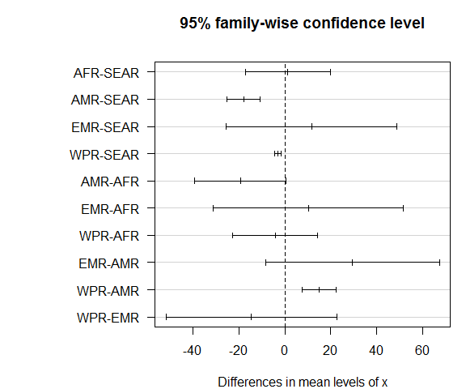

sim-age.R
================
BrDe394
2019-06-27

  - [Settings](#settings)
  - [Load data](#load-data)
  - [Simulations](#simulations)
      - [INCIDENCE](#incidence)
      - [MORTALITY](#mortality)
  - [Summarize results](#summarize-results)
      - [INCIDENCE](#incidence-1)
      - [MORTALITY](#mortality-1)
  - [FIG 4a / BARPLOT GLOBAL INC
    AGE-SEX](#fig-4a-barplot-global-inc-age-sex)
  - [FIG 4b / BARPLOT GLOBAL MRT
    AGE-SEX](#fig-4b-barplot-global-mrt-age-sex)

# Settings

``` r
## required packages
library(bd)
library(ggplot2)
library(mc2d)

## helper function
ratio <-
function(x) {
  x[1] / x[2]
}

## simulations
set.seed(264)
```

# Load data

``` r
df <- readxl("../02_data/20180815/DALY_MEL_15-8-18_EB-cleaned.xls",
             "DALY_16_03_2018_FINAL")
names(df)
```

    ##   [1] "Pubmed_ID"             "Refered_to_ID"        
    ##   [3] "Extracter"             "Author"               
    ##   [5] "Pub_Yr"                "Journal"              
    ##   [7] "Available"             "Study_type"           
    ##   [9] "Study_year"            "Country_inf_reg"      
    ##  [11] "Country_inf"           "Region"               
    ##  [13] "Subregion"             "Resident"             
    ##  [15] "Culture_pos"           "Culture_spec"         
    ##  [17] "Patients"              "Age"                  
    ##  [19] "Median_mean"           "min"                  
    ##  [21] "max"                   "Male"                 
    ##  [23] "Female"                "Episode"              
    ##  [25] "Symptom_dur"           "Min2"                 
    ##  [27] "Max3"                  "Acute"                
    ##  [29] "Chronic"               "Pneumonia"            
    ##  [31] "bacteraemic"           "Sepsis"               
    ##  [33] "Septic_shock"          "Abscess"              
    ##  [35] "Tot_abscess"           "Intra_abdo_abscess"   
    ##  [37] "Organ"                 "Single"               
    ##  [39] "Multiple"              "CNS"                  
    ##  [41] "Spinal"                "Cerebral"             
    ##  [43] "SSTI"                  "GU"                   
    ##  [45] "Prostatitis"           "MSK"                  
    ##  [47] "Osteomyelitis"         "Septic_arthritis"     
    ##  [49] "Parotitis"             "Pericarditis"         
    ##  [51] "Lymph"                 "Other"                
    ##  [53] "Other_com"             "Asymptomatic"         
    ##  [55] "Relapse_Rec"           "Mortality_tot"        
    ##  [57] "Mortality_less_24h"    "Mortality_less_48h"   
    ##  [59] "Mortality_less_7d"     "Mortality_less_28d"   
    ##  [61] "Mortality_greater_28d" "LTFU"                 
    ##  [63] "hospitalized_yes"      "Hospitalized_days"    
    ##  [65] "ICU_yes"               "ICU_no"               
    ##  [67] "ICU_time"              "ICU_seq"              
    ##  [69] "Mechanical_vent"       "RRT"                  
    ##  [71] "Inotropic"             "InD_yes_no"           
    ##  [73] "InD"                   "CNS4"                 
    ##  [75] "Seizures"              "Headache"             
    ##  [77] "MSK5"                  "Fatigue"              
    ##  [79] "Malaise_NS"            "SE"                   
    ##  [81] "other6"                "DoT"                  
    ##  [83] "Min7"                  "Max8"                 
    ##  [85] "Abx_parent"            "Abx_oral"             
    ##  [87] "No_risk_factors"       "Multiple_risk_factors"
    ##  [89] "Diabetes_mellitus"     "Hyperglycaemia"       
    ##  [91] "Prem_rupt_mem"         "Preterm"              
    ##  [93] "Low_BW"                "Underweight"          
    ##  [95] "ETOH"                  "Cirrhosis_non_etoh"   
    ##  [97] "Smoked"                "CKD"                  
    ##  [99] "Chronic_lung_dis"      "Immunocomp_non_spec"  
    ## [101] "Immunosuppression"     "Cancer"               
    ## [103] "ATSI"                  "CHD"                  
    ## [105] "RHD"                   "Thalassaemia"         
    ## [107] "HIV"                   "Other9"               
    ## [109] "HTN"                   "Trauma"               
    ## [111] "Renal_Calculi"         "CKD_Tot"              
    ## [113] "Other_spec"            "TB"                   
    ## [115] "Column10"              "antibiotics.specified"
    ## [117] "Column1"               "Column2"              
    ## [119] "Column3"

``` r
table(df$Patients)
```

    ## 
    ##    1    2    3    4    6    7    8    9   10   11   12   14   15   17   18 
    ## 1048    3    3    2    2    3    3    2    2    1    3    1    1    2    1 
    ##   20   21   22   25   26   27   28   29   30   31   32   33   34   35   39 
    ##    3    1    2    3    1    2    1    2    2    2    1    2    1    1    3 
    ##   40   41   43   44   45   46   49   53   56   57   58   60   63   72   77 
    ##    2    1    1    2    1    2    1    1    2    2    2    1    1    1    1 
    ##   80   81   83   85   87   90   91   95   98  100  109  130  134  135  144 
    ##    1    1    1    1    1    1    1    1    1    1    1    1    1    1    1 
    ##  145  153  157  170  176  204  212  214  287  311  315  372  530  540  581 
    ##    1    1    1    2    1    1    1    1    1    1    1    1    1    1    1 
    ##  602  755 1160 
    ##    1    1    1

``` r
table(df$Age)
```

    ## 
    ##                     0 0.0030000000000000001 0.0054794520547945206 
    ##                     3                     1                     4 
    ##  0.013698630136986301  0.021917808219178082  0.027397260273972601 
    ##                     1                     2                     1 
    ##   0.03287671232876712  0.035616438356164383  0.038356164383561646 
    ##                     1                     1                     2 
    ##  0.052054794520547946  0.057534246575342465  0.080000000000000002 
    ##                     1                     1                     2 
    ##   0.14999999999999999                  0.25                  0.75 
    ##                     1                     1                     2 
    ##   0.90000000000000002                     1                   1.2 
    ##                     1                     8                     1 
    ##                  1.25    1.3300000000000001                   1.5 
    ##                     1                     2                     1 
    ##                    10                    11                    12 
    ##                    20                    14                    19 
    ##                    13                    14                    15 
    ##                    11                    22                    11 
    ##                    16                    17                    18 
    ##                     4                    12                     7 
    ##                    19                     2                   2.5 
    ##                     8                    10                     1 
    ##                    20                    21                    22 
    ##                     9                     8                    10 
    ##                    23                    24                    25 
    ##                     5                    11                     4 
    ##                    26                    27                    28 
    ##                     3                    10                     9 
    ##                    29                  29.5                     3 
    ##                    16                     1                    13 
    ##                    30                    31                    32 
    ##                     6                     7                    12 
    ##                    33                    34                    35 
    ##                     5                    17                    21 
    ##                    36                    37                    38 
    ##                     7                     9                    15 
    ##                    39    39.200000000000003                  39.5 
    ##                    10                     1                     2 
    ##                     4                    40                    41 
    ##                     6                    29                    18 
    ##                    42                  42.5                    43 
    ##                    14                     1                    13 
    ##                    44    44.700000000000003                    45 
    ##                    14                     1                    34 
    ##                  45.1                  45.4    45.799999999999997 
    ##                     1                     1                     2 
    ##                    46    46.399999999999999                    47 
    ##                    26                     1                    23 
    ##                  47.9                    48                  48.5 
    ##                     1                    27                     1 
    ##    48.600000000000001                    49                  49.7 
    ##                     1                    18                     1 
    ##                     5    5.7000000000000002                    50 
    ##                    13                     1                    36 
    ##    50.399999999999999                    51    51.399999999999999 
    ##                     1                    24                     1 
    ##                  51.5                  51.6                    52 
    ##                     1                     1                    25 
    ##    52.200000000000003                  52.5                  52.9 
    ##                     1                     1                     1 
    ##                    53    53.700000000000003                    54 
    ##                    15                     1                    22 
    ##    54.299999999999997                  54.5                    55 
    ##                     1                     1                    26 
    ##                    56                  56.5    56.609999999999999 
    ##                    14                     1                     1 
    ##    56.909999999999997                    57                    58 
    ##                     1                    10                    24 
    ##                  58.2                    59                  59.5 
    ##                     1                    13                     2 
    ##                     6                    60                    61 
    ##                     4                    20                    17 
    ##    61.100000000000001                    62                    63 
    ##                     1                    22                     9 
    ##                    64    64.599999999999994                    65 
    ##                    11                     1                    15 
    ##    65.200000000000003                    66                    67 
    ##                     1                    13                     7 
    ##                    68                    69                     7 
    ##                     7                     7                     5 
    ##                   7.5    7.7999999999999998                    70 
    ##                     3                     1                    23 
    ##                    71                    72                    73 
    ##                     6                     2                     4 
    ##                    74                    75                    76 
    ##                     4                     6                     4 
    ##                    77                    79                     8 
    ##                     1                     1                     8 
    ##                    80                    81                    82 
    ##                     1                     2                     3 
    ##                    84                    87                    88 
    ##                     1                     1                     2 
    ##                    89                     9                    90 
    ##                     1                     9                     2 
    ##                    NA 
    ##                    74

``` r
table(df$min)
```

    ## 
    ##                =1/12                    0 0.013698630136986301 
    ##                    1                    3                    1 
    ##  0.10000000000000001                  0.2                  0.5 
    ##                    2                    1                    1 
    ##  0.54000000000000004  0.69999999999999996                    1 
    ##                    1                    2                    5 
    ##   1.6000000000000001                   13                   15 
    ##                    1                    1                    4 
    ##                   16                   18                   19 
    ##                    3                    5                    1 
    ##                    2                   20                   22 
    ##                    3                    2                    1 
    ##                   24                   25                   29 
    ##                    1                    2                    2 
    ##                    3                   30                   35 
    ##                    1                    3                    1 
    ##                   37                   38                   39 
    ##                    1                    2                    2 
    ##                    4                   40                 40.9 
    ##                    1                    2                    1 
    ##                   41                   43                   44 
    ##                    2                    1                    1 
    ##                   46                 49.8                    5 
    ##                    1                    1                    4 
    ##                   50                    6                    7 
    ##                    2                    1                    1 
    ##                   70                    9                   NA 
    ##                    2                    2                 1084

``` r
table(df$max)
```

    ## 
    ##                >15                  1               14.6 
    ##                  1                  1                  1 
    ##                 15                 16 16.199999999999999 
    ##                  3                  2                  1 
    ##                 18                 29                 48 
    ##                  1                  2                  1 
    ##                 49                  5                 54 
    ##                  2                  2                  1 
    ##                 56                 57                 59 
    ##                  1                  1                  1 
    ##                 60                 61               62.3 
    ##                  2                  2                  1 
    ##                 63                 64                 65 
    ##                  2                  2                  4 
    ##                 67                 68                 69 
    ##                  1                  1                  4 
    ##                 70                 72                 73 
    ##                  2                  2                  2 
    ##                 74                 75                 77 
    ##                  3                  2                  1 
    ##                 78                 79                 80 
    ##                  2                  2                  2 
    ##                 82                 83                 87 
    ##                  2                  1                  4 
    ##                 88                 89                 91 
    ##                  1                  3                  2 
    ##                 97                 NA 
    ##                  1               1087

``` r
## clean data
df$Age[df$Age == "NA"] <- NA
df$Age <- as.numeric(df$Age)

df$min[df$min == "NA"] <- NA
df$min[df$min == "=1/12"] <- 1/12
df$min <- as.numeric(df$min)

df$max[df$max == "NA"] <- NA
df$max[df$max == ">15"] <- 15
df$max <- as.numeric(df$max)

df$Region[df$Region == "NA"] <- NA

df$Mortality_tot[df$Mortality_tot == "NA"] <- NA
df$Mortality_tot <- as.numeric(df$Mortality_tot)

df$Male[df$Male == "NA"] <- NA
df$Male <- as.numeric(df$Male)

df$Female[df$Female == "NA"] <- NA
df$Female <- as.numeric(df$Female)
```

# Simulations

``` r
## do simulations
df_inc <-
  df[, c("Region", "Patients", "Age", "min", "max", "Male", "Female")]
df_mrt <-
  df[, c("Region", "Mortality_tot", "Age", "min", "max", "Male", "Female")]
df_mrt <- subset(df_mrt, Mortality_tot > 0)


do_sim_age <-
function(x) {
  if (all(is.na(x[2:4]))) {
    return(NULL)

  } else if (any(is.na(x[3:4]))) {
    return(rep(x[2], x[1]))

  } else if (is.na(x[2])) {
    return(runif(x[1], x[3], x[4]))

  } else {
    return(rpert(x[1], x[3], x[2], x[4]))
  }
}

do_sim_agesex <-
function(x) {
  y <- do_sim_age(x)

  prob <-
    if (any(is.na(x[5:6])) | sum(x[5:6]) == 0) {
      0.5
    } else {
      x[5] / sum(x[5:6])
  }

  m <- rbinom(length(y), 1, prob) == 1

  data.frame(age = y, sex = m)
}

do_sim <-
function(x){
  as <- apply(x[, -1], 1, do_sim_agesex)
  data.frame(age = unlist(sapply(as, function(x) x$age)),
             sex = unlist(sapply(as, function(x) x$sex)))
}
```

## INCIDENCE

``` r
unique(df_inc$Region)
```

    ## [1] "AMR"  "WPR"  "SEAR" "AFR"  NA     "EMR"

``` r
subset(df_inc, is.na(Region))
```

    ##      Region Patients          Age min max Male Female
    ## 97     <NA>        1 66.000000000  NA  NA    1      0
    ## 320    <NA>        1 44.000000000  NA  NA    0      1
    ## 408    <NA>        1 45.000000000  NA  NA    1      0
    ## 955    <NA>        1           NA  NA  NA   NA     NA
    ## 956    <NA>        1 61.000000000  NA  NA    1      0
    ## 957    <NA>        1           NA  NA  NA   NA     NA
    ## 958    <NA>        1 58.000000000  NA  NA    1      0
    ## 1039   <NA>        1  0.005479452  NA  NA    1      0
    ## 1059   <NA>        1 46.000000000  NA  NA    1      0

``` r
regions <- sort(unique(df_inc$Region))
reg_inc <- vector("list", length(regions))
names(reg_inc) <- regions

for (i in seq_along(reg_inc)) {
  reg_inc[[i]] <- do_sim(subset(df_inc, Region == regions[i]))
}
```

## MORTALITY

``` r
unique(df_mrt$Region)
```

    ## [1] "AMR"  "WPR"  "SEAR" "AFR"  "EMR"  NA

``` r
subset(df_mrt, is.na(Region))
```

    ##      Region Mortality_tot         Age min max Male Female
    ## 1039   <NA>             1 0.005479452  NA  NA    1      0

``` r
regions <- sort(unique(df_mrt$Region))
reg_mrt <- vector("list", length(regions))
names(reg_mrt) <- regions

for (i in seq_along(reg_mrt)) {
  reg_mrt[[i]] <- do_sim(subset(df_mrt, Region == regions[i]))
}
```

# Summarize results

## INCIDENCE

``` r
round(
  cbind(n = sapply(reg_inc, nrow),
        t(sapply(reg_inc, function(x) summary(x$age)))))
```

    ##         n Min. 1st Qu. Median Mean 3rd Qu. Max.
    ## AFR    14    1      36     49   46      60   70
    ## AMR    72    4      17     37   37      52   88
    ## EMR     1   60      60     60   60      60   60
    ## SEAR 7338    0      42     50   48      54   90
    ## WPR  3646    0      33     48   45      59   93

``` r
y <- unlist(sapply(reg_inc, function(x) x$age))
x <- unlist(mapply(rep, regions, sapply(reg_inc, nrow)))
x <- relevel(factor(x), "SEAR")
summary(aov(y ~ x))
```

    ##                Df  Sum Sq Mean Sq F value Pr(>F)    
    ## x               4   22957    5739   25.49 <2e-16 ***
    ## Residuals   11066 2491203     225                   
    ## ---
    ## Signif. codes:  0 '***' 0.001 '**' 0.01 '*' 0.05 '.' 0.1 ' ' 1

``` r
par(mfrow = c(1, 1))
par(mar = c(4, 10, 4, 1))
plot(TukeyHSD(aov(y ~ x)), las = 1)
```

<!-- -->

``` r
par(mfrow = c(1, 1))
boxplot(y ~ x)
```

<!-- -->

``` r
tiff("BoxplotInc.tiff", 10, 8, units = "in", res = 300, compress = "lzw")
par(mfrow = c(2, 3))
for (i in seq_along(reg_inc)) {
  main <- sprintf("%s (n=%s)", names(reg_inc)[i], nrow(reg_inc[[i]]))
  hist(reg_inc[[i]]$age, main = main, xlab = "Age")
}
dev.off()
```

    ## png 
    ##   2

## MORTALITY

``` r
round(
  cbind(n = sapply(reg_mrt, nrow),
        t(sapply(reg_mrt, function(x) summary(x$age)))))
```

    ##         n Min. 1st Qu. Median Mean 3rd Qu. Max.
    ## AFR     4   40      44     48   50      54   62
    ## AMR    26   10      14     30   30      43   70
    ## EMR     1   60      60     60   60      60   60
    ## SEAR 2301    0      42     50   48      54   86
    ## WPR   962    0      34     48   46      59   88

``` r
y <- unlist(sapply(reg_mrt, function(x) x$age))
x <- unlist(mapply(rep, regions, sapply(reg_mrt, nrow)))
x <- relevel(factor(x), "SEAR")
summary(aov(y ~ x))
```

    ##               Df Sum Sq Mean Sq F value   Pr(>F)    
    ## x              4  13192    3298   17.87 1.58e-14 ***
    ## Residuals   3289 606893     185                     
    ## ---
    ## Signif. codes:  0 '***' 0.001 '**' 0.01 '*' 0.05 '.' 0.1 ' ' 1

``` r
par(mfrow = c(1, 1))
par(mar = c(4, 10, 4, 1))
plot(TukeyHSD(aov(y ~ x)), las = 1)
```

<!-- -->

``` r
par(mfrow = c(1, 1))
boxplot(y ~ x)
```

<!-- -->

``` r
tiff("BoxplotMrt.tiff", 10, 8, units = "in", res = 300, compress = "lzw")
par(mfrow = c(2, 3))
for (i in seq_along(reg_mrt)) {
  main <- sprintf("%s (n=%s)", names(reg_mrt)[i], nrow(reg_mrt[[i]]))
  hist(reg_mrt[[i]]$age, main = main, xlab = "Age")
}
dev.off()
```

    ## png 
    ##   2

# FIG 4a / BARPLOT GLOBAL INC AGE-SEX

``` r
df_inc <-
  data.frame(Age = unlist(sapply(reg_inc, function(x) x$age)),
             Sex = unlist(sapply(reg_inc, function(x) x$sex)))

grp <- c(0, 1, seq(5, 85, 5), 100)
df_inc$AgeGrp <- cut(df_inc$Age, grp, include.lowest = TRUE)
df_inc_grp <- as.data.frame(with(df_inc, table(AgeGrp, Sex)))
df_inc_grp[df_inc_grp$Sex == FALSE, "Freq"] <-
  -df_inc_grp[df_inc_grp$Sex == FALSE, "Freq"]

breaks <- pretty(df_inc_grp$Freq)
hjust <- 1-(max(df_inc_grp$Freq)/diff(range(df_inc_grp$Freq)))

AgeGrp <- paste0(head(grp, -1), "-", tail(grp, -1)-1)
AgeGrp[1] <- "<1"
AgeGrp[length(AgeGrp)] <- "85+"

p_inc <-
ggplot(df_inc_grp, aes(y = Freq, x = AgeGrp, group = Sex)) +
  geom_col(aes(fill = Sex)) +
  theme_bw() +
  coord_flip() +
  scale_x_discrete("Age Group", labels = AgeGrp) +
  scale_y_continuous("Cases", breaks = breaks, labels = abs(breaks)) +
  scale_fill_discrete(labels = c("Female", "Male")) +
  theme(axis.title.x = element_text(hjust = hjust)) +
  ggtitle("Age and sex distribution of melioidosis cases")
```

# FIG 4b / BARPLOT GLOBAL MRT AGE-SEX

``` r
df_mrt <-
  data.frame(Age = unlist(sapply(reg_mrt, function(x) x$age)),
             Sex = unlist(sapply(reg_mrt, function(x) x$sex)))

grp <- c(0, 1, seq(5, 85, 5), 100)
df_mrt$AgeGrp <- cut(df_mrt$Age, grp, include.lowest = TRUE)
df_mrt_grp <- as.data.frame(with(df_mrt, table(AgeGrp, Sex)))
df_mrt_grp[df_mrt_grp$Sex == FALSE, "Freq"] <-
  -df_mrt_grp[df_mrt_grp$Sex == FALSE, "Freq"]

breaks <- pretty(df_mrt_grp$Freq)
hjust <- 1-(max(df_mrt_grp$Freq)/diff(range(df_mrt_grp$Freq)))

p_mrt <-
ggplot(df_mrt_grp, aes(y = Freq, x = AgeGrp, group = Sex)) +
  geom_col(aes(fill = Sex)) +
  theme_bw() +
  coord_flip() +
  scale_x_discrete("Age Group", labels = AgeGrp) +
  scale_y_continuous("Deaths", breaks = breaks, labels = abs(breaks)) +
  scale_fill_discrete(labels = c("Female", "Male")) +
  theme(axis.title.x = element_text(hjust = hjust)) +
  ggtitle("Age and sex distribution of melioidosis deaths")
```

``` r
#pdf("Fig3.pdf", 12, 5)
cowplot::plot_grid(
  p_inc + theme(legend.position = "none"),
  p_mrt + theme(legend.position = "none"),
  cowplot::get_legend(p_inc),
  labels = c("A", "B"),
  nrow = 1,
  rel_widths = c(1, 1, .25))
```

<!-- -->

``` r
#graphics.off()


## tabulate age-sex distribution
## .. note: SexFALSE = female; SexTRUE = male
with(df_inc, table(AgeGrp, Sex))
```

    ##           Sex
    ## AgeGrp     FALSE TRUE
    ##   [0,1]       17   32
    ##   (1,5]       71   76
    ##   (5,10]      99  113
    ##   (10,15]    132  121
    ##   (15,20]     68  108
    ##   (20,25]     78  130
    ##   (25,30]     94  197
    ##   (30,35]    141  283
    ##   (35,40]    448  779
    ##   (40,45]    313  570
    ##   (45,50]    679 1224
    ##   (50,55]   1021 1497
    ##   (55,60]    441  881
    ##   (60,65]    224  445
    ##   (65,70]    119  248
    ##   (70,75]     70  153
    ##   (75,80]     20   79
    ##   (80,85]     18   50
    ##   (85,100]    10   22

``` r
with(df_inc, table(AgeGrp, Sex) / nrow(df_inc))
```

    ##           Sex
    ## AgeGrp            FALSE         TRUE
    ##   [0,1]    0.0015355433 0.0028904345
    ##   (1,5]    0.0064131515 0.0068647819
    ##   (5,10]   0.0089422816 0.0102068467
    ##   (10,15]  0.0119230422 0.0109294553
    ##   (15,20]  0.0061421732 0.0097552163
    ##   (20,25]  0.0070454340 0.0117423900
    ##   (25,30]  0.0084906513 0.0177942372
    ##   (30,35]  0.0127359769 0.0255622798
    ##   (35,40]  0.0404660826 0.0703640141
    ##   (40,45]  0.0282720621 0.0514858640
    ##   (45,50]  0.0613314064 0.1105591184
    ##   (50,55]  0.0922229248 0.1352181375
    ##   (55,60]  0.0398338000 0.0795772740
    ##   (60,65]  0.0202330413 0.0401951043
    ##   (65,70]  0.0107488032 0.0224008671
    ##   (70,75]  0.0063228254 0.0138198898
    ##   (75,80]  0.0018065215 0.0071357601
    ##   (80,85]  0.0016258694 0.0045163039
    ##   (85,100] 0.0009032608 0.0019871737

``` r
t(apply(with(df_inc, table(AgeGrp, Sex)), 1, prop.table))
```

    ##           Sex
    ## AgeGrp         FALSE      TRUE
    ##   [0,1]    0.3469388 0.6530612
    ##   (1,5]    0.4829932 0.5170068
    ##   (5,10]   0.4669811 0.5330189
    ##   (10,15]  0.5217391 0.4782609
    ##   (15,20]  0.3863636 0.6136364
    ##   (20,25]  0.3750000 0.6250000
    ##   (25,30]  0.3230241 0.6769759
    ##   (30,35]  0.3325472 0.6674528
    ##   (35,40]  0.3651182 0.6348818
    ##   (40,45]  0.3544734 0.6455266
    ##   (45,50]  0.3568050 0.6431950
    ##   (50,55]  0.4054805 0.5945195
    ##   (55,60]  0.3335855 0.6664145
    ##   (60,65]  0.3348281 0.6651719
    ##   (65,70]  0.3242507 0.6757493
    ##   (70,75]  0.3139013 0.6860987
    ##   (75,80]  0.2020202 0.7979798
    ##   (80,85]  0.2647059 0.7352941
    ##   (85,100] 0.3125000 0.6875000

``` r
1/ratio(with(subset(df_inc, Age < 15), tapply(Age, Sex, sum)))
```

    ##    FALSE 
    ## 1.012163

``` r
1/ratio(with(subset(df_inc, Age >= 15), tapply(Age, Sex, sum)))
```

    ##    FALSE 
    ## 1.796205

``` r
with(df_mrt, table(AgeGrp, Sex))
```

    ##           Sex
    ## AgeGrp     FALSE TRUE
    ##   [0,1]        5   14
    ##   (1,5]       11   13
    ##   (5,10]      15   18
    ##   (10,15]     28   31
    ##   (15,20]     10   19
    ##   (20,25]     28   46
    ##   (25,30]     24   58
    ##   (30,35]     43   86
    ##   (35,40]    172  258
    ##   (40,45]     99  169
    ##   (45,50]    200  347
    ##   (50,55]    286  457
    ##   (55,60]    148  295
    ##   (60,65]     65  133
    ##   (65,70]     26   89
    ##   (70,75]     17   39
    ##   (75,80]      6   24
    ##   (80,85]      3    9
    ##   (85,100]     0    3

``` r
with(df_mrt, table(AgeGrp, Sex) / nrow(df_mrt))
```

    ##           Sex
    ## AgeGrp            FALSE         TRUE
    ##   [0,1]    0.0015179114 0.0042501518
    ##   (1,5]    0.0033394050 0.0039465695
    ##   (5,10]   0.0045537341 0.0054644809
    ##   (10,15]  0.0085003036 0.0094110504
    ##   (15,20]  0.0030358227 0.0057680631
    ##   (20,25]  0.0085003036 0.0139647845
    ##   (25,30]  0.0072859745 0.0176077717
    ##   (30,35]  0.0130540376 0.0261080753
    ##   (35,40]  0.0522161506 0.0783242259
    ##   (40,45]  0.0300546448 0.0513054038
    ##   (45,50]  0.0607164542 0.1053430480
    ##   (50,55]  0.0868245294 0.1387370978
    ##   (55,60]  0.0449301761 0.0895567699
    ##   (60,65]  0.0197328476 0.0403764420
    ##   (65,70]  0.0078931390 0.0270188221
    ##   (70,75]  0.0051608986 0.0118397086
    ##   (75,80]  0.0018214936 0.0072859745
    ##   (80,85]  0.0009107468 0.0027322404
    ##   (85,100] 0.0000000000 0.0009107468

``` r
t(apply(with(df_mrt, table(AgeGrp, Sex)), 1, prop.table))
```

    ##           Sex
    ## AgeGrp         FALSE      TRUE
    ##   [0,1]    0.2631579 0.7368421
    ##   (1,5]    0.4583333 0.5416667
    ##   (5,10]   0.4545455 0.5454545
    ##   (10,15]  0.4745763 0.5254237
    ##   (15,20]  0.3448276 0.6551724
    ##   (20,25]  0.3783784 0.6216216
    ##   (25,30]  0.2926829 0.7073171
    ##   (30,35]  0.3333333 0.6666667
    ##   (35,40]  0.4000000 0.6000000
    ##   (40,45]  0.3694030 0.6305970
    ##   (45,50]  0.3656307 0.6343693
    ##   (50,55]  0.3849260 0.6150740
    ##   (55,60]  0.3340858 0.6659142
    ##   (60,65]  0.3282828 0.6717172
    ##   (65,70]  0.2260870 0.7739130
    ##   (70,75]  0.3035714 0.6964286
    ##   (75,80]  0.2000000 0.8000000
    ##   (80,85]  0.2500000 0.7500000
    ##   (85,100] 0.0000000 1.0000000

``` r
1/ratio(with(subset(df_mrt, Age < 15), tapply(Age, Sex, sum)))
```

    ##   FALSE 
    ## 1.05257

``` r
1/ratio(with(subset(df_mrt, Age >= 15), tapply(Age, Sex, sum)))
```

    ##    FALSE 
    ## 1.842893

``` r
##rmarkdown::render("sim-age.R")
```
