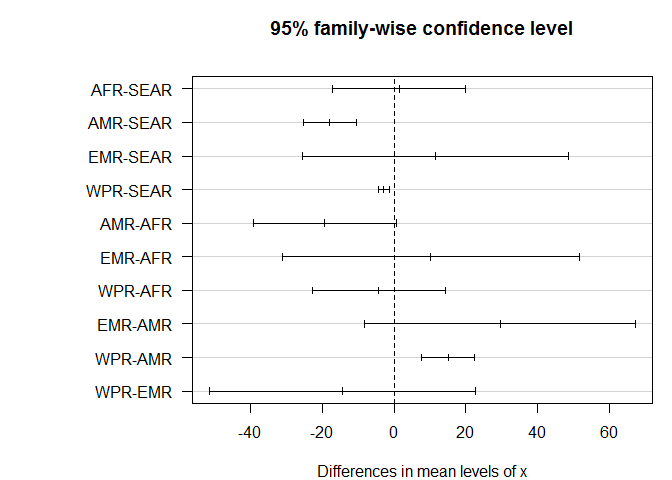

sim-lle.R
================
Bdevleesschauwer
Sun Aug 26 19:14:04 2018

# Settings

``` r
## required packages
library(future.apply)

## simulations
set.seed(264)
n <- 1e5

## helpers
lle <-
function(dem, LE) {
  age <- dem$age
  sex <- dem$sex
  col <- 3 - sex
  future_mapply(function(i,j) approx(LE[, 1], LE[, i], j)$y, col, age)
}
```

# Load data

``` r
## incidence, mortality, by country
source("read-inc-mrt-median.R")
```

    ## 'data.frame':    92 obs. of  7 variables:
    ##  $ Country.name: chr  "East_Asia_and_Pacific" "Indonesia" "Vietnam" "Phillipines" ...
    ##  $ X__1        : chr  "Predicted_Incidence" "20038" "10430" "9116" ...
    ##  $ X__2        : chr  "Lower_Limit_PI" "7859" "4097" "4819" ...
    ##  $ X__3        : chr  "Upper_Limit_PI" "52812" "27480" "18999" ...
    ##  $ X__4        : chr  "Predicted Mortality" "10224" "4703" "4510" ...
    ##  $ X__5        : chr  "Lower_Limit_PM" "3944" "1827" "2369" ...
    ##  $ X__6        : chr  "Upper_Limit_PM" "27524" "12631" "9739" ...
    ## 'data.frame':    83 obs. of  7 variables:
    ##  $ COUNTRY: chr  "Indonesia" "Vietnam" "Phillipines" "Thailand" ...
    ##  $ INC    : chr  "20038" "10430" "9116" "7572" ...
    ##  $ INC.LW : chr  "7859" "4097" "4819" "3396" ...
    ##  $ INC.UP : chr  "52812" "27480" "18999" "17685" ...
    ##  $ MRT    : chr  "10224" "4703" "4510" "2838" ...
    ##  $ MRT.LW : chr  "3944" "1827" "2369" "1259" ...
    ##  $ MRT.UP : chr  "27524" "12631" "9739" "6678" ...

``` r
INC_sim <- INC_sim[, !is.na(colnames(INC_sim))]
MRT_sim <- MRT_sim[, !is.na(colnames(MRT_sim))]

## age-sex distributions, by region
source("sim-age.R")
```

<!-- --><!-- --><!-- --><!-- --><!-- -->

``` r
str(reg_inc)
```

    ## List of 5
    ##  $ AFR :'data.frame':    14 obs. of  2 variables:
    ##   ..$ age: num [1:14] 60 70 57 58 29 29 52 45 40 1.33 ...
    ##   ..$ sex: logi [1:14] TRUE TRUE TRUE TRUE TRUE TRUE ...
    ##  $ AMR :'data.frame':    72 obs. of  2 variables:
    ##   ..$ age: num [1:72] 50 35 17 36 32 7 88 27 42 46 ...
    ##   ..$ sex: logi [1:72] TRUE TRUE TRUE TRUE TRUE FALSE ...
    ##  $ EMR :'data.frame':    1 obs. of  2 variables:
    ##   ..$ age: num 60
    ##   ..$ sex: logi TRUE
    ##  $ SEAR:'data.frame':    7338 obs. of  2 variables:
    ##   ..$ age: num [1:7338] 45 47 42 58 62 48 55 65 45 52 ...
    ##   ..$ sex: logi [1:7338] TRUE TRUE TRUE TRUE FALSE TRUE ...
    ##  $ WPR :'data.frame':    3646 obs. of  2 variables:
    ##   ..$ age: num [1:3646] 53 53 48.8 51.8 56.7 ...
    ##   ..$ sex: logi [1:3646] TRUE TRUE TRUE TRUE TRUE TRUE ...

``` r
str(reg_mrt)
```

    ## List of 5
    ##  $ AFR :'data.frame':    4 obs. of  2 variables:
    ##   ..$ age: num [1:4] 52 45 40 62
    ##   ..$ sex: logi [1:4] TRUE TRUE FALSE FALSE
    ##  $ AMR :'data.frame':    26 obs. of  2 variables:
    ##   ..$ age: num [1:26] 50 35 58 44 53 17 44 38 55 11 ...
    ##   ..$ sex: logi [1:26] TRUE TRUE TRUE TRUE TRUE TRUE ...
    ##  $ EMR :'data.frame':    1 obs. of  2 variables:
    ##   ..$ age: num 60
    ##   ..$ sex: logi TRUE
    ##  $ SEAR:'data.frame':    2301 obs. of  2 variables:
    ##   ..$ age: num [1:2301] 47 42 62 65 55 42 63 50 61.1 61.1 ...
    ##   ..$ sex: logi [1:2301] TRUE TRUE FALSE TRUE TRUE TRUE ...
    ##  $ WPR :'data.frame':    962 obs. of  2 variables:
    ##   ..$ age: num [1:962] 62.9518 51.3842 58.8574 56.373 0.0356 ...
    ##   ..$ sex: logi [1:962] TRUE FALSE TRUE TRUE FALSE TRUE ...

``` r
## match countries to regions
reg_id <-
  match(
    FERG2015:::crpop_2015$WHORegion[
      match(colnames(MRT_sim), FERG2015:::crpop_2015$Country)],
    names(reg_inc))
```

<!-- -->

# Run simulations

``` r
lle_sim <- matrix(ncol = ncol(INC_sim), nrow = n)
colnames(lle_sim) <- colnames(INC_sim)

for (i in seq(ncol(lle_sim))) {
  country <- colnames(INC_sim)[i]
  LE <- FERG2015:::get_local_LE(country)
  id <- reg_id[which(colnames(INC_sim) == country)]
  LEi <- lle(reg_inc[[id]], LE)
  lle_sim[, i] <-
    future_sapply(seq(n), function(x) mean(sample(LEi, replace = TRUE)))
}

knitr::kable(t(apply(lle_sim, 2, mean_ci)), digits = 1)
```

|                                    | mean | 2.5% | 97.5% |
| ---------------------------------- | ---: | ---: | ----: |
| Indonesia                          | 26.5 | 26.2 |  26.7 |
| Viet Nam                           | 34.2 | 33.6 |  34.8 |
| Philippines                        | 29.1 | 28.6 |  29.7 |
| Thailand                           | 31.5 | 31.3 |  31.7 |
| China                              | 33.3 | 32.7 |  33.9 |
| Myanmar                            | 26.5 | 26.2 |  26.7 |
| Cambodia                           | 29.7 | 29.1 |  30.2 |
| Malaysia                           | 32.6 | 32.1 |  33.2 |
| Lao People’s Democratic Republic   | 29.0 | 28.5 |  29.5 |
| Singapore                          | 38.0 | 37.4 |  38.6 |
| Australia                          | 38.5 | 37.9 |  39.1 |
| Papua New Guinea                   | 28.6 | 28.1 |  29.2 |
| Brunei Darussalam                  | 34.0 | 33.4 |  34.6 |
| Timor-Leste                        | 27.2 | 26.9 |  27.4 |
| Fiji                               | 29.3 | 28.8 |  29.9 |
| India                              | 27.7 | 27.4 |  27.9 |
| Bangladesh                         | 29.6 | 29.3 |  29.8 |
| Sri Lanka                          | 30.5 | 30.2 |  30.7 |
| Nepal                              | 27.4 | 27.1 |  27.6 |
| Pakistan                           |  9.3 |  6.9 |  11.6 |
| Bhutan                             | 29.6 | 29.4 |  29.8 |
| Nigeria                            | 23.6 | 17.5 |  30.4 |
| Guinea                             | 25.7 | 19.1 |  33.4 |
| Côte d’Ivoire                      | 23.4 | 17.6 |  29.9 |
| Benin                              | 27.6 | 21.0 |  35.1 |
| Madagascar                         | 27.8 | 20.9 |  35.7 |
| Burkina Faso                       | 26.0 | 19.3 |  33.7 |
| Sierra Leone                       | 22.7 | 16.8 |  29.5 |
| Mali                               | 25.9 | 19.4 |  33.3 |
| Cameroon                           | 26.0 | 20.0 |  32.9 |
| Liberia                            | 26.4 | 19.6 |  34.3 |
| Chad                               | 25.0 | 19.2 |  31.6 |
| Ghana                              | 26.5 | 19.7 |  34.3 |
| Niger                              | 26.6 | 19.9 |  34.1 |
| United Republic of Tanzania        | 27.9 | 21.5 |  35.3 |
| Congo                              | 28.0 | 21.5 |  35.5 |
| Ethiopia                           | 28.5 | 21.8 |  36.2 |
| Mozambique                         | 25.8 | 19.9 |  32.5 |
| Democratic Republic of the Congo   | 27.0 | 20.5 |  34.3 |
| Malawi                             | 27.0 | 20.8 |  34.3 |
| Togo                               | 25.7 | 19.0 |  33.3 |
| Central African Republic           | 23.6 | 18.3 |  29.7 |
| Zambia                             | 27.0 | 20.8 |  34.1 |
| Guinea-Bissau                      | 25.5 | 19.0 |  32.8 |
| Kenya                              | 28.8 | 22.1 |  36.5 |
| Somalia                            |  8.3 |  6.0 |  10.5 |
| Sudan                              |  9.1 |  6.7 |  11.4 |
| Senegal                            | 27.8 | 20.6 |  36.0 |
| Gabon                              | 28.7 | 22.1 |  36.5 |
| South Sudan                        | 26.0 | 19.9 |  32.9 |
| Uganda                             | 26.6 | 20.5 |  33.6 |
| Angola                             | 27.4 | 20.9 |  34.9 |
| South Africa                       | 24.4 | 18.3 |  31.3 |
| Mauritania                         | 27.6 | 20.5 |  35.7 |
| Eritrea                            | 26.5 | 19.8 |  34.2 |
| Gambia                             | 26.0 | 19.3 |  33.6 |
| Zimbabwe                           | 25.7 | 20.1 |  32.3 |
| Equatorial Guinea                  | 26.5 | 20.3 |  33.5 |
| Mauritius                          | 31.1 | 23.6 |  39.7 |
| Brazil                             | 40.7 | 36.4 |  45.0 |
| Mexico                             | 42.8 | 38.4 |  47.1 |
| Colombia                           | 40.8 | 36.6 |  45.0 |
| El Salvador                        | 39.6 | 35.5 |  43.7 |
| Venezuela (Bolivarian Republic of) | 39.9 | 35.6 |  44.2 |
| Honduras                           | 41.3 | 37.1 |  45.6 |
| Panama                             | 43.7 | 39.4 |  48.0 |
| Guatemala                          | 40.4 | 36.3 |  44.6 |
| Nicaragua                          | 41.4 | 37.2 |  45.6 |
| Peru                               | 41.0 | 36.7 |  45.3 |
| Haiti                              | 35.7 | 31.9 |  39.6 |
| Cuba                               | 43.6 | 39.1 |  48.0 |
| Argentina                          | 40.8 | 36.4 |  45.2 |
| Costa Rica                         | 44.0 | 39.5 |  48.5 |
| Suriname                           | 37.5 | 33.3 |  41.7 |
| Paraguay                           | 40.7 | 36.5 |  45.0 |
| Bolivia (Plurinational State of)   | 39.7 | 35.7 |  43.8 |
| Guyana                             | 35.3 | 31.2 |  39.3 |
| Yemen                              |  8.2 |  6.0 |  10.5 |
| Saudi Arabia                       |  9.2 |  6.8 |  11.6 |
| Iraq                               |  8.6 |  6.3 |  10.9 |
| Iran (Islamic Republic of)         | 10.1 |  7.6 |  12.5 |
| Oman                               | 10.2 |  7.6 |  12.7 |

``` r
save(lle_sim, file = "lle-sim.RData")

##rmarkdown::render("sim-lle.R")
```
