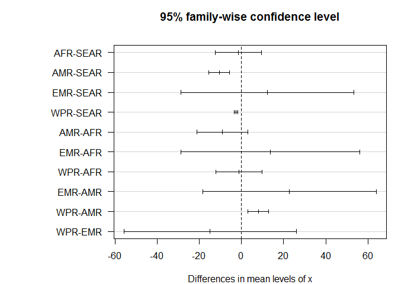

sim-rle.R
================
Bdevleesschauwer
Sun Aug 26 19:11:54 2018

# Settings

``` r
## required packages
library(future.apply)
```

    ## Loading required package: future

    ## 
    ## Attaching package: 'future.apply'

    ## The following object is masked from 'package:future':
    ## 
    ##     future_lapply

``` r
## simulations
set.seed(264)
n <- 1e5

## helper function
rle <-
function(x, LE = c("GBD", "WHO")) {
  LE <- match.arg(LE)
  LT <- switch(LE, GBD = FERG2015:::std_LE_GBD, WHO = FERG2015:::std_LE_WHO)
  approx(LT[, 1], LT[, 2], x)$y
}
```

# Load data

``` r
## incidence, mortality, by country
source("read-inc-mrt-median.R")
```

    ## 'data.frame':    92 obs. of  7 variables:
    ##  $ Country.name: chr  "East_Asia_and_Pacific" "Indonesia" "Vietnam" "Phillipines" ...
    ##  $ X__1        : chr  "Predicted_Incidence" "20038" "10430" "9116" ...
    ##  $ X__2        : chr  "Lower_Limit_PI" "7859" "4097" "4819" ...
    ##  $ X__3        : chr  "Upper_Limit_PI" "52812" "27480" "18999" ...
    ##  $ X__4        : chr  "Predicted Mortality" "10224" "4703" "4510" ...
    ##  $ X__5        : chr  "Lower_Limit_PM" "3944" "1827" "2369" ...
    ##  $ X__6        : chr  "Upper_Limit_PM" "27524" "12631" "9739" ...
    ## 'data.frame':    83 obs. of  7 variables:
    ##  $ COUNTRY: chr  "Indonesia" "Vietnam" "Phillipines" "Thailand" ...
    ##  $ INC    : chr  "20038" "10430" "9116" "7572" ...
    ##  $ INC.LW : chr  "7859" "4097" "4819" "3396" ...
    ##  $ INC.UP : chr  "52812" "27480" "18999" "17685" ...
    ##  $ MRT    : chr  "10224" "4703" "4510" "2838" ...
    ##  $ MRT.LW : chr  "3944" "1827" "2369" "1259" ...
    ##  $ MRT.UP : chr  "27524" "12631" "9739" "6678" ...

``` r
INC_sim <- INC_sim[, !is.na(colnames(INC_sim))]
MRT_sim <- MRT_sim[, !is.na(colnames(MRT_sim))]

## age-sex distributions, by region
source("sim-age.R")
```

<!-- --><!-- --><!-- --><!-- --><!-- -->

``` r
str(reg_inc)
```

    ## List of 5
    ##  $ AFR :'data.frame':    14 obs. of  2 variables:
    ##   ..$ age: num [1:14] 60 70 57 58 29 29 52 45 40 1.33 ...
    ##   ..$ sex: logi [1:14] TRUE TRUE TRUE TRUE TRUE TRUE ...
    ##  $ AMR :'data.frame':    72 obs. of  2 variables:
    ##   ..$ age: num [1:72] 50 35 17 36 32 7 88 27 42 46 ...
    ##   ..$ sex: logi [1:72] TRUE TRUE TRUE TRUE TRUE FALSE ...
    ##  $ EMR :'data.frame':    1 obs. of  2 variables:
    ##   ..$ age: num 60
    ##   ..$ sex: logi TRUE
    ##  $ SEAR:'data.frame':    7338 obs. of  2 variables:
    ##   ..$ age: num [1:7338] 45 47 42 58 62 48 55 65 45 52 ...
    ##   ..$ sex: logi [1:7338] TRUE TRUE TRUE TRUE FALSE TRUE ...
    ##  $ WPR :'data.frame':    3646 obs. of  2 variables:
    ##   ..$ age: num [1:3646] 53 53 48.8 51.8 56.7 ...
    ##   ..$ sex: logi [1:3646] TRUE TRUE TRUE TRUE TRUE TRUE ...

``` r
str(reg_mrt)
```

    ## List of 5
    ##  $ AFR :'data.frame':    4 obs. of  2 variables:
    ##   ..$ age: num [1:4] 52 45 40 62
    ##   ..$ sex: logi [1:4] TRUE TRUE FALSE FALSE
    ##  $ AMR :'data.frame':    26 obs. of  2 variables:
    ##   ..$ age: num [1:26] 50 35 58 44 53 17 44 38 55 11 ...
    ##   ..$ sex: logi [1:26] TRUE TRUE TRUE TRUE TRUE TRUE ...
    ##  $ EMR :'data.frame':    1 obs. of  2 variables:
    ##   ..$ age: num 60
    ##   ..$ sex: logi TRUE
    ##  $ SEAR:'data.frame':    2301 obs. of  2 variables:
    ##   ..$ age: num [1:2301] 47 42 62 65 55 42 63 50 61.1 61.1 ...
    ##   ..$ sex: logi [1:2301] TRUE TRUE FALSE TRUE TRUE TRUE ...
    ##  $ WPR :'data.frame':    962 obs. of  2 variables:
    ##   ..$ age: num [1:962] 62.9518 51.3842 58.8574 56.373 0.0356 ...
    ##   ..$ sex: logi [1:962] TRUE FALSE TRUE TRUE FALSE TRUE ...

``` r
## match countries to regions
reg_id <-
  match(
    FERG2015:::crpop_2015$WHORegion[
      match(colnames(MRT_sim), FERG2015:::crpop_2015$Country)],
    names(reg_mrt))
```

<!-- -->

# Simulations

``` r
RLE_WHO <- RLE_GBD <-
  matrix(ncol = length(reg_mrt), nrow = n)

sample2 <-
function(x, ...) {
  if (length(x) == 1) {
    x

  } else {
    sample(x,...)
  }
}

plan(multiprocess)

for (i in seq(length(reg_mrt))) {
  RLE_WHO[, i] <-
    future_sapply(seq(n),
           function(x)
             mean(rle(sample2(reg_mrt[[i]]$age, replace = TRUE), "WHO")))
  RLE_GBD[, i] <-
    future_sapply(seq(n),
           function(x)
             mean(rle(sample2(reg_mrt[[i]]$age, replace = TRUE), "GBD")))
}

rbind(sapply(reg_mrt, function(x) mean(x$age)),
      rle(sapply(reg_mrt, function(x) mean(x$age))))
```

    ##          AFR      AMR   EMR     SEAR      WPR
    ## [1,] 49.7500 30.46154 60.00 48.38040 45.53667
    ## [2,] 37.2875 56.00492 27.81 38.58862 41.29017

``` r
t(apply(RLE_WHO, 2, mean_ci))
```

    ##          mean     2.5%    97.5%
    ## [1,] 42.63985 34.86800 49.73500
    ## [2,] 61.73943 54.94221 68.33571
    ## [3,] 32.65000 32.65000 32.65000
    ## [4,] 44.01256 43.59827 44.43376
    ## [5,] 46.94193 45.76893 48.12216

``` r
t(apply(RLE_GBD, 2, mean_ci))
```

    ##          mean     2.5%    97.5%
    ## [1,] 37.40706 29.95150 44.22000
    ## [2,] 56.19326 49.50384 62.70124
    ## [3,] 27.81000 27.81000 27.81000
    ## [4,] 38.74370 38.34105 39.15536
    ## [5,] 41.75655 40.62197 42.90912

``` r
save(RLE_WHO, RLE_GBD, file = "rle-sim.RData")

##rmarkdown::render("sim-rle.R")
```
